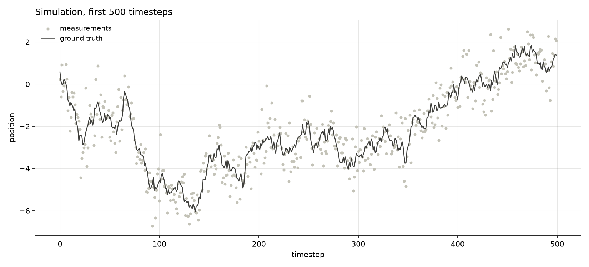
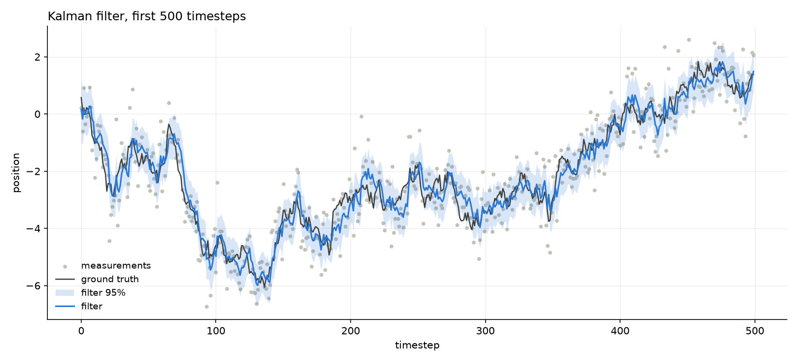
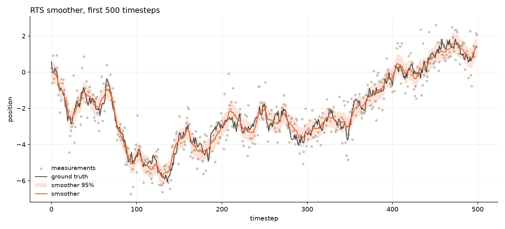
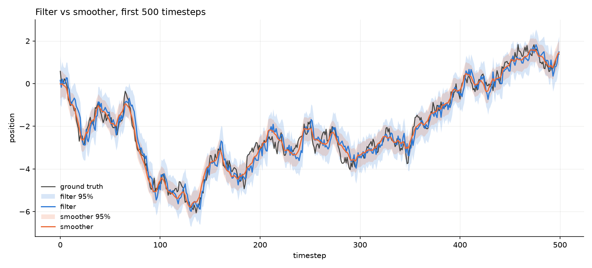
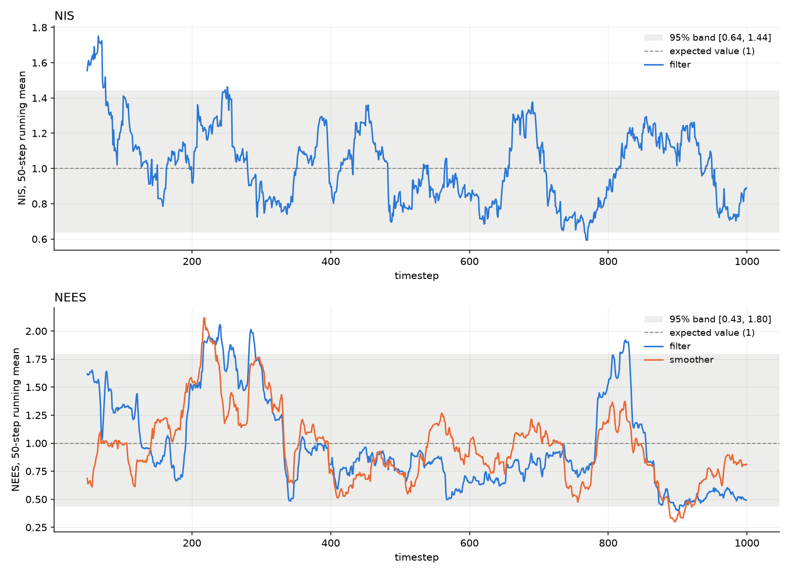
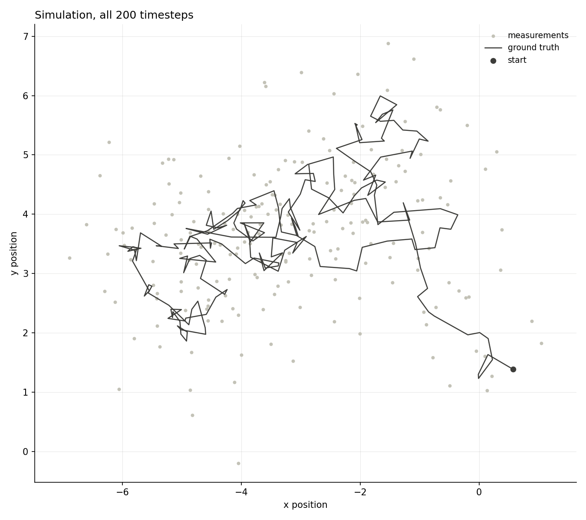
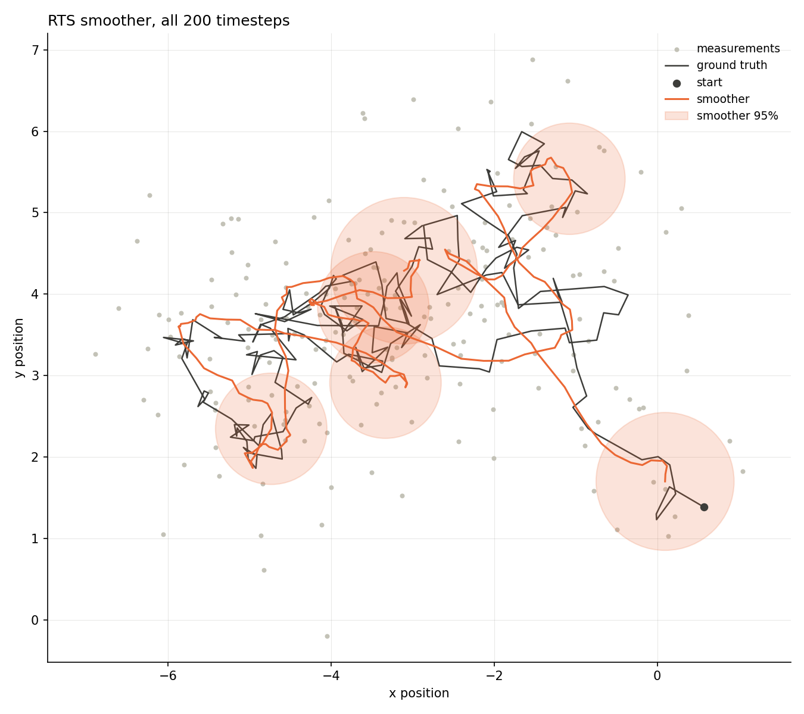
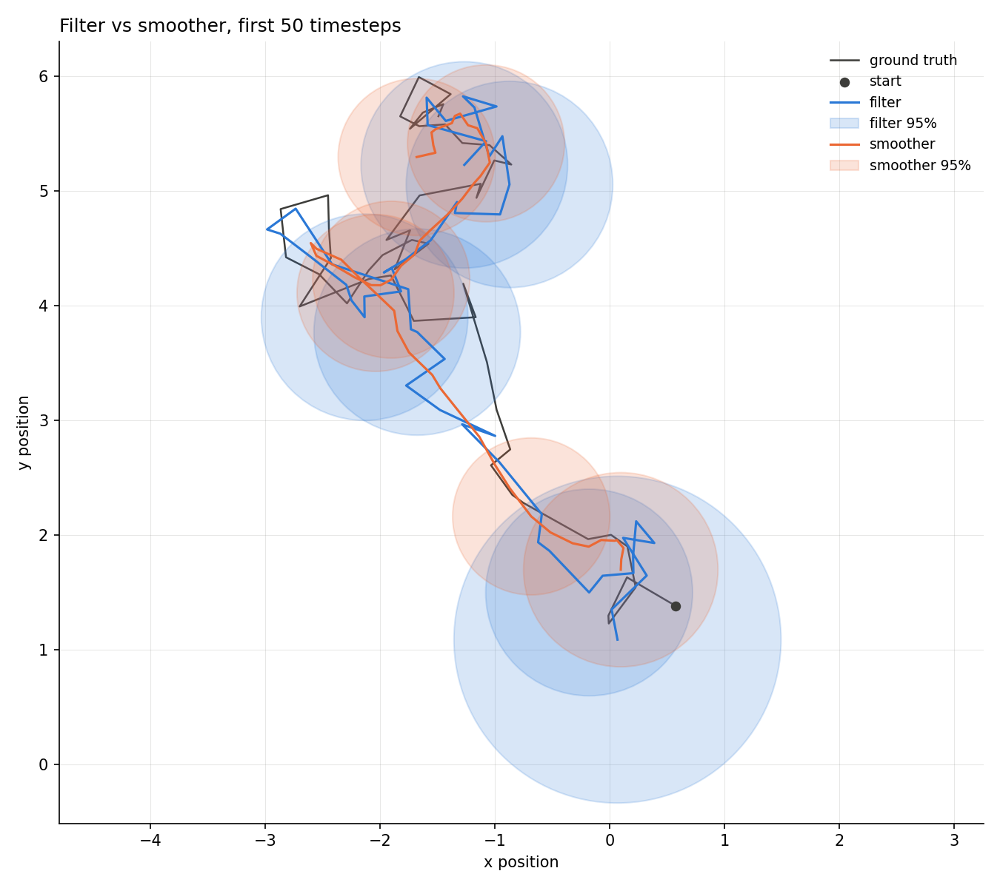

# Trajectory reconstruction and sensor fusion for underwater robotics

A place to store code that will be used in my masters pre-project. This Repo will likely see many revisions and changes, and nothing here is permanent.

## Plans

### Prototype & play around to figure stuff out stage

1. Make simple testcases, like gaussian random walk, gaussian white noise, CV model, CT model.
2. Make standard KF and filter the trajectory forward
3. Make a standard forward-backward smoother and RTS smoother and use it on the path
4. Plot the results, remember to evaluate filter consistency, smoother consistency.

---

**Phase 1 progress.** Steps 1-4 are done for the 1-D and 2-D cases: a Gaussian random walk observed through
Gaussian white noise, filtered forward with a KF, smoothed backward with an RTS smoother, and
evaluated with NIS and NEES. The CV and CT models nor the forward-backward smoother are written yet.

#### Building and running

```bash
cmake -S . -B build -G Ninja -DCMAKE_BUILD_TYPE=Release
cmake --build build
./build/kalman_filtering_and_smoothing
```

Requires Eigen 3 and a C++20 compiler. `data/`, `figures/` and `.venv/` are
gitignored.

The dimension and length of the run are set at the top of `main()` (`dim`,
`timesteps`). Analyze the output with the script matching `dim`:

```bash
python3 scripts/analyze_1d.py   # dim = 1
python3 scripts/analyze_2d.py   # dim = 2
```

They read `data/` and write their figures to `figures/`.

#### The first (baby steps) model

A 1-D random walk observed directly:

```
x_k = x_{k-1} + w_k,   w_k ~ N(0, q)    ->   F = 1, Q = q
z_k = x_k     + v_k,   v_k ~ N(0, r)    ->   H = 1, R = r
```

this was tested with the following parameter table:

| parameter  | value    | meaning                    |
| ---------- | -------- | -------------------------- |
| `q`        | 0.05     | process noise variance     |
| `r`        | 0.5      | measurement noise variance |
| `x0`, `p0` | 0.0, 1.0 | prior mean and variance    |
| timesteps  | 1000     |                            |

#### Code layout

| file                                                   | contents                                                                       |
| ------------------------------------------------------ | ------------------------------------------------------------------------------ |
| `lib/bayesian_filter.hpp`, `lib/bayesian_smoother.hpp` | pure virtual interfaces                                                        |
| `lib/models.hpp`                                       | `MotionModel` (F, Q) and `MeasurementModel` (H, R)                             |
| `src/kalman_filter.cpp`                                | implements the kalman filter predict/update step from Algorithm 1, Brekke 2025 |
| `src/rauch_tung_striebel_smoother.cpp`                 | implements the backward recursion equations from Sarkka theorem 12.2           |
| `src/simulation.cpp`                                   | Gaussian white noise and random walk generators for the simulation             |
| `src/results.cpp`                                      | CSV export for filter, smoother and ground truth                               |
| `scripts/analyze_1d.py`                                | plots and consistency statistics for the 1-D case                              |
| `scripts/analyze_2d.py`                                | trajectory plots with covariance ellipses and consistency statistics for 2-D   |

#### Results, 1-D

Figures below are the first 500 timesteps of a 1000-step run, seed 42.

The problem: a hidden random walk and the noisy measurements of it.



The Kalman filter with its 95% confidence band. It tracks, but lags at the turns
and inherits visible jitter from the measurements, because each estimate only
knows the past.



The RTS smoother over the same data. Each estimate uses the whole record, so it
is smoother, closer to truth, and reports a narrower band.



Side by side, the smoother's band is roughly half the width of the filter's.



|          | RMSE   | mean P |
| -------- | ------ | ------ |
| filter   | 0.3648 | 0.1354 |
| smoother | 0.2736 | 0.0783 |

#### Consistency, 1-D



Top panel is NIS, bottom is NEES, both as a 50-step running mean. The dashed line
is the expected value of the statistic (`E[chi2_dof] = dof`) and the
shaded region is the 95% band, widened to account for autocorrelation in NEES.

| statistic      | value  | 95% band         | verdict    |
| -------------- | ------ | ---------------- | ---------- |
| ANIS           | 1.0313 | [0.9118, 1.0922] | consistent |
| ANEES filter   | 0.9840 | [0.8520, 1.1597] | consistent |
| ANEES smoother | 0.9563 | [0.8614, 1.1488] | consistent |

#### Results, 2-D

The same model with a 2-D state: `F = H = I_2`, `Q = q * I_2`, `R = r * I_2`.

| parameter  | value       | meaning                              |
| ---------- | ----------- | ------------------------------------ |
| `q`        | 0.05        | process noise variance, per axis     |
| `r`        | 0.5         | measurement noise variance, per axis |
| `x0`, `P0` | [0, 0], I_2 | prior mean and covariance            |
| timesteps  | 200         |                                      |

`Q`, `R` and `P0` are all multiples of the identity, so the confidence regions
are circles here. They only become proper ellipses once the two axes differ or
couple, for example with different noise per axis such as would be the case in
a coordinated turn (CT) model or constant velocity (CV) model.

Figures below are the full 200-step run, seed 42. The problem: a hidden 2-D
random walk (black, the dot is where it starts) and the noisy measurements of it
(grey).



The Kalman filter with a 95% confidence ellipse at six timesteps. The first
ellipse is large because the prior is `P0 = I`; once measurements have come in
it settles at a constant size.


The RTS smoother over the same data. Its path is smoother and closer to the
truth, and its ellipses are smaller, including at the start, where it can use
every later measurement.



Side by side over the first 50, 100 and all 200 timesteps. The shorter windows
make the individual ellipses readable.




|          | RMSE   | mean trace P |
| -------- | ------ | ------------ |
| filter   | 0.5450 | 0.2738       |
| smoother | 0.3875 | 0.1583       |

RMSE is taken over the Euclidean position error, so it counts both axes.

#### Consistency, 2-D


Same layout as the 1-D figure. Both statistics have 2 degrees of freedom, so the
expected value is 2. The running mean needs a full 50-step window, so the first
49 steps are not drawn, which is a quarter of this shorter run.

| statistic      | value  | 95% band         | verdict    |
| -------------- | ------ | ---------------- | ---------- |
| ANIS           | 2.1678 | [1.7127, 2.3092] | consistent |
| ANEES filter   | 2.1842 | [1.5081, 2.5602] | consistent |
| ANEES smoother | 1.8951 | [1.5883, 2.4585] | consistent |

ANIS and the filter's ANEES sit a little above 2 but inside their bands. This is
a single 200-step run, so it is a sanity check; the Monte Carlo over seeds listed
under Next is the proper test.

#### Next

- Mis-tune `q` or `r` in the filter while leaving the simulator alone, to show
  an inconsistent filter for contrast.
- Monte Carlo over seeds for proper consistency bands.
- CV and CT models, then the forward-backward smoother.

Most of the code is handwritten by myself, the scripts and visualization is done
with a lot of heavy lifting by Anthropics Claude Code.

---

### Sophistication phase

1. Extend the current filter and smoother to be able to handle nonlinearities.
2. Add and experiment with EKF and ERTSS
3. Add and experiment with UKF and URTSS
4. (stretch goal) add and experiment with ESKF and ESRTSS

### Towards realistic scenarios

1. Make test cases more realistic and aligned with the goal of the project
2. Implement dynamical AUV model from Fossen
3. Implement models for sensors which will be used
4. (stretch goal) test using the Stonefish simulator, hereunder find a good way to get GNSS and ground truth data to play with
5. Adopt the existing codebase to accomodate for the new AUV model and Sensor models
6. Run experiments and document consistency, accuracy and other factors that might be of interest
