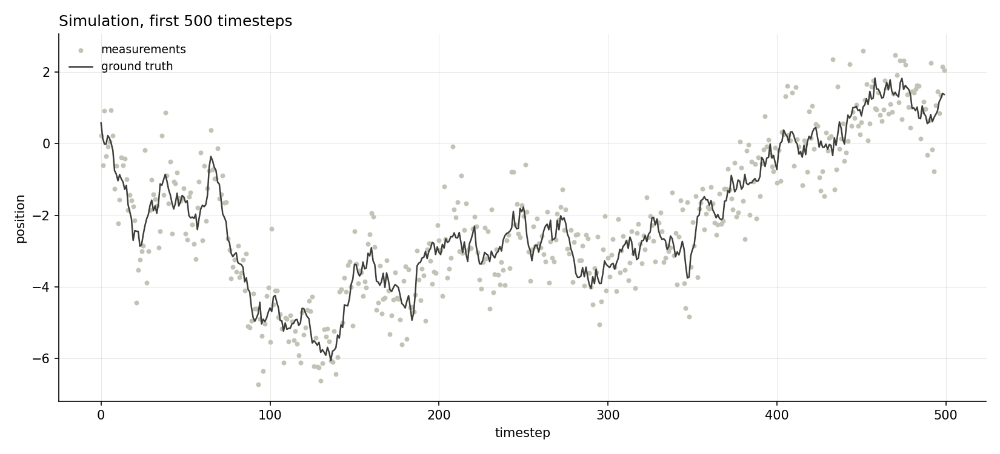
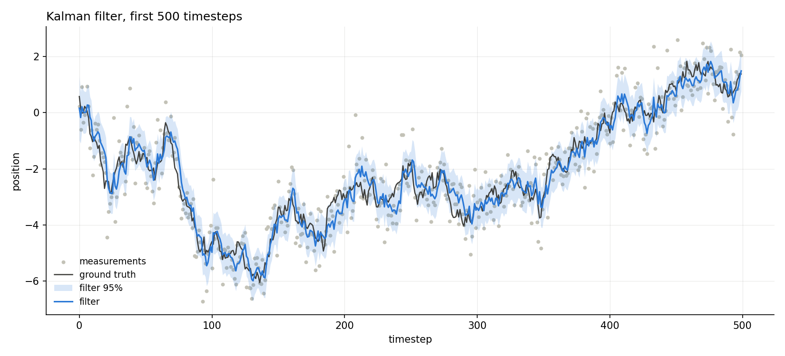
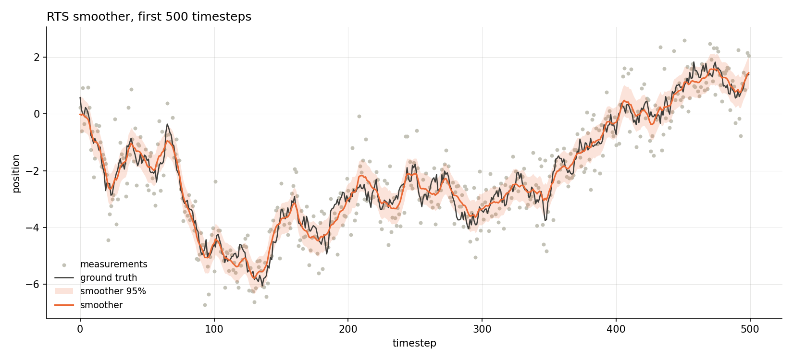
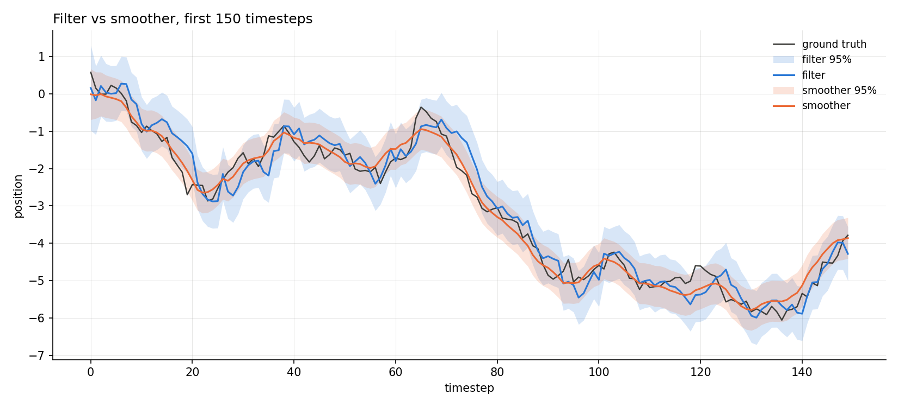
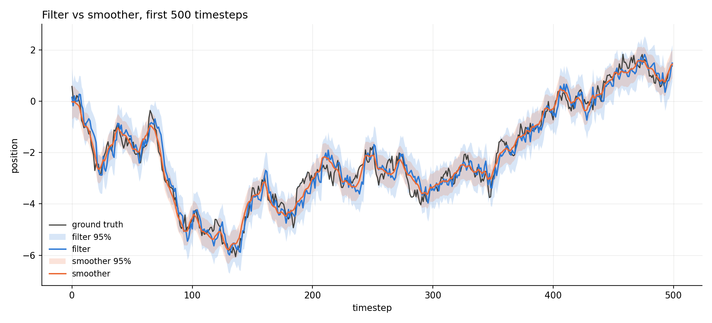
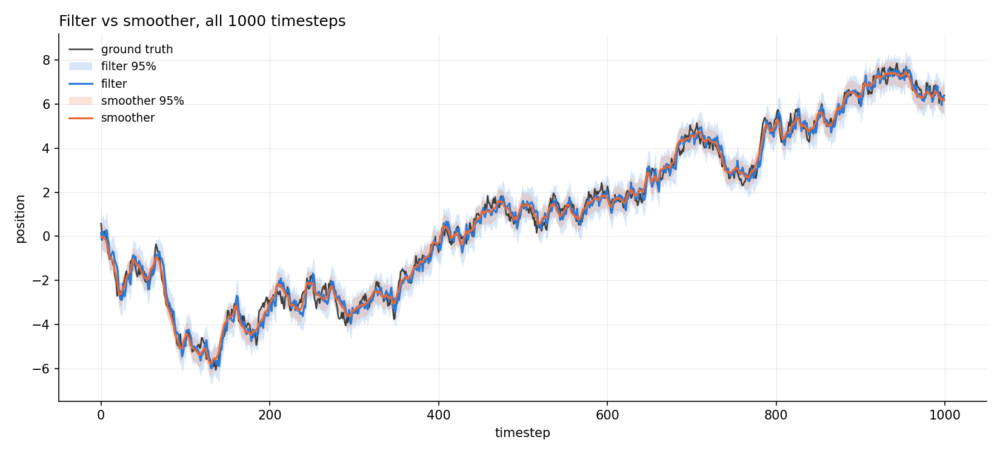
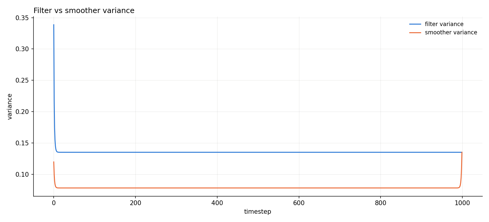
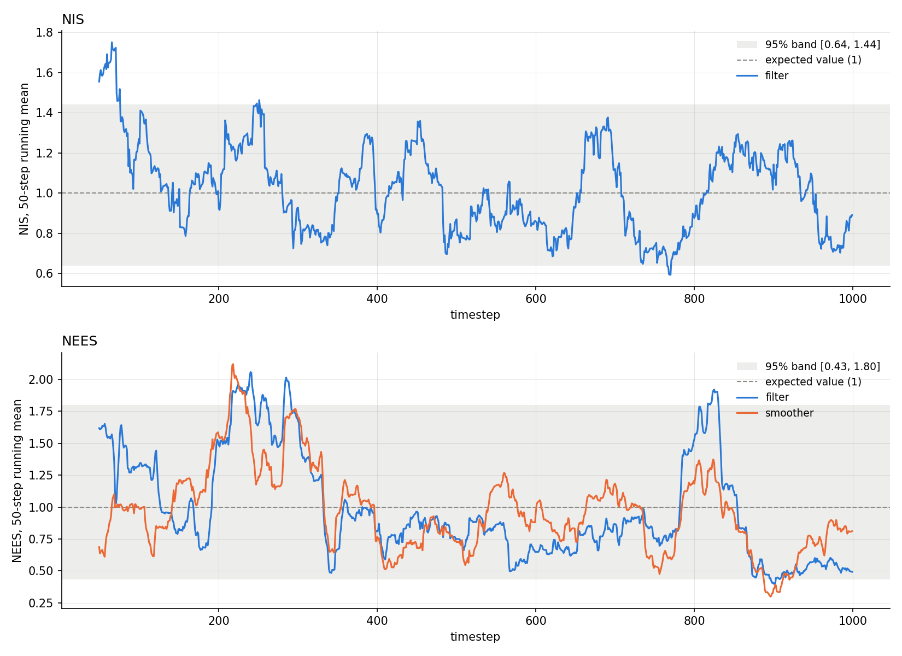

# 1-D random walk

[Back to the overview](../../README.md) | [Next: 2-D random walk](../2D/README.md)

The first end-to-end test of the filter and the smoother, on the simplest model
there is. The filter is given exactly the model the data was simulated from (a
_matched_ model), so if the implementation is right the estimates should be
accurate and consistent. If they are not, the bug is in the code, not in a
modelling choice.

|               |                                         |
| ------------- | --------------------------------------- |
| **Status**    | done, all three consistency checks pass |
| **Run**       | 1000 timesteps, seed 42                 |
| **Reproduce** | see [Reproduce](#reproduce)             |

## Setup

A 1-D random walk observed directly:

```
x_k = x_{k-1} + w_k,   w_k ~ N(0, q)    ->   F = 1, Q = q
z_k = x_k     + v_k,   v_k ~ N(0, r)    ->   H = 1, R = r
```

| parameter  | value    | meaning                    |
| ---------- | -------- | -------------------------- |
| `q`        | 0.05     | process noise variance     |
| `r`        | 0.5      | measurement noise variance |
| `x0`, `p0` | 0.0, 1.0 | prior mean and variance    |
| timesteps  | 1000     |                            |

- `q` and `r` are declared once in `main.cpp` and handed to both the simulator
  and the filter, so the filter's model matches the truth by construction.
- The true initial state is drawn from the prior `N(x0, p0)`, so the prior is
  honest from the first step.
- The Kalman filter runs predict then update at every timestep, starting from
  the prior. The RTS smoother then runs backward over the stored filter output,
  starting from the last filtered estimate.

## Reproduce

To regenerate the figures and statistics from the stored data:

```bash
python3 scripts/analyze_1d.py results/1D/data
```

To regenerate the data as well, set `dim = 1` and `timesteps = 1000` at the top
of `main()` in `src/main.cpp`, then:

```bash
cmake --build build && ./build/kalman_filtering_and_smoothing   # writes data/
cp data/*.csv results/1D/data/
python3 scripts/analyze_1d.py results/1D/data                   # writes results/1D/figures/
```

## Data

`data/` holds three CSV files with one row per timestep and a shared `timestep`
column, so they can be joined on it. The column layout is documented in
`lib/results.hpp`.

| file           | columns                                                                                     |
| -------------- | ------------------------------------------------------------------------------------------- |
| `truth.csv`    | `timestep, x_true_0, z_0`                                                                   |
| `filter.csv`   | `timestep, x_predicted_0, P_predicted_0_0, x_updated_0, innovation_0, S_0_0, P_updated_0_0` |
| `smoother.csv` | `timestep, x_smoothed_0, P_smoothed_0_0`                                                    |

`S` is the innovation covariance, kept so that NIS can be computed later.

## Results

`figures/` holds all 13 figures the analysis script produces: four trajectory
views for each of the first 150, 500 and 1000 timesteps, plus the consistency
figure. The ones used below are the first 500 timesteps of the run.

The problem: a hidden random walk and the noisy measurements of it.



The Kalman filter with its 95% confidence band. It tracks, but lags at the turns
and inherits visible jitter from the measurements, because each estimate only
knows the past.



The RTS smoother over the same data. Each estimate uses the whole record, so it
is smoother, closer to truth, and reports a narrower band.



Side by side, at three zoom levels. The smoother's band is about 76% as wide as
the filter's (its variance is about 58% of the filter's).







|          | RMSE   | mean P |
| -------- | ------ | ------ |
| filter   | 0.3648 | 0.1354 |
| smoother | 0.2736 | 0.0783 |

The smoother's RMSE is 25% lower and its mean `P` is 42% lower.

## Filter vs smoother variance



The smoother's reported variance is never larger than the filter's, and the two
are equal at the final timestep, matching Figure 12.2 in Sarkka's _Bayesian
Filtering and Smoothing_ for this exact example (a Gaussian random walk).
It's a property of the RTS recursion itself, since the smoother's covariance
update only ever subtracts a positive semi-definite term from the filter's, so
therefore it's more of a check on the implementation, not on the data.

## Consistency



Top panel is NIS, bottom is NEES, both as a 50-step running mean. The dashed line
is the expected value of the statistic (`E[chi2_dof] = dof`) and the
shaded region is the 95% band, widened to account for autocorrelation in NEES.

| statistic      | value  | 95% band         | verdict    |
| -------------- | ------ | ---------------- | ---------- |
| ANIS           | 1.0313 | [0.9118, 1.0922] | consistent |
| ANEES filter   | 0.9840 | [0.8520, 1.1597] | consistent |
| ANEES smoother | 0.9563 | [0.8614, 1.1488] | consistent |

## Takeaways and limits

- With a matched model, the filter and the smoother are both consistent, and the
  smoother is more accurate and more confident, as it should be. That is good
  evidence that the predict/update step and the RTS backward recursion are
  implemented correctly, within the limits below.
- This is a single run of one seed. A proper consistency test needs a Monte
  Carlo over many seeds; that is on the roadmap in the overview.
