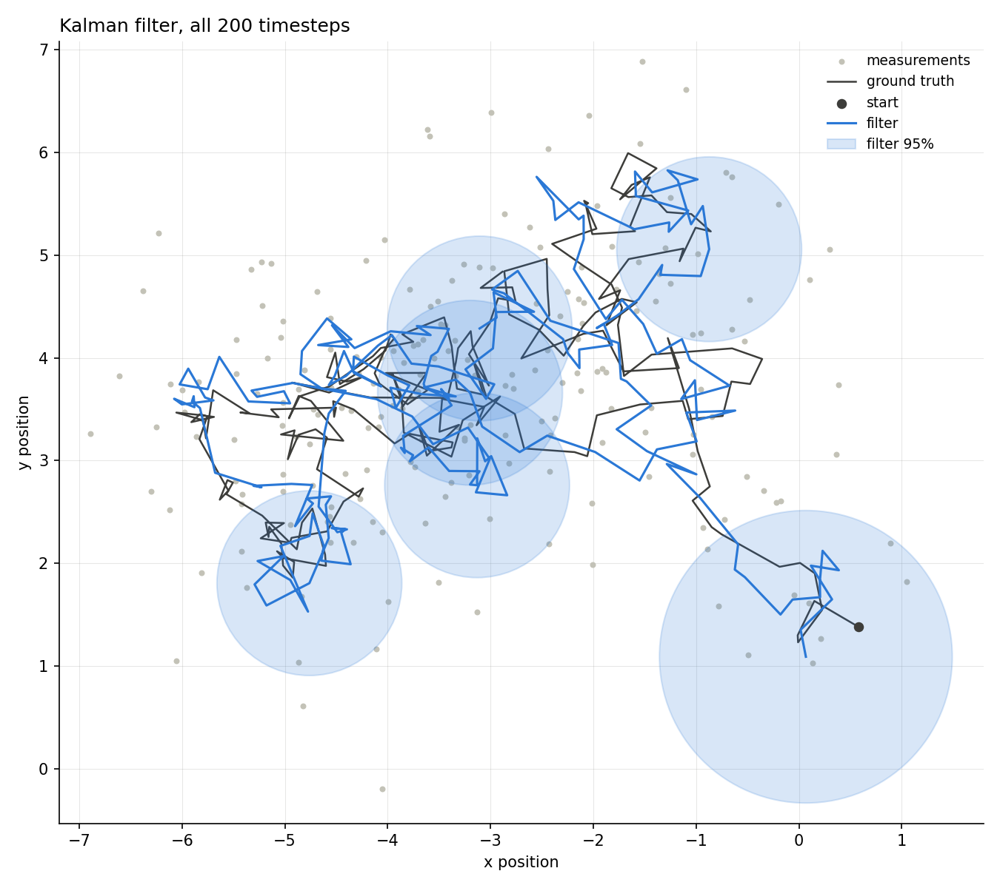
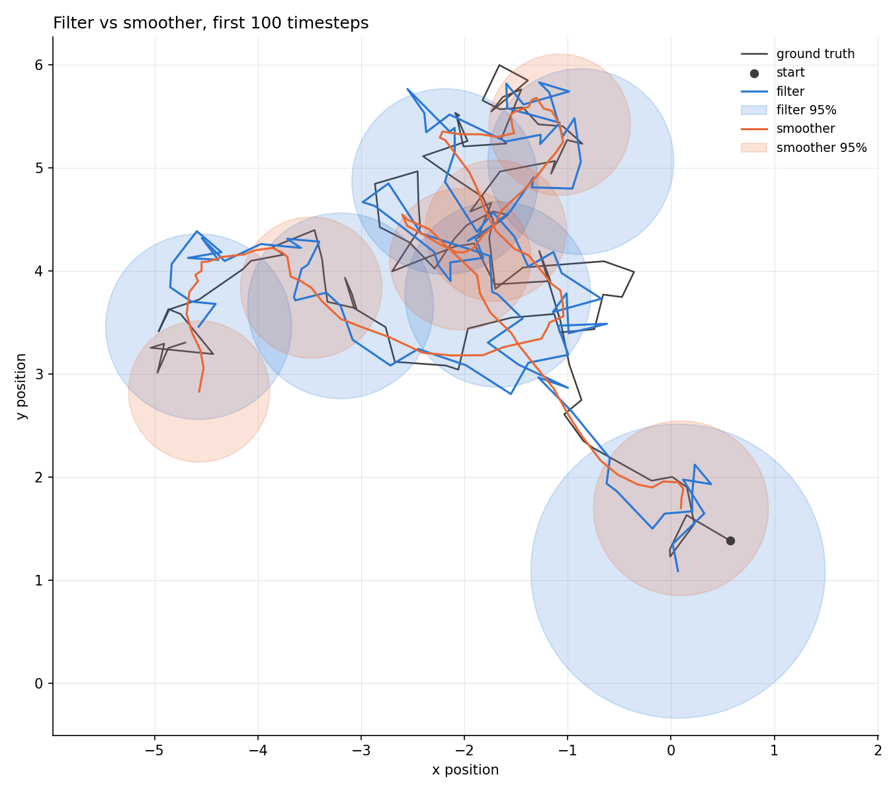
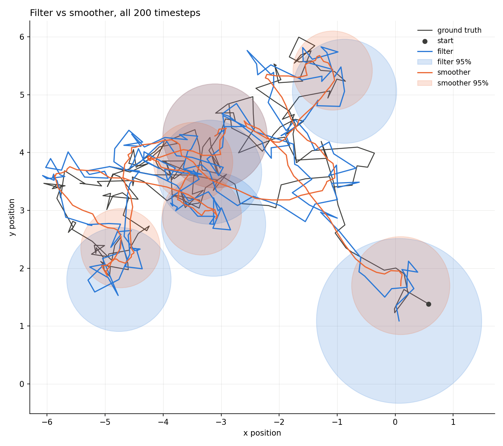
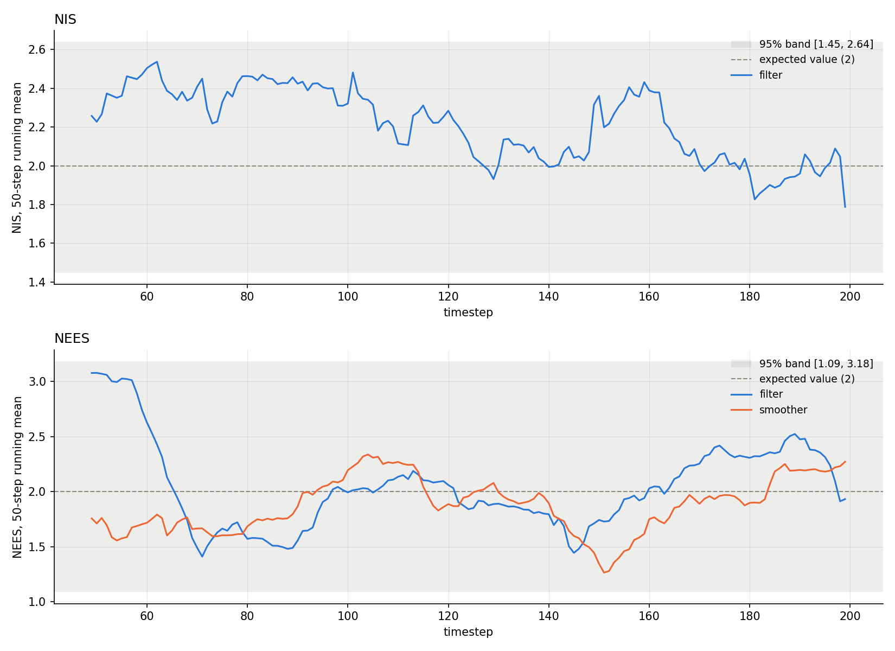

# 2-D random walk

[Back to the overview](../../README.md) | [Previous: 1-D random walk](../1D/README.md)

The same experiment as [the 1-D run](../1D/README.md), with a 2-D state. This is
the first run with real vectors and covariance matrices, and the first where
covariance ellipses can be drawn.

|               |                                         |
| ------------- | --------------------------------------- |
| **Status**    | done, all three consistency checks pass |
| **Run**       | 200 timesteps, seed 42                  |
| **Reproduce** | see [Reproduce](#reproduce)             |

## Setup

A 2-D random walk observed directly:

```
x_k = x_{k-1} + w_k,   w_k ~ N(0, Q)    ->   F = I_2, Q = q * I_2
z_k = x_k     + v_k,   v_k ~ N(0, R)    ->   H = I_2, R = r * I_2
```

| parameter  | value       | meaning                              |
| ---------- | ----------- | ------------------------------------ |
| `q`        | 0.05        | process noise variance, per axis     |
| `r`        | 0.5         | measurement noise variance, per axis |
| `x0`, `P0` | [0, 0], I_2 | prior mean and covariance            |
| timesteps  | 200         |                                      |

`Q`, `R` and `P0` are all multiples of the identity, so the two axes are
independent copies of the 1-D problem and the confidence regions are circles
here. They only become proper ellipses once the two axes differ or couple, for
example with different noise per axis such as would be the case in a coordinated
turn (CT) model or constant velocity (CV) model. As in the 1-D run, the filter's
model matches the simulator's, and the true initial state is drawn from the
prior.

The 200 steps are shorter than the 1-D run's 1000 because the trajectory plots
become unreadable at length, and this is enough for a first check.

## Reproduce

To regenerate the figures and statistics from the stored data:

```bash
python3 scripts/analyze_2d.py results/2D/data
```

To regenerate the data as well, set `dim = 2` and `timesteps = 200` at the top of
`main()` in `src/main.cpp`, then:

```bash
cmake --build build && ./build/kalman_filtering_and_smoothing   # writes data/
cp data/*.csv results/2D/data/
python3 scripts/analyze_2d.py results/2D/data                   # writes results/2D/figures/
```

The analysis assumes state components 0 and 1 are the x and y position.

## Data

`data/` holds three CSV files with one row per timestep and a shared `timestep`
column. Matrices are flattened row-major. The column layout is documented in
`lib/results.hpp`.

| file           | columns (n = 2 state dimensions, m = 2 measurement dimensions)                                                                  |
| -------------- | ------------------------------------------------------------------------------------------------------------------------------- |
| `truth.csv`    | `timestep`, `x_true_0..1`, `z_0..1`                                                                                             |
| `filter.csv`   | `timestep`, `x_predicted_0..1`, `P_predicted_0_0..1_1`, `x_updated_0..1`, `innovation_0..1`, `S_0_0..1_1`, `P_updated_0_0..1_1` |
| `smoother.csv` | `timestep`, `x_smoothed_0..1`, `P_smoothed_0_0..1_1`                                                                            |

`S` is the innovation covariance, kept so that NIS can be computed later.

## Results

`figures/` holds all 13 figures the analysis script produces: four trajectory
views for each of the first 50, 100 and 200 timesteps, plus the consistency
figure. Estimates are drawn as paths, with 95% confidence ellipses
(`chi2.ppf(0.95, 2) = 5.991`) built from the position block of `P` at six evenly
spaced timesteps.

The problem: a hidden 2-D random walk (black, the dot is where it starts) and the
noisy measurements of it (grey).


The Kalman filter. The first ellipse is large because the prior is `P0 = I`; once
measurements have come in it settles at a constant size.



The RTS smoother over the same data. Its path is smoother and closer to the
truth, and its ellipses are smaller, including at the start, where it can use
every later measurement.


Side by side over the first 50, 100 and all 200 timesteps. The shorter windows
make the individual ellipses readable.






|          | RMSE   | mean trace P |
| -------- | ------ | ------------ |
| filter   | 0.5450 | 0.2738       |
| smoother | 0.3875 | 0.1583       |

RMSE is taken over the Euclidean position error, so it counts both axes. The
smoother's RMSE is 29% lower and its mean `trace(P)` is 42% lower.

## Consistency



Same layout as the 1-D figure. Both statistics have 2 degrees of freedom, so the
expected value is 2. The running mean needs a full 50-step window, so the first
49 steps are not drawn, which is a quarter of this shorter run.

| statistic      | value  | 95% band         | verdict    |
| -------------- | ------ | ---------------- | ---------- |
| ANIS           | 2.1678 | [1.7127, 2.3092] | consistent |
| ANEES filter   | 2.1842 | [1.5081, 2.5602] | consistent |
| ANEES smoother | 1.8951 | [1.5883, 2.4585] | consistent |

ANIS and the filter's ANEES sit a little above 2 but inside their bands. This is
a single 200-step run, so it is a sanity check; the Monte Carlo over seeds on the
roadmap is the proper test.

## Takeaways and limits

- The results agree with the 1-D run. Per axis, the mean `P` is 0.137 (filter)
  and 0.079 (smoother), against 0.135 and 0.078 in 1-D. The small excess is
  consistent with the start-up transient being a larger share of a 200-step run.
- Because every matrix is a multiple of the identity, the off-diagonal terms of
  `P` are exactly zero and this run cannot catch an error in the order of matrix
  products (for example in the smoother gain, `K = P_filter F^T P_predicted^-1`).
  The CV model, where `F` couples position and velocity, is the first real test
  of that.
- Single run, single seed; see the roadmap for the Monte Carlo.
