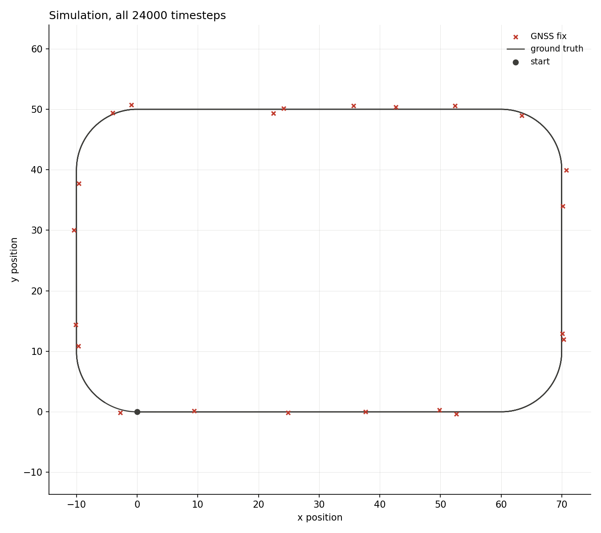
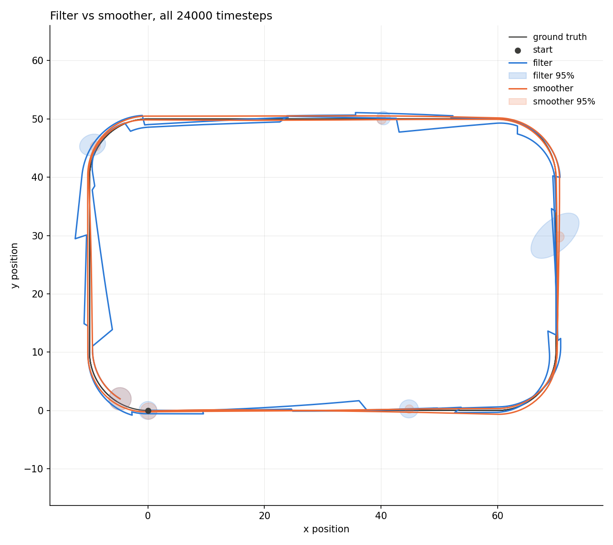
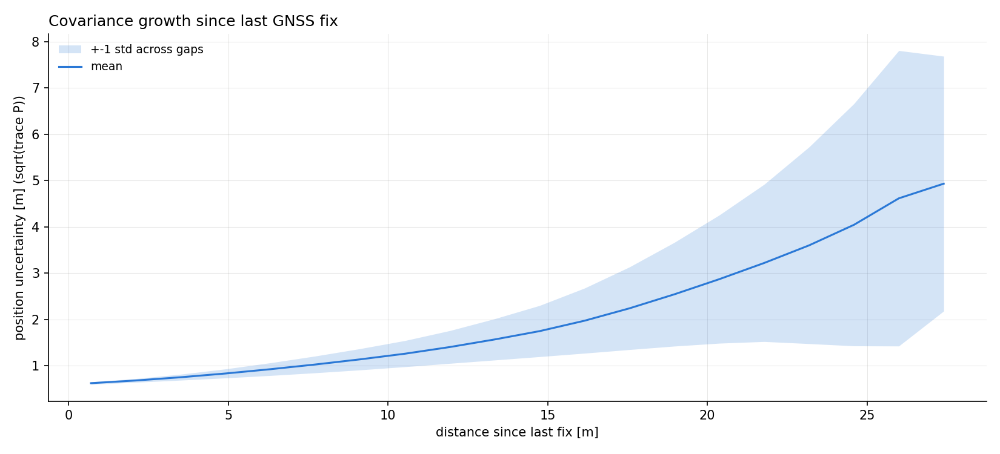
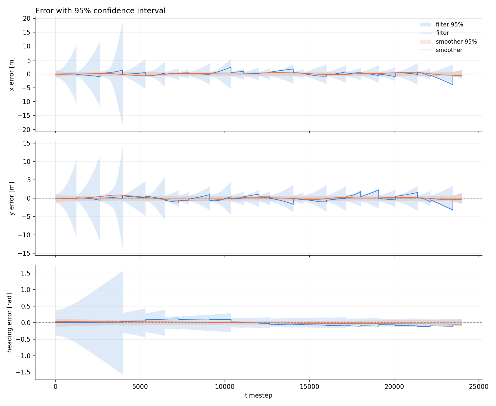
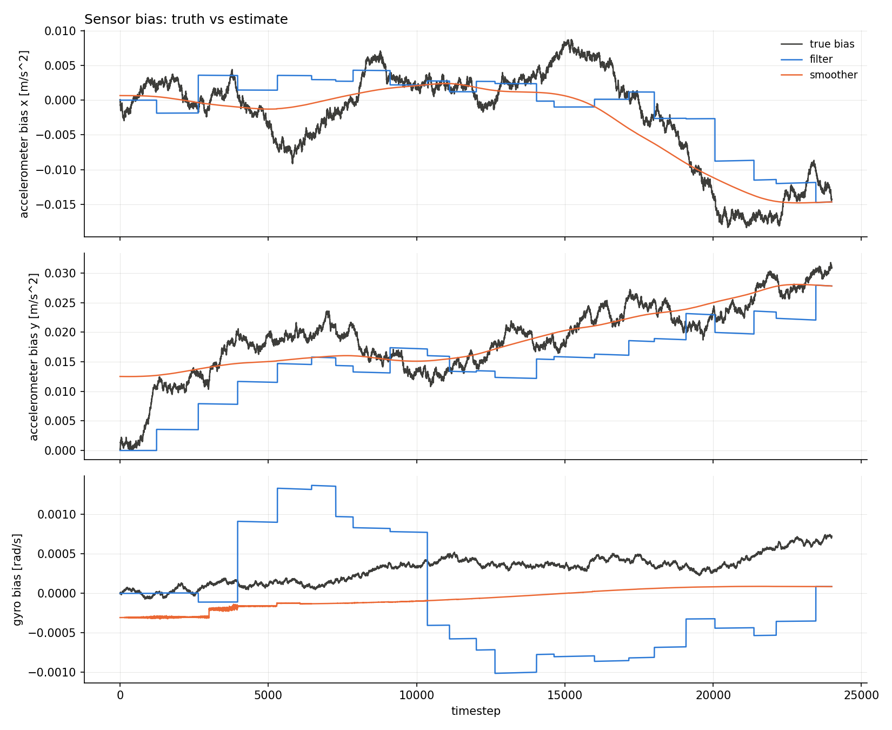
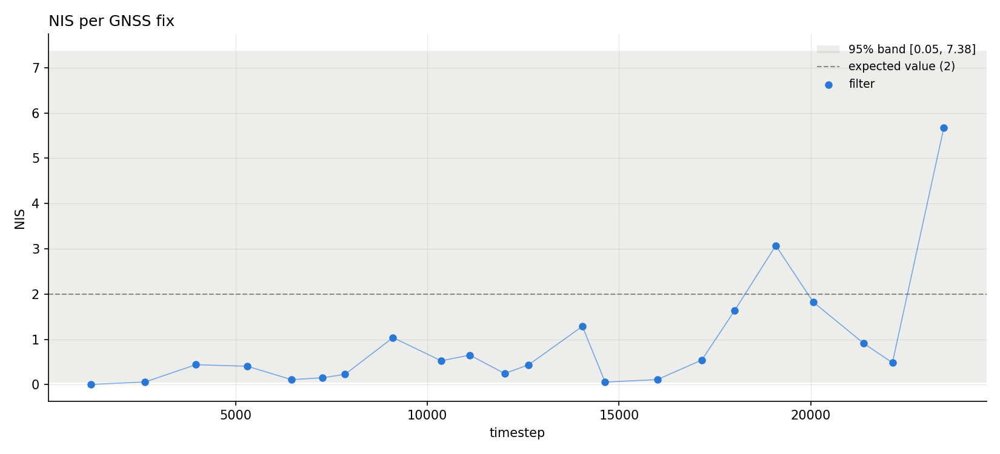
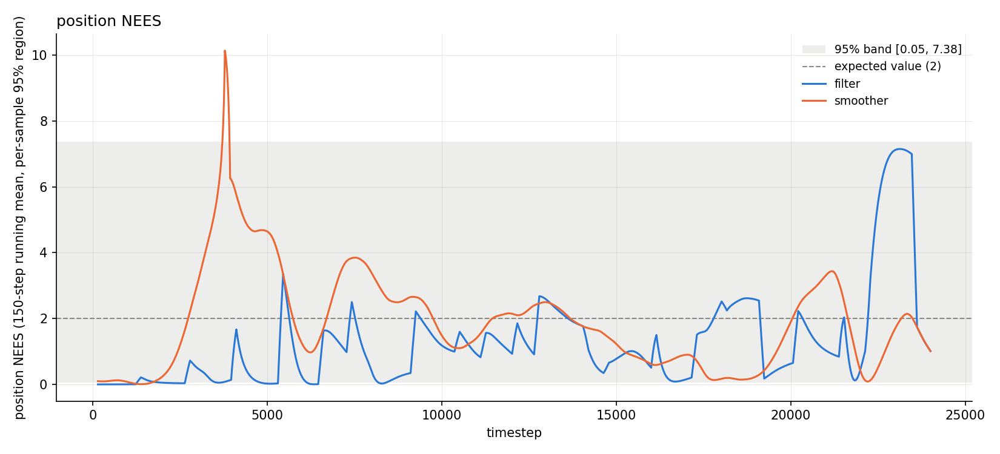

# 2-D strapdown INS

[Back to the overview](../../README.md) | [Previous: 2-D random walk](../2D/README.md) | [Next: short GNSS gaps](../2D_INS_short_gnss/README.md)

The first end-to-end test of the nonlinear side of the project: an 8-state
strapdown INS (`[x, y, psi, u, v, b_ax, b_ay, b_gyro]`), driven by a simulated
IMU with its own Gauss-Markov biases, aided by GNSS position fixes that arrive
at irregular intervals rather than every timestep. The filter's own model of
the IMU noise is matched to what's actually simulated here. An inconsistent
(deliberately mistuned) run is planned as a follow-up, see
[Next](#next).

|               |                                                  |
| ------------- | ------------------------------------------------ |
| **Status**    | done, matched model, mostly consistent            |
| **Run**       | 24000 timesteps (4 minutes at dt=0.01s), seed 42  |
| **Reproduce** | see [Reproduce](#reproduce)                       |

## Setup

A rounded-rectangle track (an 80m x 50m "four corner test" with 10m fillets),
traced at a constant 2 m/s, starting at the origin heading +x. The truth
trajectory is generated directly from the path's closed-form geometry (see
`lib/trajectory.hpp`), not by integrating the motion model, so position and
heading truth are exact; only the sensor biases are genuinely stochastic
(simulated with the `GaussMarkov` process in `lib/simulation.hpp`).

| parameter | value | meaning |
| --- | --- | --- |
| gyro bias instability | 5e-7 (rad/s)^2 | ~146 deg/hr, deliberately worse than a real MEMS IMU |
| accel bias instability | 5e-4 (m/s^2)^2, both axes | ~2.3 mg |
| gyro / accel bias time constant | 1000s | slow enough to look like a near-constant offset over one run |
| GNSS position noise | 0.25 m^2 | 1-sigma ~0.5m |
| GNSS period | uniform(5, 15)s | irregular, not fixed-rate |

The IMU noise is deliberately exaggerated relative to a real sensor (see the
`configs/strapdown_ins_2D.yaml` comments) so bias effects are visible within a
few-minute run instead of needing tens of minutes. The filter's own belief
about this noise (the `filter_*` config keys) is set equal to the values
above in this run: a matched model, the nonlinear analogue of the 1-D and
2-D random walk experiments.

## Reproduce

To regenerate the figures and statistics from the stored data:

```bash
python3 scripts/analyze_ins_2d.py results/2D_INS/data
```

To regenerate the data as well, copy `results/2D_INS/config.yaml` over
`configs/strapdown_ins_2D.yaml` (the live config has since moved on to later
experiments), then:

```bash
cmake --build build
./build/kalman_filtering_and_smoothing   # writes data/
cp data/*.csv results/2D_INS/data/
python3 scripts/analyze_ins_2d.py results/2D_INS/data   # writes results/2D_INS/figures/
```

## Data

`data/` holds `truth.csv`, `filter.csv` and `smoother.csv` with one row per
timestep (column layout documented in `lib/results.hpp`), plus
`gnss_fixes.csv`, one row per timestep that actually got a real GNSS update.
`truth.csv`'s `z` column is written every timestep, but the filter only
ever consumes it on the ~20-odd rows `gnss_fixes.csv` names.

## Results



The track and the 22 irregularly-spaced GNSS fixes that landed on it.



Filter and smoother against truth, with 95% position confidence ellipses at a
few points each. The filter's dead-reckoning sawtooth between fixes is
visible on the left and right straights; the smoother, using the whole
record, tracks the corner much more tightly.



Filter position uncertainty against distance travelled since the last GNSS
fix, every inter-fix gap pooled together by binned distance rather than shown
as one cherry-picked example. Growth is roughly linear out to about 15m, then
accelerates, consistent with uncertainty compounding through the
heading/velocity coupling on the longer gaps.





The true bias is small and close to flat (as configured); the filter visibly
chases it in steps between GNSS corrections, the smoother converges to a much
steadier estimate.

## Consistency




|                        | value  | band             | verdict      |
| ---------------------- | ------ | ---------------- | ------------ |
| ANIS                   | 0.9049 | [1.0550, 3.2422] | INCONSISTENT |
| ANEES position filter  | 1.2637 | [0.9190, 3.4941] | consistent   |
| ANEES position smoother| 1.8960 | [1.5862, 2.4611] | consistent   |

RMSE: filter 1.1210m, smoother 0.4607m.

Two things worth knowing when reading this table (see the conversation this
came out of for the full derivation): the "band" width is not fixed per
statistic, it depends on how many *effectively independent* samples that
statistic actually has once autocorrelation is accounted for: NIS only has
the ~22 real GNSS fixes to work with, so its band stays fairly wide, while
position NEES (24000 raw, but correlated) lands somewhere in between. ANIS
sitting just below its band here means the filter's innovations are on
average slightly smaller than its own reported `S` predicts (mild
overconfidence in the wrong direction), worth watching across more runs,
not alarming on its own with this few effective samples behind it.

## Takeaways and limits

- Matched model, single seed, single trajectory: the nonlinear-model analogue
  of the 1-D/2-D "does the implementation work at all" check. It does.
- The smoother's covariance update has no algebraic PSD guarantee the way the
  filter's Joseph-form update does, and does go indefinite on some runs
  (masked out of NEES rather than counted as inconsistent when it happens,
  see `analyze_ins_2d.py`'s `masked_quadratic_form`), not a problem in this
  particular run, but a known fragility worth keeping in mind.
- GNSS period is fixed at uniform(5, 15)s here; the plan is to test both much
  shorter and much longer gaps next.

## Next

Planned follow-up experiments, not yet run:

- Deliberately mistune the `filter_*` noise keys against the true ones, to
  produce and document a genuinely inconsistent filter for contrast.
- Very short and very long GNSS periods, to see consistency and the
  covariance-growth-vs-distance relationship at both extremes.
