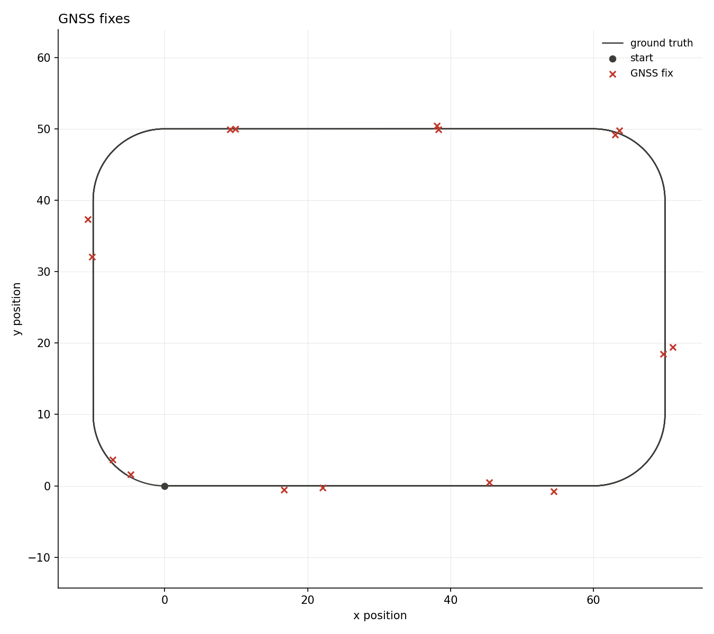
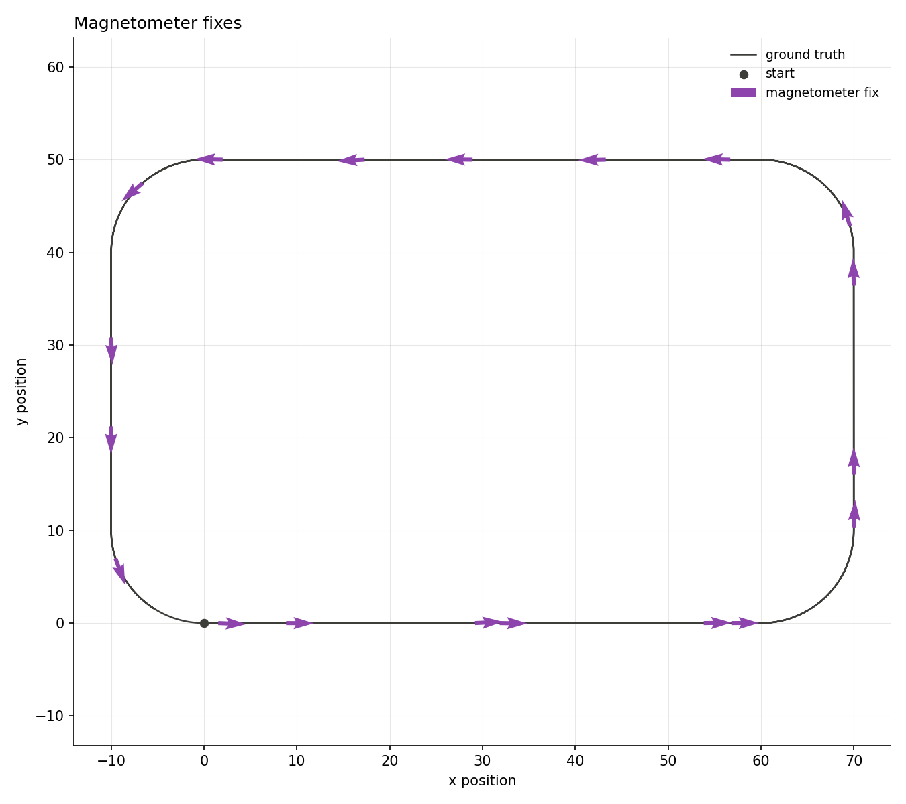
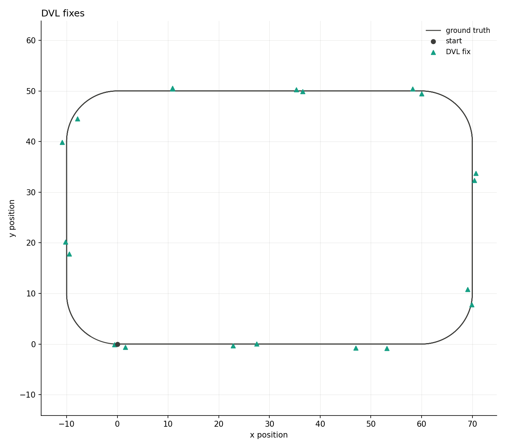
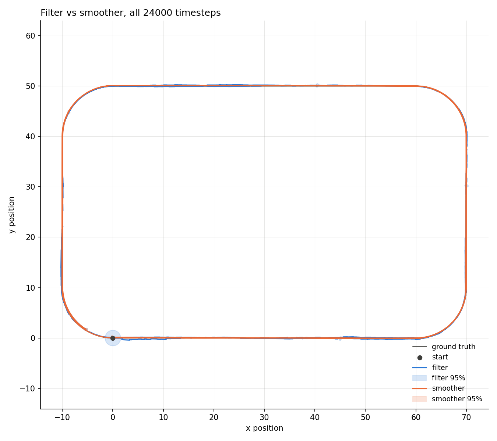
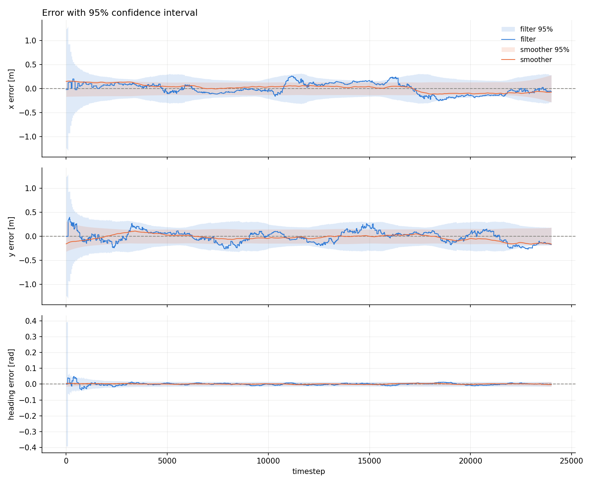
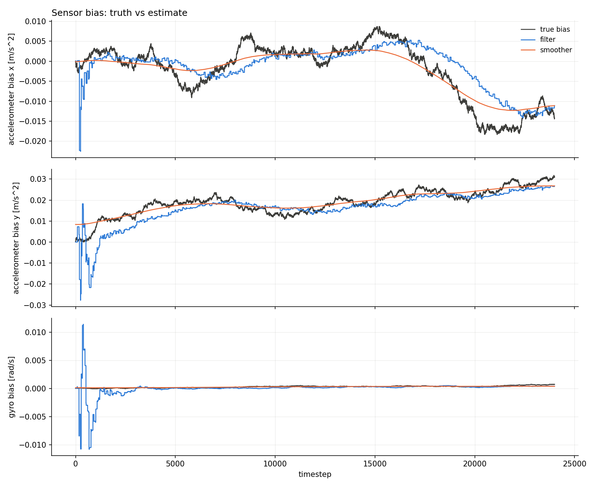
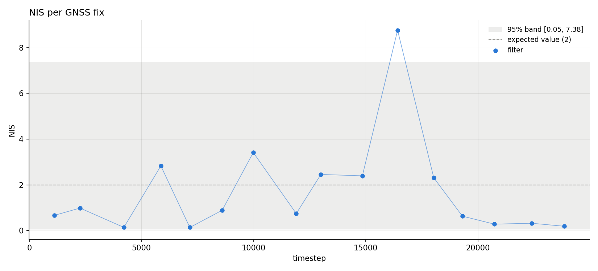
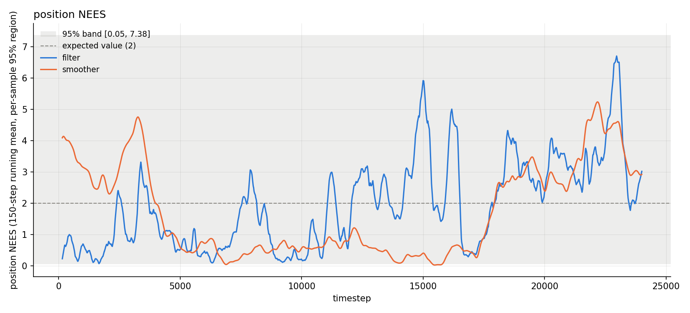

# 2-D strapdown INS, multi-sensor fusion

[Back to the overview](../../README.md) | [Previous: short GNSS gaps](../2D_INS_short_gnss/README.md)

Adds two more aiding sensors on top of the [GNSS-only baseline](../2D_INS/README.md):
a magnetometer (heading only) and a DVL (position and body-frame velocity),
each firing on its own independent uniform-random schedule. Within a
timestep, whichever sensors are due update the same filter in turn, each
using whatever `x`/`P` the previous update that step already produced. By
the time this run was made the live config had also moved the GNSS period
and noise on from both earlier baselines (see the table below), so this
isn't a single-isolated-variable comparison against them, it's the next
baseline going forward.

|               |                                                  |
| ------------- | ------------------------------------------------ |
| **Status**    | done, consistent                                  |
| **Run**       | 24000 timesteps (4 minutes at dt=0.01s), seed 42  |
| **Reproduce** | see [Reproduce](#reproduce)                       |

## Setup

Same track, IMU noise and seed as the [baseline run](../2D_INS/README.md#setup).
The `filter_*` gyro/accelerometer noise keys carry the same mild,
unintentional mismatch noted in the
[short GNSS gaps run](../2D_INS_short_gnss/README.md#setup)
(`filter_gyro_noise_variance` 8e-7 vs true 5e-7,
`filter_accelerometer_noise_variance` [7e-4, 7e-4] vs true [5e-4, 5e-4]).

| sensor       | noise                                              | period            | fixes this run |
| ------------ | --------------------------------------------------- | ----------------- | --------------- |
| GNSS         | 0.20 m^2 (1-sigma ~0.45m)                            | uniform(10, 20)s  | 16               |
| Magnetometer | 1e-3 rad^2 (1-sigma ~1.8deg)                         | uniform(0.25, 1)s | 377              |
| DVL          | 0.5 m^2, 0.5 m^2 position; 1e-4, 1e-4 (m/s)^2 velocity | uniform(0.2, 1)s  | 395              |

GNSS noise/period both moved since the earlier baselines (0.25 m^2 /
uniform(5,15)s there vs 0.20 m^2 / uniform(10,20)s here).

## Reproduce

```bash
python3 scripts/analyze_ins_2d.py results/2D_INS_multi_sensor/data
```

To regenerate the data, copy `results/2D_INS_multi_sensor/config.yaml` over
`configs/strapdown_ins_2D.yaml`, then follow the same steps as the
[baseline run's reproduce section](../2D_INS/README.md#reproduce).

## Data

Same layout as the baseline, plus `magnetometer_fixes.csv` and
`dvl_fixes.csv`: one row per fix with the raw measurement (`z_*`),
`innovation_*` and `S_*_*` columns. `gnss_fixes.csv` stays timestep-only,
since GNSS's `z` already lives in `truth.csv`.

## Results





Each sensor's own fixes against the track, one plot per sensor rather than
overlaid (all three on one plot drowned out the path). Magnetometer and DVL
fire far more often than GNSS, so only every 20th fix is drawn: GNSS shows
all 16, the others a representative sample of their ~380-400.



With DVL and magnetometer aiding between GNSS fixes, the filter's
dead-reckoning sawtooth from the [baseline](../2D_INS/README.md#results) is
gone; filter and smoother both track the truth closely throughout.




## Consistency




|                         | value  | band              | verdict    |
| ----------------------- | ------ | ----------------- | ---------- |
| ANIS                    | 1.6973 | [1.0273, 3.2912]  | consistent |
| ANEES position filter   | 1.9453 | [1.0570, 3.2386]  | consistent |
| ANEES position smoother | 1.7339 | [0.0000, 17.0308] | consistent |

RMSE: filter 0.1647m, smoother 0.1023m.

## Takeaways and limits

- All three consistency checks pass, and both RMSE figures are far lower
  than either single-GNSS baseline (1.12m / 1.12m to 0.50m filter RMSE
  there, 0.16m here), as expected with DVL and magnetometer filling the
  long GNSS gaps. Not a clean ablation though: GNSS's own noise and period
  changed at the same time (see Setup), so the improvement can't be
  attributed to the new sensors alone from this run.
- Single seed, single trajectory, and the same unintentional `filter_*`
  mismatch carried over from the short-GNSS run.
- Sequential same-step updates (predict once, then each due sensor updates
  in turn on whatever the previous one left) haven't broken consistency
  here, but this run doesn't stress multiple sensors firing in the same
  step particularly hard given how different their periods are.

## Next

Planned follow-up experiments, not yet run:

- Ablate DVL and magnetometer one at a time against a held-fixed GNSS
  schedule, to isolate each sensor's actual contribution.
- Deliberately mistune the `filter_*` noise keys against the true ones, to
  produce and document a genuinely inconsistent filter for contrast.
- The still-pending "very long GNSS gap" counterpart to the short-gap run.
