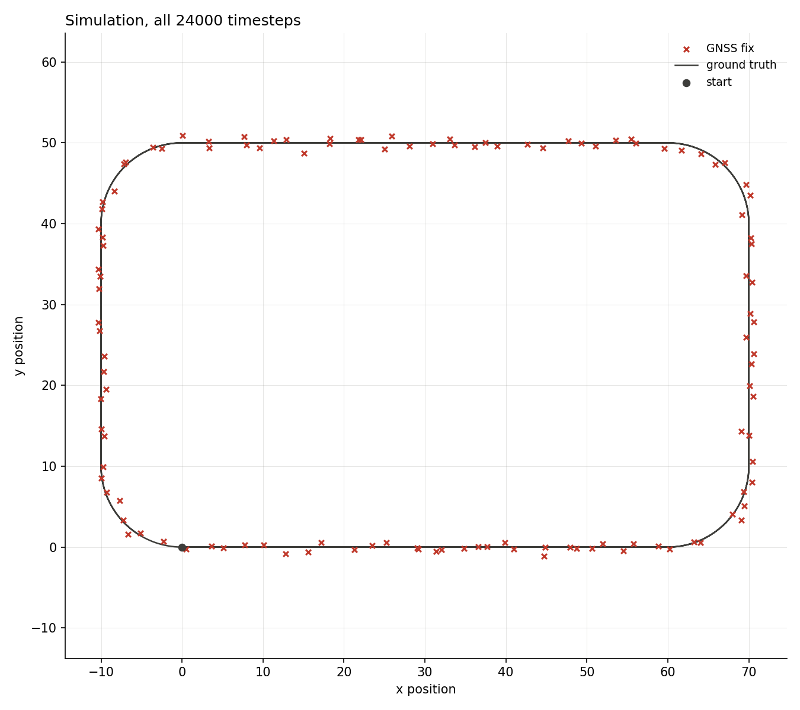
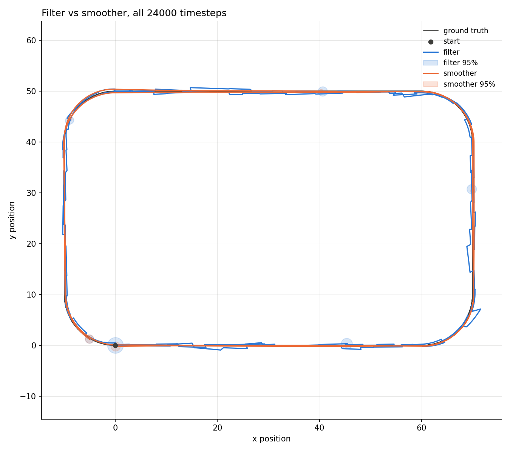

# 2-D strapdown INS, short GNSS gaps

[Back to the overview](../../README.md) | [Previous: 2-D strapdown INS](../2D_INS/README.md)

The "very short" half of a planned pair testing how GNSS fix frequency
affects consistency and accuracy. GNSS period dropped from uniform(5, 15)s
in the [baseline run](../2D_INS/README.md) to uniform(1, 3)s here, everything
else the same. The "very long" counterpart is still to come.

|               |                                                  |
| ------------- | ------------------------------------------------ |
| **Status**    | done, consistent                                  |
| **Run**       | 24000 timesteps (4 minutes at dt=0.01s), seed 42  |
| **Reproduce** | see [Reproduce](#reproduce)                       |

## Setup

Same track, same IMU noise and same seed as the
[baseline run](../2D_INS/README.md#setup), with two changes:

| parameter    | baseline        | this run        |
| ------------ | --------------- | ---------------- |
| GNSS period  | uniform(5, 15)s | uniform(1, 3)s   |
| GNSS fixes   | 22              | 118              |

One thing worth flagging: by the time this run was made, `filter_*` had
already drifted slightly from the true IMU noise (`filter_gyro_noise_variance`
8e-7 vs true 5e-7, `filter_accelerometer_noise_variance` [7e-4, 7e-4] vs true
[5e-4, 5e-4]), a mild, unintentional mismatch, not the deliberate one still
planned. It doesn't seem to have hurt consistency here; worth re-running with
a clean match if that ever becomes a question.

## Reproduce

```bash
python3 scripts/analyze_ins_2d.py results/2D_INS_short_gnss/data
```

To regenerate the data, copy `results/2D_INS_short_gnss/config.yaml` over
`configs/strapdown_ins_2D.yaml`, then follow the same steps as the
[baseline run's reproduce section](../2D_INS/README.md#reproduce).

## Results



118 fixes at roughly one every 2s, dense enough that individual markers blur
together along the straights.



No visible sawtooth this time. The filter never travels far enough between
fixes to leave the well-behaved, roughly-linear part of the covariance growth
curve (see the [baseline's growth plot](../2D_INS/README.md#results)), so it
tracks almost as tightly as the smoother throughout.

## Consistency

|                         | value  | band             | verdict    | baseline verdict |
| ----------------------- | ------ | ---------------- | ---------- | ----------------- |
| ANIS                    | 1.7008 | [1.6627, 2.3680] | consistent | INCONSISTENT      |
| ANEES position filter   | 1.4797 | [1.4518, 2.6346] | consistent | consistent         |
| ANEES position smoother | 2.5127 | [0.0000, 22.7589]| consistent | consistent         |

RMSE: filter 0.50m (was 1.12m), smoother 0.27m (was 0.46m).

The `ANEES position smoother` band is unusually wide here ([0, 22.8] against
the baseline's [1.59, 2.46]) -- the correlation-based effective-sample
estimate it's built on is sensitive to exactly how autocorrelated NEES
happens to be in a given run, and that clearly shifted with the GNSS-period
change. Not a bug, just a reminder that band width itself varies run to run,
not only the statistic being tested.

## Takeaways

- Substantially more accurate (RMSE roughly halved on both filter and
  smoother) and, unlike the baseline, ANIS is now comfortably consistent
  rather than borderline -- more, closer-together corrections give the
  averaging test more effective samples *and* keep the filter on the flat
  part of the growth-vs-distance curve at the same time.
- Still only one seed, one trajectory, and now a mild unintentional
  filter/truth mismatch on top -- see the note in Setup.
