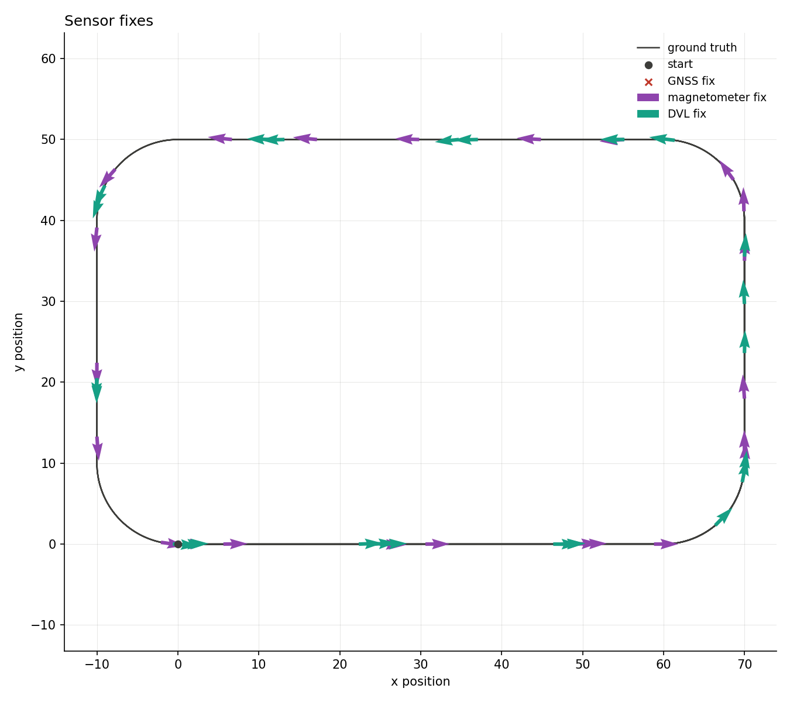
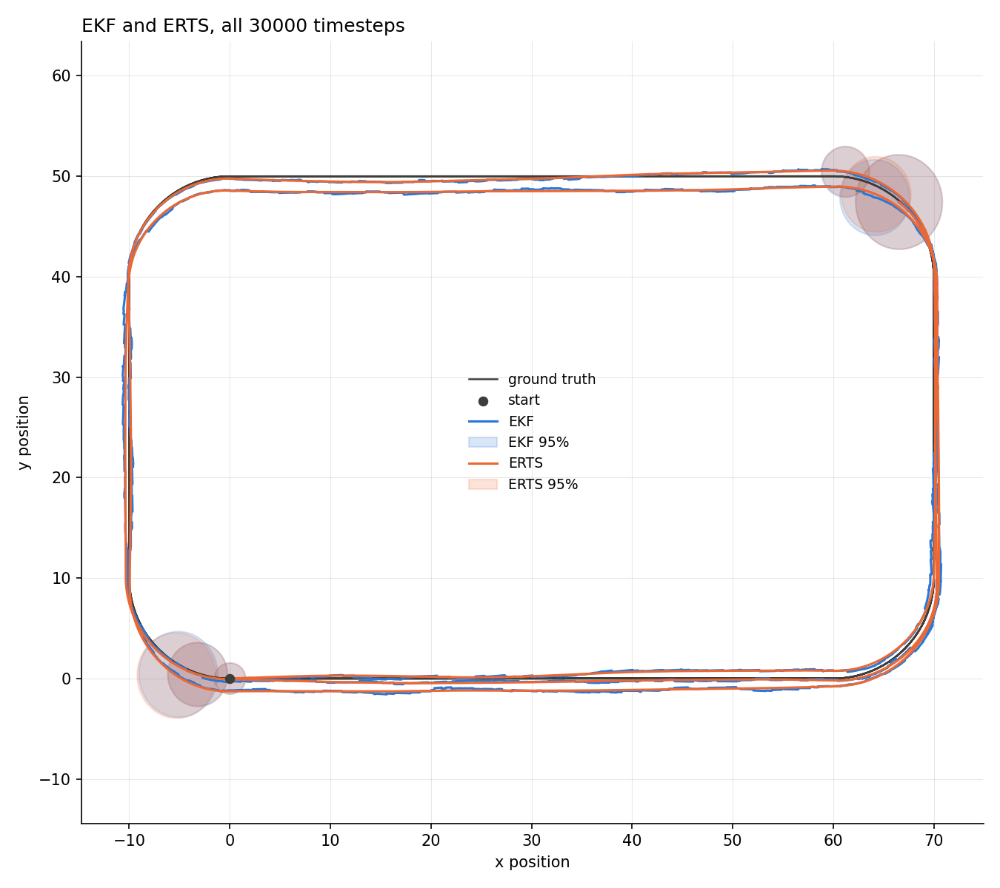
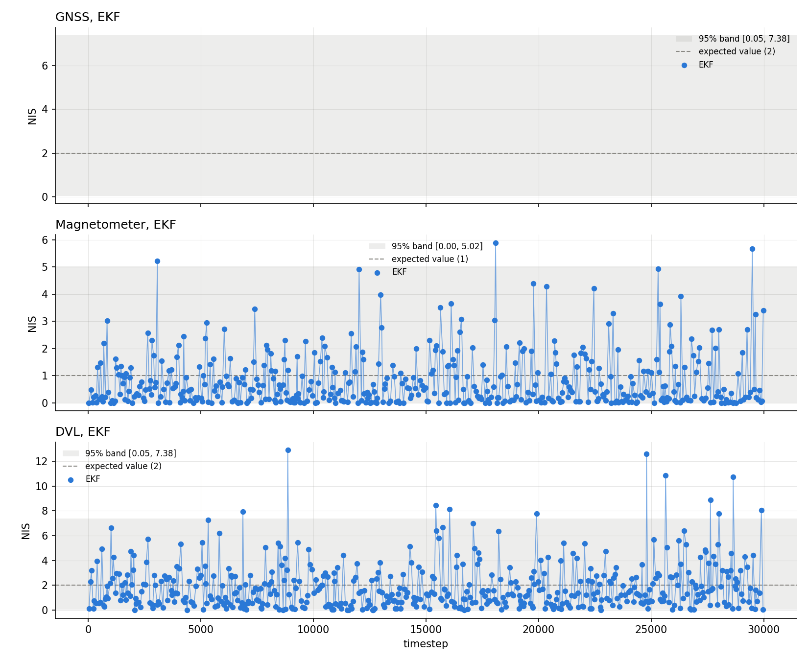
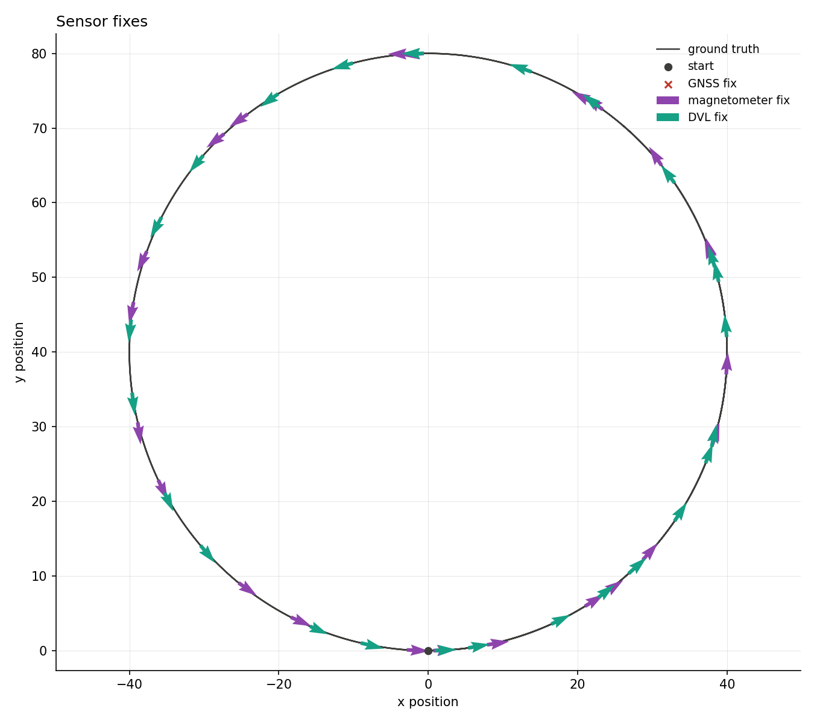
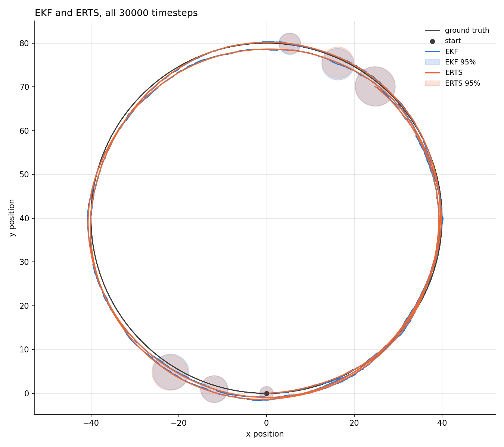
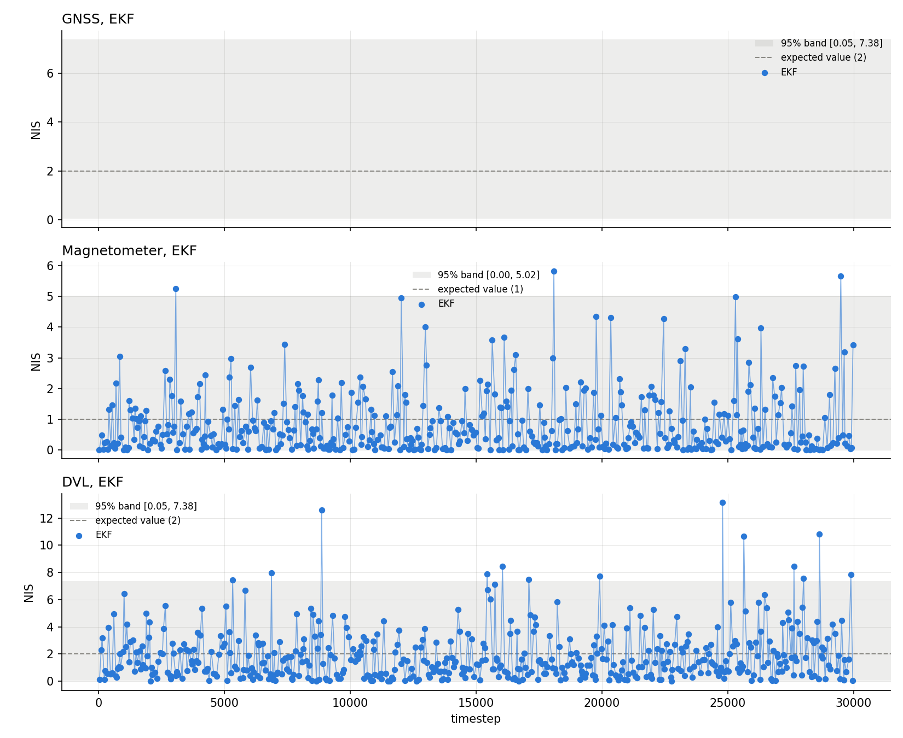
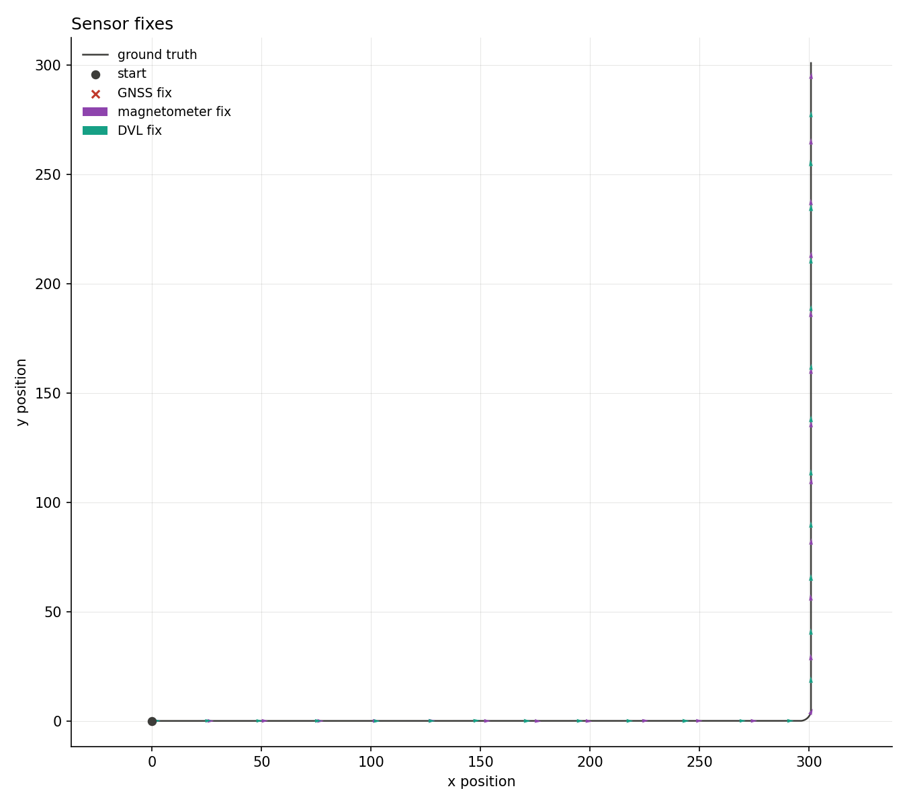
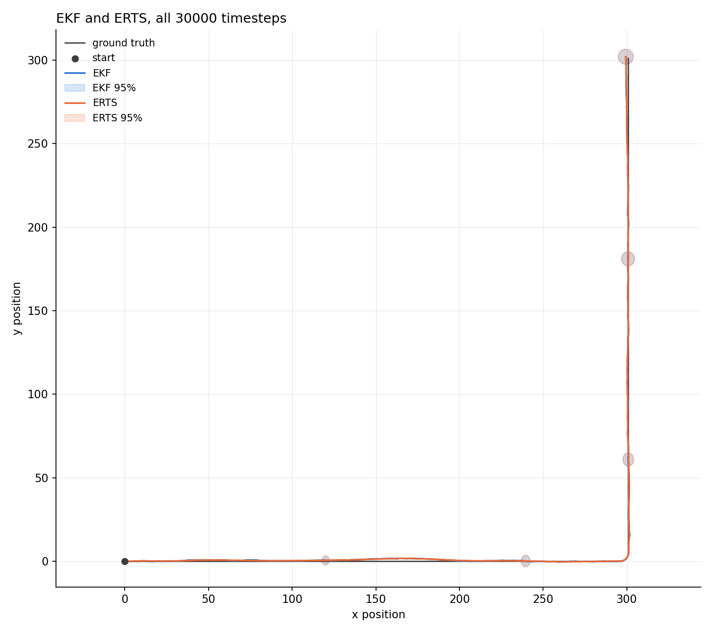
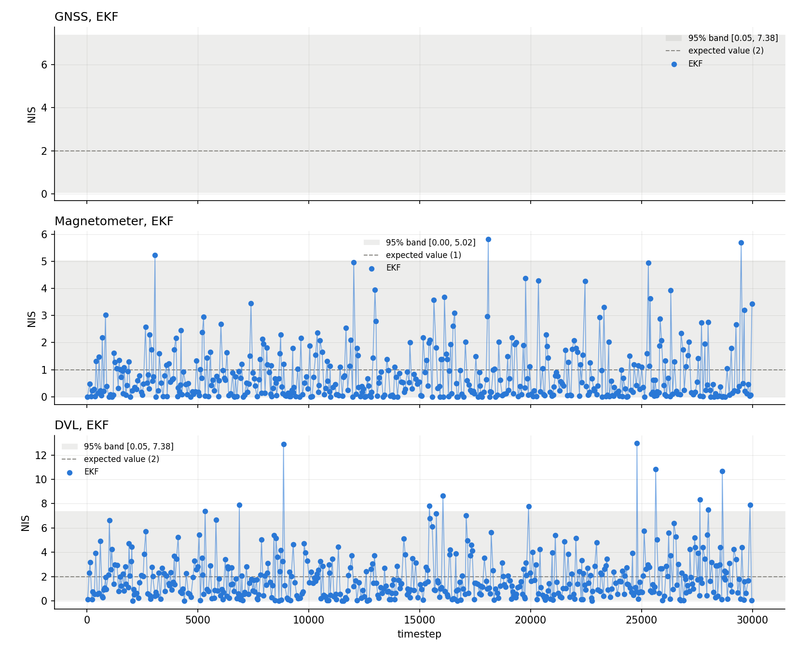

# 2-D strapdown INS, dead reckoning

[Back to the overview](../../../README.md) | [Previous: multi-sensor fusion](../multi_sensor_fusion/README.md) | [Next: GNSS outage](../gnss_outage/README.md)

Third of three scenarios sharing one setup (see
[GNSS only](../only_gnss/README.md#setup) for the shared parameters): GNSS
disabled for the whole run. Magnetometer and DVL active. No
absolute position reference anywhere in the run, genuine dead reckoning,
aided only by heading and body-frame velocity corrections.

|               |                                                  |
| ------------- | ------------------------------------------------ |
| **Status**    | done, position conservative; magnetometer NIS mildly low |
| **Run**       | 30000 timesteps (5 minutes at dt=0.01s), seed 42 |
| **Reproduce** | see [Reproduce](#reproduce)                      |

## Setup

Same shared parameters as [GNSS only](../only_gnss/README.md#setup). This
scenario's own sensor periods:

| sensor       | period            | fixes per run |
| ------------ | ----------------- | ------------- |
| GNSS         | disabled (1e5 s)  | 0             |
| Magnetometer | uniform(0.25, 1)s | ~470          |
| DVL          | uniform(0.2, 1)s  | ~500          |

## Reproduce

```bash
python3 scripts/analyze_ins_2d.py results/INS2D/dead_reckoning/<trajectory>/data
```

To regenerate the data, copy
`results/INS2D/dead_reckoning/<trajectory>/config.yaml` over
`configs/strapdown_ins_2D.yaml`, then follow the same steps as
[GNSS only's reproduce section](../only_gnss/README.md#reproduce).

## Results

### rounded_rectangle





|                         | value  | band             | verdict      |
| ----------------------- | ------ | ---------------- | ------------ |
| ANIS magnetometer       | 0.8112 | [0.8761, 1.1320] | INCONSISTENT |
| ANIS DVL                | 1.8901 | [1.8256, 2.1823] | consistent   |
| ANEES position filter   | 0.3330 | [0.9036, 3.5245] | INCONSISTENT |
| ANEES position smoother | 0.3169 | [0.0506, 7.3778] | consistent   |

RMSE: filter 0.84m, smoother 0.82m. (GNSS: no fixes recorded.)

### circle





|                         | value  | band             | verdict      |
| ----------------------- | ------ | ---------------- | ------------ |
| ANIS magnetometer       | 0.8110 | [0.8760, 1.1321] | INCONSISTENT |
| ANIS DVL                | 1.8863 | [1.8259, 2.1820] | consistent   |
| ANEES position filter   | 0.4903 | [0.8266, 3.6828] | INCONSISTENT |
| ANEES position smoother | 0.4778 | [0.0506, 7.3778] | consistent   |

RMSE: filter 1.01m, smoother 1.00m. (GNSS: no fixes recorded.)

### straight_into_turn





|                         | value  | band             | verdict      |
| ----------------------- | ------ | ---------------- | ------------ |
| ANIS magnetometer       | 0.8110 | [0.8763, 1.1318] | INCONSISTENT |
| ANIS DVL                | 1.8868 | [1.8254, 2.1824] | consistent   |
| ANEES position filter   | 0.3579 | [0.4590, 4.6535] | INCONSISTENT |
| ANEES position smoother | 0.3446 | [0.0506, 7.3778] | consistent   |

RMSE: filter 0.76m, smoother 0.75m. (GNSS: no fixes recorded.)

## Consistency, read carefully

RMSE of 0.76-1.01m, the largest of the three scenarios, is the expected
signature of dead reckoning, not a sign of a broken filter: there is
nothing here to correct an accumulating position error against. What
matters for consistency is whether the filter's own `P` reflects that
error, and here it overstates it. `ANEES position filter` is 0.33-0.49 on
all three trajectories, below its band (the expected value is 2), so the
filter's position covariance is about 4 to 6 times larger than the actual
error warrants. It is conservative, not overconfident.

Magnetometer ANIS is 0.81 on all three, just under its band (which starts
around 0.876): `S` is about 20% larger than the innovations need. DVL ANIS
is consistent on all three (1.89, bands start around 1.83).

## Takeaways and limits

- RMSE is 0.84m (rectangle), 1.01m (circle) and 0.76m (straight_into_turn).
  The worst case is the circle, which turns continuously, and the best is
  the mostly straight track, so error seems to grow with how much the
  vehicle turns, not with how sharp the turn is. Not tested.
- The smoother barely helps (0.84 to 0.82m, 1.01 to 1.00m, 0.76 to
  0.75m): with no absolute position anywhere in the run there is nothing
  for it to carry backwards.
- The filter is conservative in position and slightly underconfident
  about the magnetometer on all three trajectories. The same magnetometer
  result shows up in the outage and (marginally) multi-sensor scenarios,
  so it looks like a property of the magnetometer's `R`, not of one
  scenario. The conservative position covariance is not explained by
  either sensor's NIS, and is not isolated here.
- Single seed per trajectory, matched IMU model, no deliberate mismatch
  test yet.
