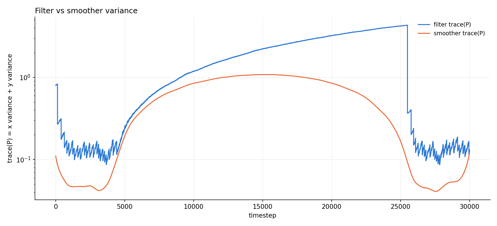
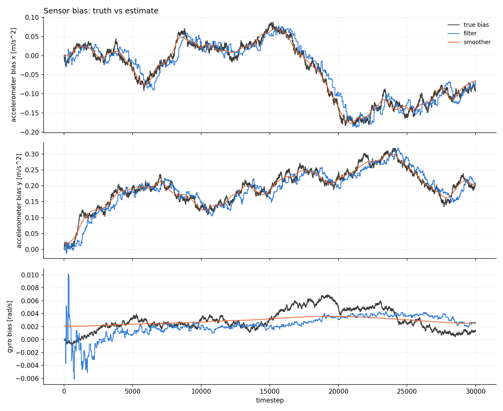

# 2-D strapdown INS, GNSS outage

[Back to the overview](../../../README.md) | [Previous: dead reckoning](../dead_reckoning/README.md)

A single long GNSS outage in the middle of an otherwise GNSS-aided run,
rather than a constant sensor mix for the whole run like the other three
scenarios. GNSS pings at the same fast rate as the [GNSS-only
scenario](../only_gnss/README.md) (uniform(1, 3)s) for the first 15% and
last 15% of the run, and is denied entirely for the 70% in between.
Magnetometer and DVL stay active throughout, same rates as [multi-sensor
fusion](../multi_sensor_fusion/README.md), so the outage is dead reckoning
aided by heading and body-frame velocity, not totally unaided.

Run twice: once with the filter's IMU noise belief matched to the truth,
once deliberately mistuned (1.6x gyro, 1.8x accel), to see whether the
mismatch shows up differently during an outage than it does with GNSS
constantly available.

|               |                                                   |
| ------------- | ------------------------------------------------- |
| **Status**    | done, consistent except magnetometer               |
| **Run**       | 30000 timesteps (5 minutes at dt=0.01s), seed 42   |
| **Reproduce** | see [Reproduce](#reproduce)                        |

## Setup

Same shared parameters as [GNSS only](../only_gnss/README.md#setup), one
trajectory only (`rounded_rectangle`), with:

| sensor       | period            | denied window | fixes per run |
| ------------ | ------------------ | -------------- | -------------- |
| GNSS         | uniform(1, 3)s      | 45-255s        | 45             |
| Magnetometer | uniform(0.25, 1)s   | never          | ~370           |
| DVL          | uniform(0.2, 1)s    | never          | ~390           |

`matched`: `filter_gyro_noise_variance` 5e-5, `filter_accelerometer_noise_variance`
[5e-2, 5e-2], same as true.
`mistuned`: `filter_gyro_noise_variance` 8e-5, `filter_accelerometer_noise_variance`
[9e-2, 9e-2], true stays the same as `matched`.

## Reproduce

```bash
python3 scripts/analyze_ins_2d.py results/INS2D/gnss_outage/<matched|mistuned>/data
```

To regenerate the data, copy
`results/INS2D/gnss_outage/<matched|mistuned>/config.yaml` over
`configs/strapdown_ins_2D.yaml`, then follow the same steps as
[GNSS only's reproduce section](../only_gnss/README.md#reproduce).

## Results

### Variance



Log scale, since the outage pushes the filter's variance up almost two
orders of magnitude before GNSS returns. The shape is the clean textbook
case: the filter's variance grows through the whole outage (bounded by
magnetometer/DVL, not unbounded the way pure dead reckoning would be, see
the [dead reckoning scenario](../dead_reckoning/README.md)) and snaps back
down hard the moment GNSS resumes. The smoother, anchored by GNSS on both
sides of the outage, peaks in the middle and stays below the filter at
every single timestep, the same invariant checked for the random walk
case. The mistuned run looks near-identical at this scale (image in
`mistuned/figures/ins_6_variance.png`); a 1.6-1.8x IMU noise mismatch is
small next to the outage's own effect on variance.

### Bias



Accelerometer bias (both axes) tracks the true value closely through the
entire run, outage included, magnetometer and DVL give the filter enough
to keep learning it even with GNSS gone. Gyro bias is noisier and drifts
further from truth than the other two, consistent with it being the
hardest of the three biases to observe in this setup (see the
[GNSS-only](../only_gnss/README.md) and [short-gap random
walk](../../2D/README.md) scenarios for the same pattern). The mistuned
run's bias plot looks very similar; see
`mistuned/figures/ins_7_bias.png`.

### Consistency

**matched**

|                         | value  | band             | verdict      |
| ----------------------- | ------ | ---------------- | ------------ |
| ANIS GNSS               | 1.9989 | [1.4349, 2.6574] | consistent   |
| ANIS magnetometer       | 0.8573 | [0.8682, 1.1410] | INCONSISTENT |
| ANIS DVL                | 1.9935 | [1.8296, 2.1779] | consistent   |
| ANEES position filter   | 1.4470 | [1.2959, 2.8544] | consistent   |
| ANEES position smoother | 1.5674 | [0.0506, 7.3778] | consistent   |

RMSE: filter 1.00m, smoother 0.71m.

**mistuned**

|                         | value  | band             | verdict      |
| ----------------------- | ------ | ---------------- | ------------ |
| ANIS GNSS               | 1.9969 | [1.4434, 2.6459] | consistent   |
| ANIS magnetometer       | 0.8487 | [0.8668, 1.1426] | INCONSISTENT |
| ANIS DVL                | 1.9253 | [1.8274, 2.1803] | consistent   |
| ANEES position filter   | 1.4555 | [1.3109, 2.8323] | consistent   |
| ANEES position smoother | 1.5343 | [0.0506, 7.3778] | consistent   |

RMSE: filter 1.01m, smoother 0.70m.

Magnetometer ANIS is the one surprise, mildly inconsistent in both runs,
and just under its band both times (0.857 and 0.849 against bands starting
around 0.87). Same direction as the DVL finding in the [dead reckoning
scenario](../dead_reckoning/README.md#consistency-read-carefully), the
filter is a touch underconfident about a sensor's `R`, not overconfident.
Worth a look together with that finding in a future retuning pass.

## Takeaways and limits

- The variance plot is the clearest illustration in this whole results set
  of what the smoother buys over the filter: identical sensors, identical
  data, and the smoother's peak uncertainty mid-outage is still below the
  filter's uncertainty at almost every other point in the run.
- The deliberate IMU mismatch (1.6x gyro, 1.8x accel) doesn't show up as a
  meaningfully different consistency story here, both runs are consistent
  in the same places and inconsistent in the same place (magnetometer).
  Either the mismatch is too small to matter at this outage length, or its
  effect is swamped by the outage itself.
- Single seed, one trajectory. The outage window (45-255s) and GNSS rate
  were chosen by hand, not swept.
