# 2-D strapdown INS, GNSS outage

[Back to the overview](../../../README.md) | [Previous: dead reckoning](../dead_reckoning/README.md) | [Next: UKF and URTSS](../ukf/README.md)

GNSS is the only sensor that bounds the position error, and it can disappear: underwater, under bridges, or when it is jammed. This scenario runs a full sensor set with dense GNSS and switches GNSS off for 210 s in the middle of the run. The magnetometer and the DVL keep running, so the outage is dead reckoning aided by heading and body-frame velocity, bracketed by normal operation.

|               |                                  |
| ------------- | -------------------------------- |
| **Status**    | done, consistent, the DVL ANIS of one run just above its band |
| **Run**       | 30000 timesteps (300 s at $\Delta t = 0.01$ s), seed 42 |
| **Reproduce** | see [Reproduction](#reproduction) |

## Motivation

An outage shows what the aiding is worth and how the estimators behave when it is lost and returns:

- How fast does the filter's uncertainty grow during the outage, and does it match the error?
- What does the smoother, which has GNSS on both sides of the outage, recover?
- Does a filter whose IMU noise model is mistuned behave differently during an outage than with GNSS constantly available?

Each question is answered on two paths, a four-corner test and a figure-eight, and for two filter settings, one with the IMU noise parameters of the simulator (matched) and one with them deliberately wrong (mistuned).

## Problem formulation

### State and motion model

The state collects position, velocity in the navigation frame, heading and the two sensor biases,

$$
x = \begin{bmatrix} p^\top & v^\top & \psi & b_a^\top & b_g \end{bmatrix}^\top \in \mathbb{R}^{8},
\qquad p, v \in \mathbb{R}^2 .
$$

The IMU reading $u_k$ is corrected with the estimated biases, $\tilde a_k = a_k - b_{a,k}$ and
$\tilde\omega_k = \omega_k - b_{g,k}$, and integrated with the heading at the middle of the step,
$\psi_{k+\frac12} = \psi_k + \tfrac{\Delta t}{2}\tilde\omega_k$:

$$
\begin{aligned}
p_{k+1} &= p_k + \Delta t\, v_k + \tfrac{\Delta t^2}{2}\, R(\psi_{k+\frac12})\,\tilde a_k, \\
v_{k+1} &= v_k + \Delta t\, R(\psi_{k+\frac12})\,\tilde a_k, \\
\psi_{k+1} &= \psi_k + \Delta t\, \tilde\omega_k, \\
b_{a,k+1} &= e^{-\Delta t / T_a}\, b_{a,k}, \qquad b_{g,k+1} = e^{-\Delta t / T_g}\, b_{g,k}.
\end{aligned}
$$

Written as $x_k = f(x_{k-1}, u_k) + w_k$ with $w_k \sim \mathcal{N}(0, Q_k)$. The biases are first-order
Gauss-Markov processes with time constant $T$ and stationary variance $\sigma_b^2$, driven by white noise of
intensity $2\sigma_b^2 / T$. White accelerometer noise enters the velocity and white gyro noise the heading. With $G_k$ mapping the
six noise sources into the state, $D$ the diagonal matrix of their intensities and $A$ the continuous-time Jacobian of the model at the
current estimate, the process noise is the exact discretization by Van Loan's formula,

$$
\exp\!\left( \begin{bmatrix} -A & G_k D G_k^\top \\ 0 & A^\top \end{bmatrix} \Delta t \right)
= \begin{bmatrix} \cdot & E_{12} \\ 0 & E_{22} \end{bmatrix},
\qquad Q_k = E_{22}^\top E_{12} .
$$


| symbol | meaning |
| --- | --- |
| $x_k$ | state: position $p_k$, navigation-frame velocity $v_k$, heading $\psi_k$, accelerometer bias $b_{a,k}$ and gyro bias $b_{g,k}$ |
| $u_k$ | IMU reading $(a_k, \omega_k)$: body-frame specific force and yaw rate |
| $R(\psi)$ | rotation from the body to the navigation frame |
| $\bar x_k,\ \bar P_k$ | predicted mean and covariance |
| $\hat x_k,\ \hat P_k$ | updated (filtered) mean and covariance |
| $\hat x^s_k,\ P^s_k$ | smoothed mean and covariance |
| $\eta_k,\ S_k$ | innovation and innovation covariance |
| $W_k$ | Kalman gain |
| $\boxplus,\ \boxminus$ | addition and subtraction that wrap the heading to $(-\pi, \pi]$ |


| parameter | value |
| --- | --- |
| time step $\Delta t$, steps, duration | 0.01 s, 30000, 300 s |
| speed along the path | 2 m/s |
| accelerometer bias: variance $\sigma_{b_a}^2$, time constant $T_a$ | $5\cdot10^{-2}$ (m/s²)², 200 s, both axes |
| gyro bias: variance $\sigma_{b_g}^2$, time constant $T_g$ | $5\cdot10^{-5}$ (rad/s)², 200 s |
| white noise intensity, accelerometer / gyro | $5\cdot10^{-4}$ (m/s²)²·s / $5\cdot10^{-4}$ rad²/s |
| true initial state $x_0$ | $[0,\ 0,\ 0,\ 2,\ 0,\ 0,\ 0,\ 0]^\top$ |
| prior mean $\hat x_0$ | drawn from $\mathcal{N}(x_0,\ \hat P_0)$ |
| prior covariance $\hat P_0$ | $\mathrm{diag}(0.4,\ 0.4,\ 0.04,\ 0.04,\ 0.04,\ 0.004,\ 0.004,\ 0.0004)$ |


The truth is simulated, not generated by $f$. A geometric path (below) gives position, heading and curvature at constant
speed; the velocity is the speed along the heading, the specific force is the centripetal acceleration rotated into the body frame, and
each IMU reading is that ideal value plus a simulated Gauss-Markov bias plus white noise. The filter is configured with the same noise
values the simulator uses. The white noise is a continuous-time intensity in both, so the simulator draws each sample with variance
intensity$/\Delta t$. The biases start at zero and are simulated with the exact discretization $b_k = e^{-\Delta t/T} b_{k-1} + w_k$,
$w_k \sim \mathcal{N}(0,\ \sigma_b^2 (1 - e^{-2\Delta t/T}))$, so with $T = 200$ s their variance reaches 95% of $\sigma_b^2$ by the end of the run.
The prior mean is drawn around the true initial state from the prior covariance, so the initial error is a sample from $\hat P_0$, as the consistency
tests assume.

### Sensors

**GNSS** observes the position directly,

$$
z^{g}_k = H_g\, x_k + \varepsilon^{g}_k, \qquad H_g = \begin{bmatrix} I_2 & 0_{2\times 6} \end{bmatrix}, \qquad \varepsilon^{g}_k \sim \mathcal{N}(0,\ 0.2\, I_2)\ \mathrm{m^2}.
$$

**Magnetometer** observes the heading,

$$
z^{m}_k = \psi_k + \varepsilon^{m}_k, \qquad \varepsilon^{m}_k \sim \mathcal{N}(0,\ 3\cdot 10^{-3})\ \mathrm{rad^2},
$$

and its innovation is wrapped, $\eta^m_k = z^m_k \boxminus h^m(\bar x_k)$.

**DVL** observes the velocity in the body frame, which makes it the one nonlinear sensor,

$$
z^{d}_k = R(\psi_k)^\top v_k + \varepsilon^{d}_k, \qquad
H_d = \begin{bmatrix} 0_{2\times 2} & R(\psi)^\top & \dfrac{\partial R^\top}{\partial \psi}\, v & 0_{2\times 3} \end{bmatrix}, \qquad
\varepsilon^{d}_k \sim \mathcal{N}(0,\ 10^{-2}\, I_2)\ \mathrm{(m/s)^2}.
$$


GNSS fires at random intervals drawn uniformly from 1 to 3 s, except that none is delivered between $t = 45$ s and $t = 255$ s (so 45 fixes in total). The magnetometer (0.25 to 1 s, 470 fixes) and the DVL (0.2 to 1 s, 492 fixes) run throughout.

The filter's IMU noise parameters are set in two ways, with the simulator unchanged:

| setting | gyro bias variance $\sigma_{b_g}^2$ [(rad/s)²] | accelerometer bias variance $\sigma_{b_a}^2$ [(m/s²)²] | factor against the simulator |
| --- | --- | --- | --- |
| matched | $5\cdot10^{-5}$ | $5\cdot10^{-2}$ | 1 |
| mistuned | $8\cdot10^{-5}$ | $9\cdot10^{-2}$ | 1.6 (gyro), 1.8 (accelerometer) |


### Trajectories

Both paths are traced at constant speed starting at the origin heading $+x$.

| trajectory | geometry | length per lap | laps in 300 s |
| --- | --- | --- | --- |
| four-corner test (`rounded_rectangle`) | $80 \times 50$ m rectangle with corner radius 10 m, counterclockwise: left turns only | 242.8 m | 2.5 |
| figure-eight (`figure_eight`) | two circles of radius 20 m with centres 70 m apart, joined by two straights that cross at the origin: one right and one left turn per lap | 289.2 m | 2.1 |

### Estimators

When several sensors fire in the same step they update in turn, each starting from the result of the previous one.

**Extended Kalman filter.** Prediction and update with sensor model $h$, Jacobians $F$ and $H$, and measurement noise $R$:

$$
\bar x_k = f(\hat x_{k-1}, u_k), \qquad \bar P_k = F_k \hat P_{k-1} F_k^\top + Q_k,
$$

$$
\eta_k = z_k \boxminus h(\bar x_k), \qquad S_k = H_k \bar P_k H_k^\top + R, \qquad W_k = \bar P_k H_k^\top S_k^{-1},
$$

$$
\hat x_k = \bar x_k \boxplus W_k \eta_k, \qquad
\hat P_k = (I - W_k H_k)\, \bar P_k\, (I - W_k H_k)^\top + W_k R\, W_k^\top .
$$

The covariance update is written in Joseph form, which keeps $\hat P_k$ positive semidefinite.

**Extended Rauch-Tung-Striebel smoother (ERTS).** Run backward over the stored filter output, starting from
$\hat x^s_N = \hat x_N$, with $F_k$ evaluated at the filtered state:

$$
G_k = \hat P_k F_k^\top \bar P_{k+1}^{-1}, \qquad
\hat x^s_k = \hat x_k \boxplus G_k\,(\hat x^s_{k+1} \boxminus \bar x_{k+1}), \qquad
P^s_k = \hat P_k + G_k\,(P^s_{k+1} - \bar P_{k+1})\,G_k^\top .
$$

### Consistency

A filter is consistent if the errors it makes agree with the covariance it reports. Two statistics test this, with the truth $x_k$ known from the simulation.

$$
\mathrm{NIS}_k = \eta_k^\top S_k^{-1} \eta_k \sim \chi^2_{m}, \qquad
\mathrm{NEES}_k = (p_k - \hat p_k)^\top \big(\hat P^{pp}_k\big)^{-1} (p_k - \hat p_k) \sim \chi^2_{2},
$$

where $m$ is the measurement dimension (2 for GNSS and DVL, 1 for the magnetometer) and $\hat P^{pp}_k$ is the position block of the covariance.
The NIS is evaluated at every fix of a sensor. The NEES is evaluated for the position at every step, for the filter and for the smoother.
The time average $\bar\epsilon = \frac{1}{N}\sum_k \epsilon_k$ of either statistic with $d$ degrees of freedom is held against the interval

$$
\left[\ \frac{\chi^2_{\alpha/2}(N_{\mathrm{eff}}\, d)}{N_{\mathrm{eff}}},\ \ \frac{\chi^2_{1-\alpha/2}(N_{\mathrm{eff}}\, d)}{N_{\mathrm{eff}}}\ \right], \qquad
N_{\mathrm{eff}} = \max\!\Big(1,\ N\,\frac{1-\rho}{1+\rho}\Big), \qquad \alpha = 0.05,
$$

where $\rho$ is the lag-one autocorrelation of the series. A statistic is "consistent" if its time average lies inside the interval. A value below the interval
means the errors are smaller than the reported covariance says, the estimator is underconfident (conservative). A value above means the errors are larger than it says, the estimator is overconfident (too optimistic).
The position NEES is strongly autocorrelated, so $N_{\mathrm{eff}}$ is small and the interval wide; for the smoother it is so wide that it excludes almost nothing. The
share of steps with the true position inside the reported 95% ellipse is a second check that does not depend on it.
All numbers are from one run with seed 42, so they carry no error bars.

## Reproduction

Build once, then simulate and analyse each case:

```bash
cmake -S . -B build && cmake --build build
./build/kalman_filtering_and_smoothing results/INS2D/gnss_outage/matched
python3 scripts/analyze_ins_2d.py results/INS2D/gnss_outage/matched/data
./build/kalman_filtering_and_smoothing results/INS2D/gnss_outage/mistuned
python3 scripts/analyze_ins_2d.py results/INS2D/gnss_outage/mistuned/data
./build/kalman_filtering_and_smoothing results/INS2D/gnss_outage/figure_eight_matched
python3 scripts/analyze_ins_2d.py results/INS2D/gnss_outage/figure_eight_matched/data
./build/kalman_filtering_and_smoothing results/INS2D/gnss_outage/figure_eight_mistuned
python3 scripts/analyze_ins_2d.py results/INS2D/gnss_outage/figure_eight_mistuned/data
```

The executable reads `<case>/config.yaml` and writes `<case>/data`. Given a folder that holds several cases, it runs all of them, so
`./build/kalman_filtering_and_smoothing results/INS2D/gnss_outage` simulates every case of this page in one command. The analysis reads `<case>/data`
and writes `<case>/stats.txt`, which holds every number quoted below, and the figures in `<case>/figures`.

`data/` holds one CSV file per quantity with one row per timestep and a shared `timestep` column. `truth.csv` has the true state `x_true_0 ... x_true_7`, ordered as in the state $x$ above;
`ekf_filter.csv` and `ekf_smoother.csv` have the predicted and updated (or smoothed) mean and the full covariance; `ekf_*_fixes.csv` has, for each fix of one sensor, the raw measurement,
the innovation and $S$, which is what the NIS is computed from.

## Results

### Four-corner test

#### Matched filter

The true path with the direction of travel, and when each sensor fired.

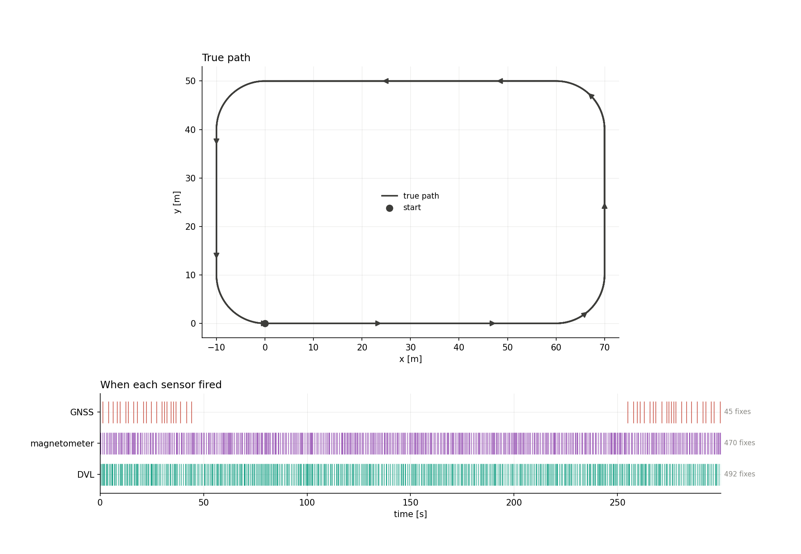

The path with the EKF and ERTS estimates, and a zoom on the turn where the filter's position error is largest, with the 95% position ellipses of both estimators.

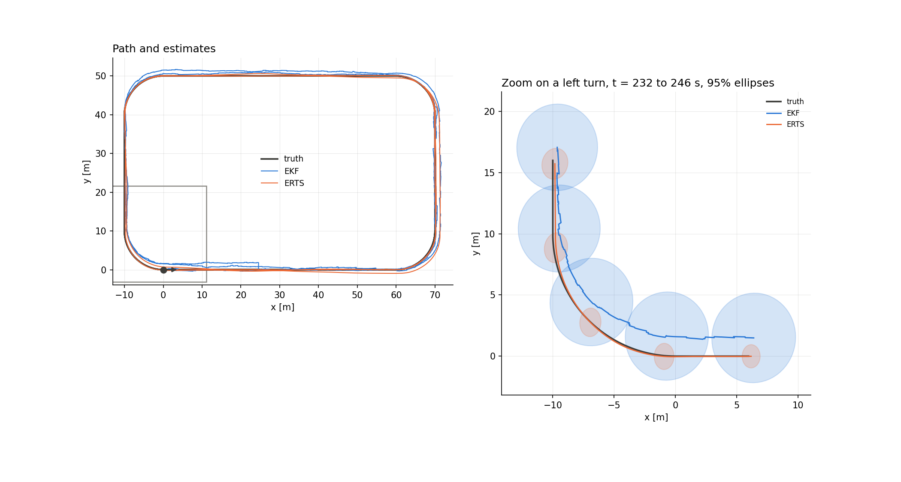

Error against truth with each estimator's own 95% band, shaded where GNSS is denied.

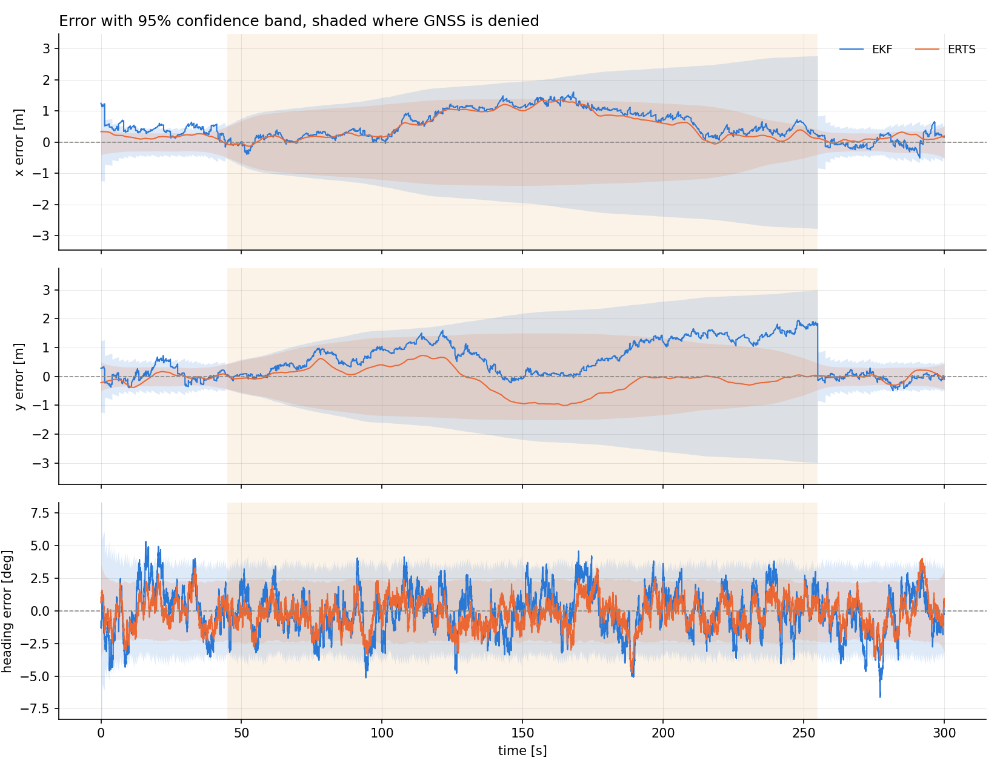

The position spread $\sqrt{\mathrm{tr}\,P_{xy}}$ each estimator reports about itself, on a log scale, shaded where GNSS is denied.

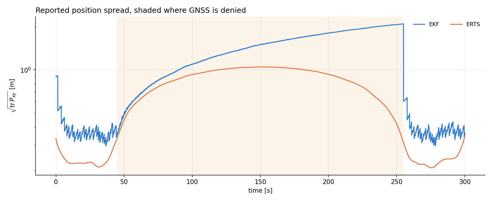

True and estimated sensor biases.


NIS of every fix against its 95% interval, and the running mean of the position NEES.

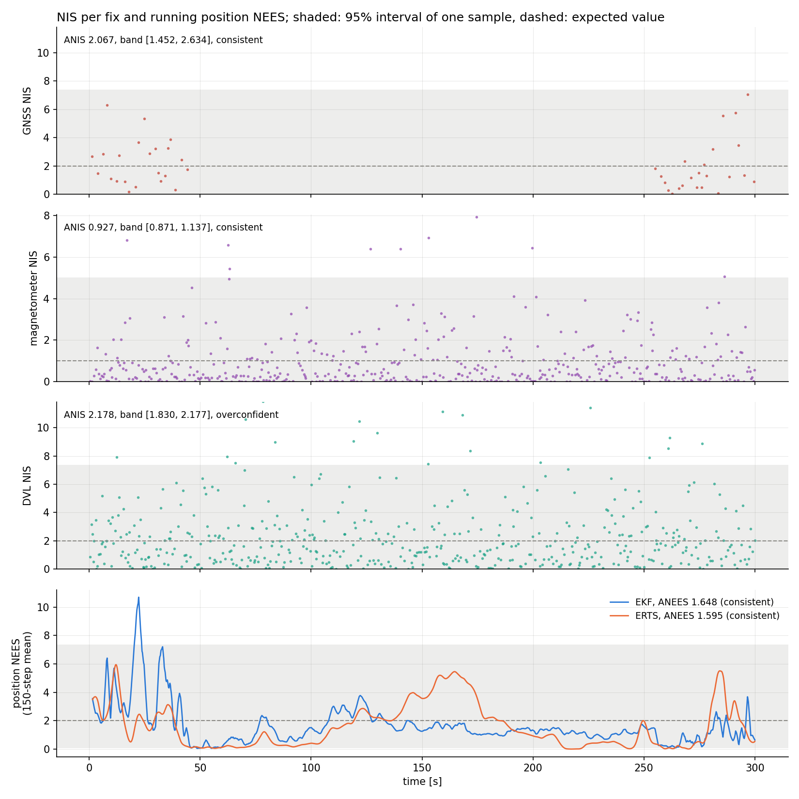

| statistic | value | 95% band | verdict |
| --- | --- | --- | --- |
| ANIS GNSS | 2.0675 | [1.4521, 2.6342] | consistent |
| ANIS magnetometer | 0.9272 | [0.8714, 1.1373] | consistent |
| ANIS DVL | 2.1775 | [1.8304, 2.1770] | overconfident |
| ANEES position filter (EKF) | 1.6477 | [1.3180, 2.8220] | consistent |
| ANEES position smoother (ERTS) | 1.5950 | [0.0506, 7.3778] | consistent |

| estimator | RMSE position [m] | median [m] | 95th percentile [m] | max [m] | RMSE heading [°] |
| --- | --- | --- | --- | --- | --- |
| EKF | 1.068 | 1.069 | 1.661 | 2.048 | 1.75 |
| ERTS | 0.705 | 0.323 | 1.523 | 1.670 | 1.17 |

| estimator | RMSE $b_{a,x}$ [m/s²] | RMSE $b_{a,y}$ [m/s²] | RMSE $b_g$ [rad/s] | peak $\lvert b_g - \hat b_g \rvert$ [rad/s] |
| --- | --- | --- | --- | --- |
| EKF | 0.0395 | 0.0437 | 0.00383 | 0.0197 |
| ERTS | 0.0206 | 0.0206 | 0.00204 | 0.0054 |

#### Mistuned filter

The error and the consistency of the mistuned filter on the same data (its [scenario](mistuned/figures/1_scenario.png), [path](mistuned/figures/2_path.png), [uncertainty](mistuned/figures/4_uncertainty.png) and [biases](mistuned/figures/5_biases.png) figures are in its figures folder).

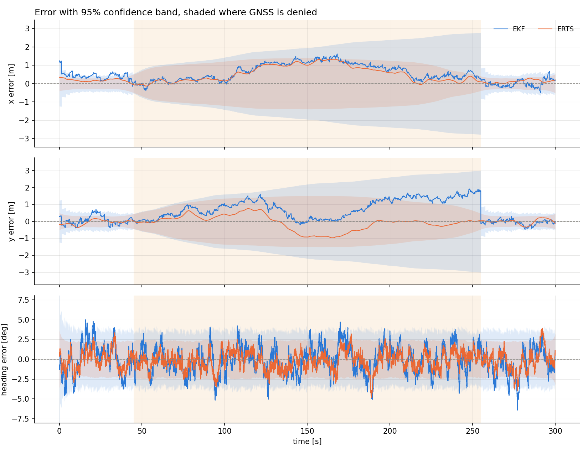

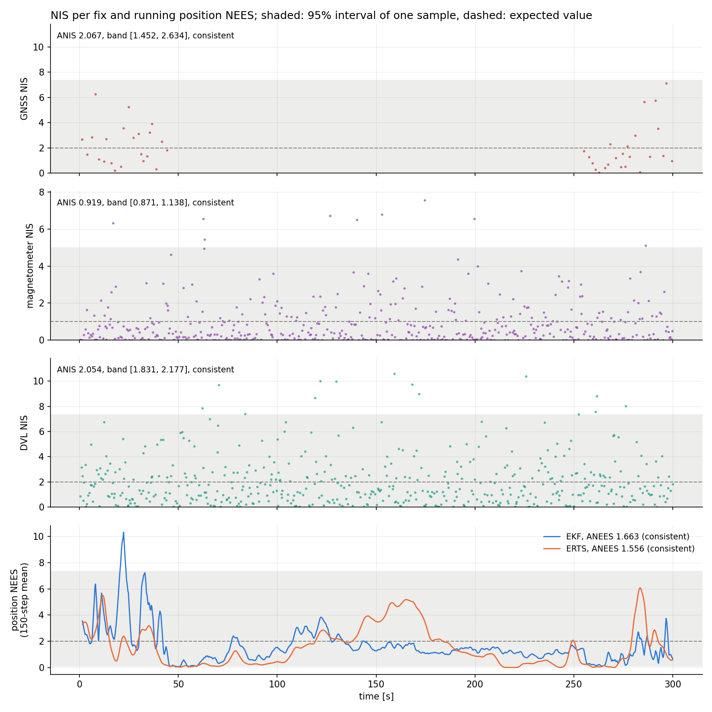

| statistic | value | 95% band | verdict |
| --- | --- | --- | --- |
| ANIS GNSS | 2.0672 | [1.4524, 2.6339] | consistent |
| ANIS magnetometer | 0.9191 | [0.8708, 1.1380] | consistent |
| ANIS DVL | 2.0544 | [1.8308, 2.1766] | consistent |
| ANEES position filter (EKF) | 1.6629 | [1.3228, 2.8149] | consistent |
| ANEES position smoother (ERTS) | 1.5560 | [0.0506, 7.3778] | consistent |

| estimator | RMSE position [m] | median [m] | 95th percentile [m] | max [m] | RMSE heading [°] |
| --- | --- | --- | --- | --- | --- |
| EKF | 1.078 | 1.079 | 1.681 | 2.031 | 1.74 |
| ERTS | 0.697 | 0.317 | 1.504 | 1.630 | 1.17 |

| estimator | RMSE $b_{a,x}$ [m/s²] | RMSE $b_{a,y}$ [m/s²] | RMSE $b_g$ [rad/s] | peak $\lvert b_g - \hat b_g \rvert$ [rad/s] |
| --- | --- | --- | --- | --- |
| EKF | 0.0398 | 0.0436 | 0.00373 | 0.0198 |
| ERTS | 0.0214 | 0.0206 | 0.00183 | 0.0048 |

### Figure-eight

#### Matched filter

The true path with the direction of travel, and when each sensor fired.

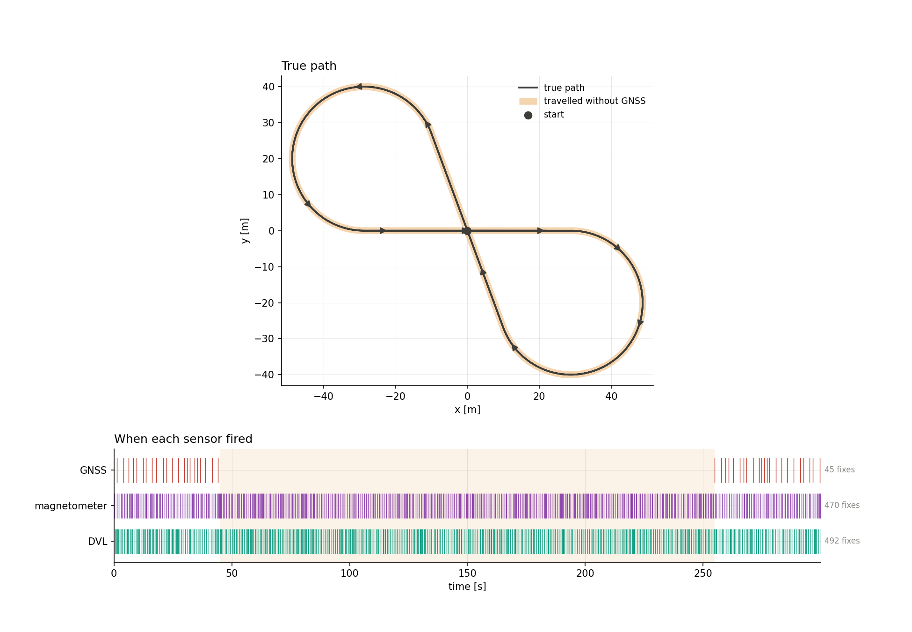

The path with the EKF and ERTS estimates, and a zoom on the turn where the filter's position error is largest, with the 95% position ellipses of both estimators.

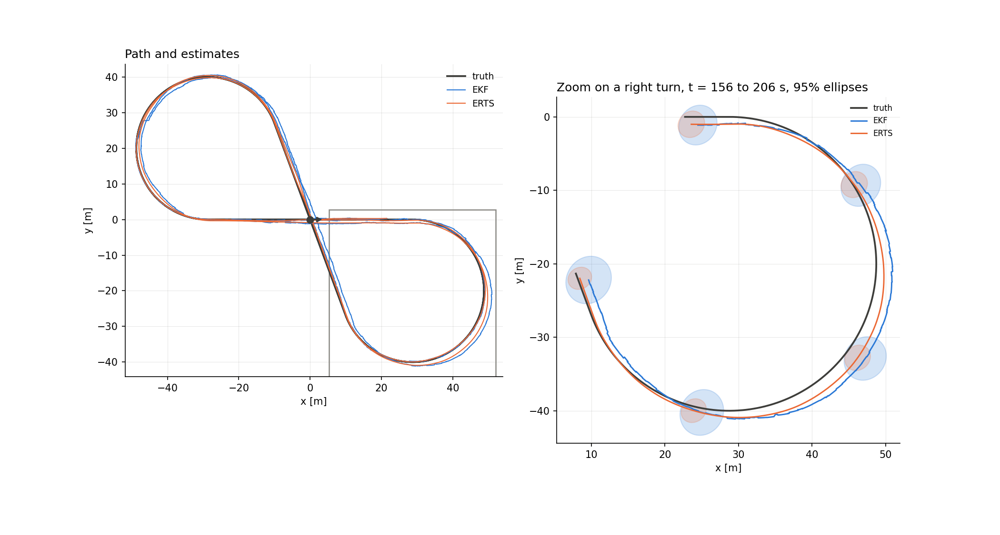

Error against truth with each estimator's own 95% band, shaded where GNSS is denied.


The position spread $\sqrt{\mathrm{tr}\,P_{xy}}$ each estimator reports about itself, on a log scale, shaded where GNSS is denied.


True and estimated sensor biases.

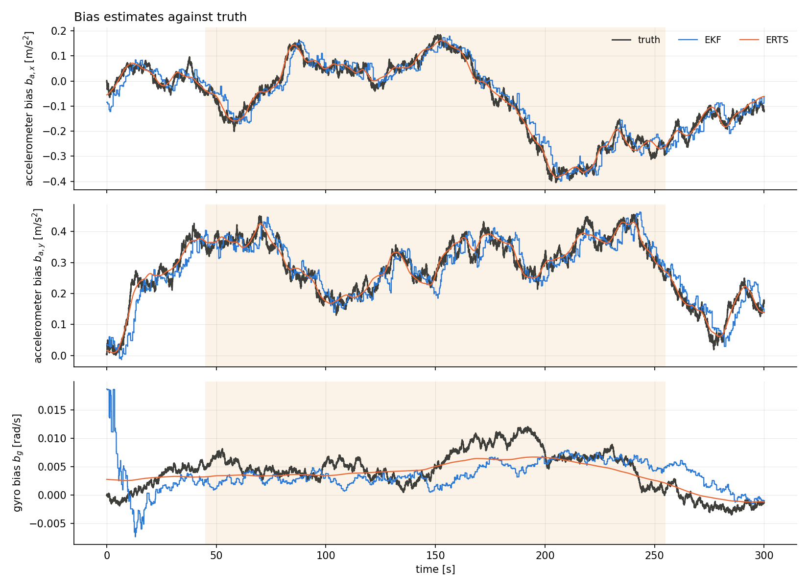

NIS of every fix against its 95% interval, and the running mean of the position NEES.

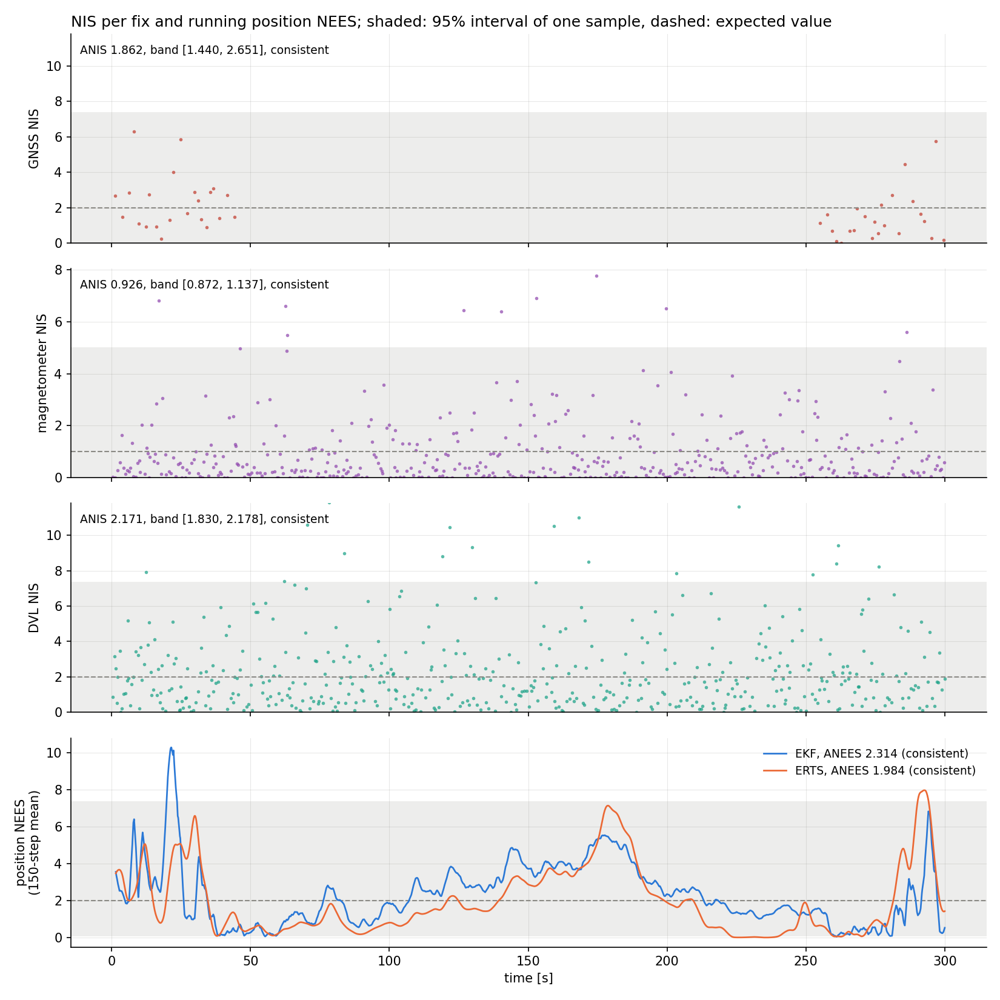

| statistic | value | 95% band | verdict |
| --- | --- | --- | --- |
| ANIS GNSS | 1.8616 | [1.4399, 2.6507] | consistent |
| ANIS magnetometer | 0.9262 | [0.8716, 1.1371] | consistent |
| ANIS DVL | 2.1712 | [1.8298, 2.1776] | consistent |
| ANEES position filter (EKF) | 2.3143 | [1.2298, 2.9544] | consistent |
| ANEES position smoother (ERTS) | 1.9839 | [0.0506, 7.3778] | consistent |

| estimator | RMSE position [m] | median [m] | 95th percentile [m] | max [m] | RMSE heading [°] |
| --- | --- | --- | --- | --- | --- |
| EKF | 1.383 | 1.205 | 2.365 | 2.616 | 1.78 |
| ERTS | 0.737 | 0.425 | 1.431 | 1.804 | 1.21 |

| estimator | RMSE $b_{a,x}$ [m/s²] | RMSE $b_{a,y}$ [m/s²] | RMSE $b_g$ [rad/s] | peak $\lvert b_g - \hat b_g \rvert$ [rad/s] |
| --- | --- | --- | --- | --- |
| EKF | 0.0389 | 0.0434 | 0.00383 | 0.0197 |
| ERTS | 0.0204 | 0.0206 | 0.00205 | 0.0054 |

#### Mistuned filter

The error and the consistency of the mistuned filter on the same data (its [scenario](figure_eight_mistuned/figures/1_scenario.png), [path](figure_eight_mistuned/figures/2_path.png), [uncertainty](figure_eight_mistuned/figures/4_uncertainty.png) and [biases](figure_eight_mistuned/figures/5_biases.png) figures are in its figures folder).

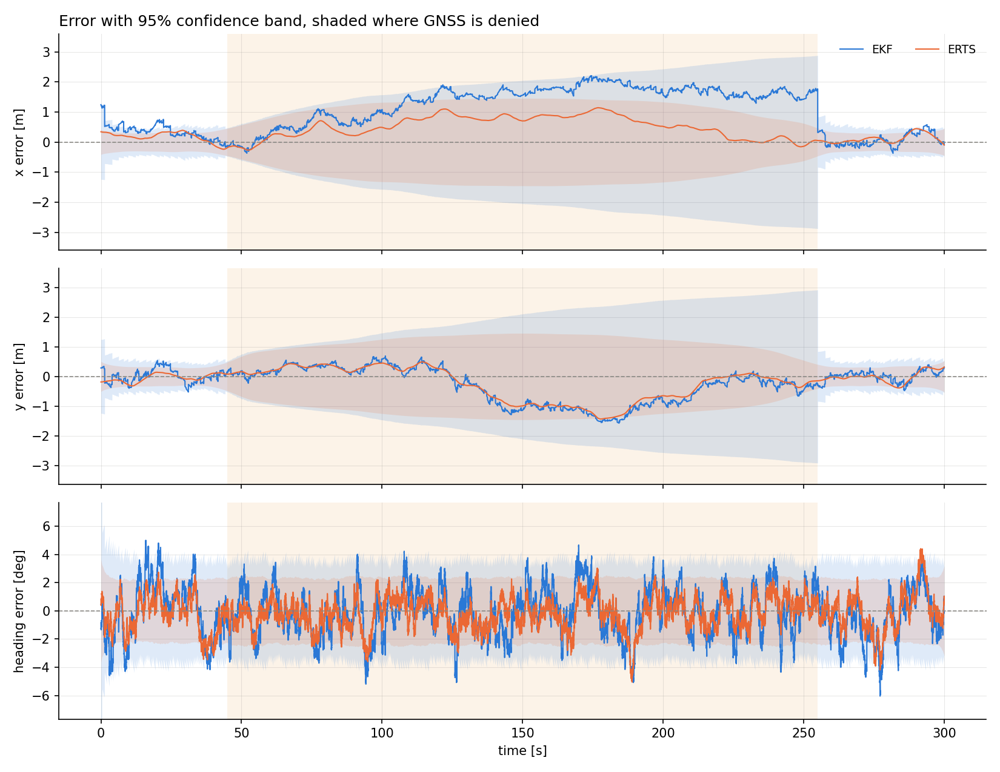

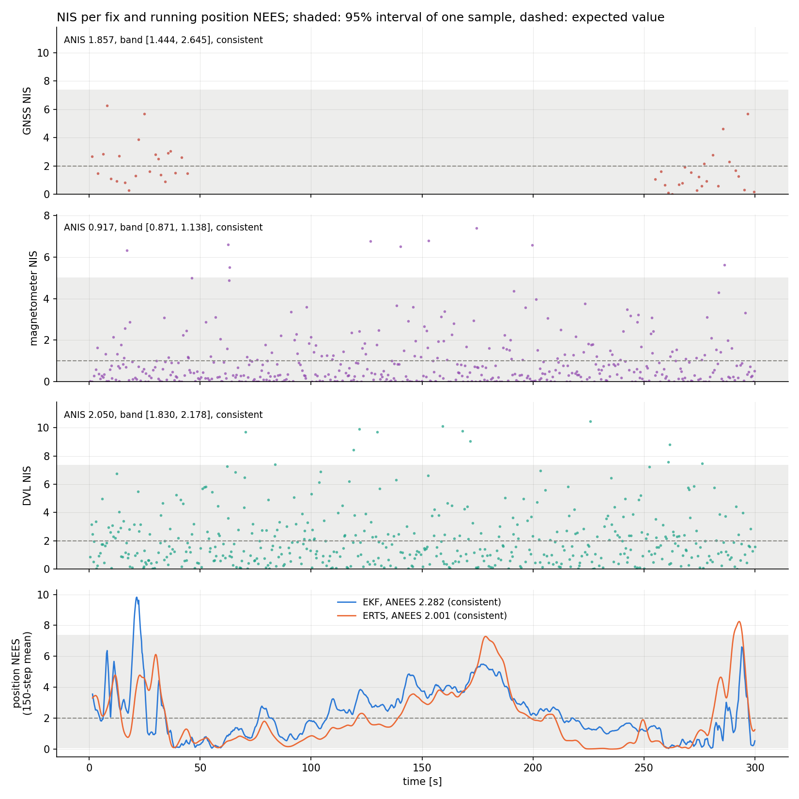

| statistic | value | 95% band | verdict |
| --- | --- | --- | --- |
| ANIS GNSS | 1.8567 | [1.4444, 2.6446] | consistent |
| ANIS magnetometer | 0.9173 | [0.8709, 1.1379] | consistent |
| ANIS DVL | 2.0497 | [1.8298, 2.1776] | consistent |
| ANEES position filter (EKF) | 2.2823 | [1.2313, 2.9522] | consistent |
| ANEES position smoother (ERTS) | 2.0008 | [0.0506, 7.3778] | consistent |

| estimator | RMSE position [m] | median [m] | 95th percentile [m] | max [m] | RMSE heading [°] |
| --- | --- | --- | --- | --- | --- |
| EKF | 1.377 | 1.204 | 2.355 | 2.611 | 1.77 |
| ERTS | 0.749 | 0.421 | 1.462 | 1.827 | 1.22 |

| estimator | RMSE $b_{a,x}$ [m/s²] | RMSE $b_{a,y}$ [m/s²] | RMSE $b_g$ [rad/s] | peak $\lvert b_g - \hat b_g \rvert$ [rad/s] |
| --- | --- | --- | --- | --- |
| EKF | 0.0393 | 0.0435 | 0.00374 | 0.0198 |
| ERTS | 0.0212 | 0.0208 | 0.00184 | 0.0049 |

## Discussion

- **The filter's uncertainty grows through the outage and is reset when GNSS returns.** On the figure-eight the reported spread $\sqrt{\mathrm{tr}\,P_{xy}}$ is 0.36 m shortly before the outage and 2.1 m just before GNSS returns at 255 s, then falls back to about 0.3 m within the next fixes (bottom panel of the error figure). The growth is bounded by the magnetometer and the DVL, not unbounded as in pure dead reckoning.
- **The reported covariance matches the error.** The filter's position ANEES is 1.65 (four-corner) and 2.31 (figure-eight), inside the bands, with the true position inside the 95% ellipse on 96.9% and 97.2% of the steps. The GNSS and magnetometer ANIS are consistent on both paths. The magnetometer ANIS is now 0.93, where it was 0.86 and underconfident before the white noise was simulated as intensity$/\Delta t$.
- **The DVL ANIS of the matched four-corner run is just above its band.** It is 2.178 against an upper edge of 2.177, which is a single seed on the edge. Over the 21-run Monte Carlo the matched DVL ANIS is 2.03 on both paths, consistent.
- **The figure-eight has the larger filter error.** Position RMSE is 1.38 m against 1.07 m on the four-corner test for the matched filter, while the smoothers are close (0.74 m and 0.70 m). The figure-eight turns for about 60% of its length against about 26% for the four-corner test (corner arcs $2\pi\cdot 10$ m out of 242.8 m). This fits error growing with turning but was not isolated here.
- **The smoother recovers a large part of the error.** Position RMSE falls from 1.07 to 0.70 m and from 1.38 to 0.74 m, reductions of 34% and 47%. The smoother's own uncertainty peaks mid-outage but stays below the filter's at every step in all four runs (`stats.txt`).
- **The mistuning is hardly visible in one run, but the Monte Carlo sees it.** The 1.6 to 1.8 times larger bias variance in the filter changes the position RMSE from 1.068 to 1.078 m and from 1.383 to 1.377 m, and no single-run verdict changes. Over the 21-run Monte Carlo the mistuned DVL ANIS is 1.93 on both paths, with a 95% interval below 2, so the filter is underconfident about the velocity fixes, as a too large bias variance should make it.
- **Biases.** Accelerometer biases are tracked through the outage (RMSE 0.039 and 0.043 m/s² on the figure-eight). The gyro bias is the weaker one, with a peak filter error of 0.020 rad/s while the true bias moves between about -0.004 and 0.012 rad/s.
- **Limits.** One seed, the outage window and the GNSS rate were chosen by hand and not swept, and only one mismatch factor is tried.

## Related results

- [GNSS only](../only_gnss/README.md) is this GNSS rate without the outage and without the other sensors.
- [Dead reckoning](../dead_reckoning/README.md) has the same magnetometer and DVL and no GNSS for the whole run.
- [Multi-sensor fusion](../multi_sensor_fusion/README.md) has all three sensors with sparse GNSS throughout.
- [UKF](../ukf/README.md) and [IEKF](../iekf/README.md) rerun this data with other estimators, and the UKF page adds a run in which the filter's initial heading is wrong.
