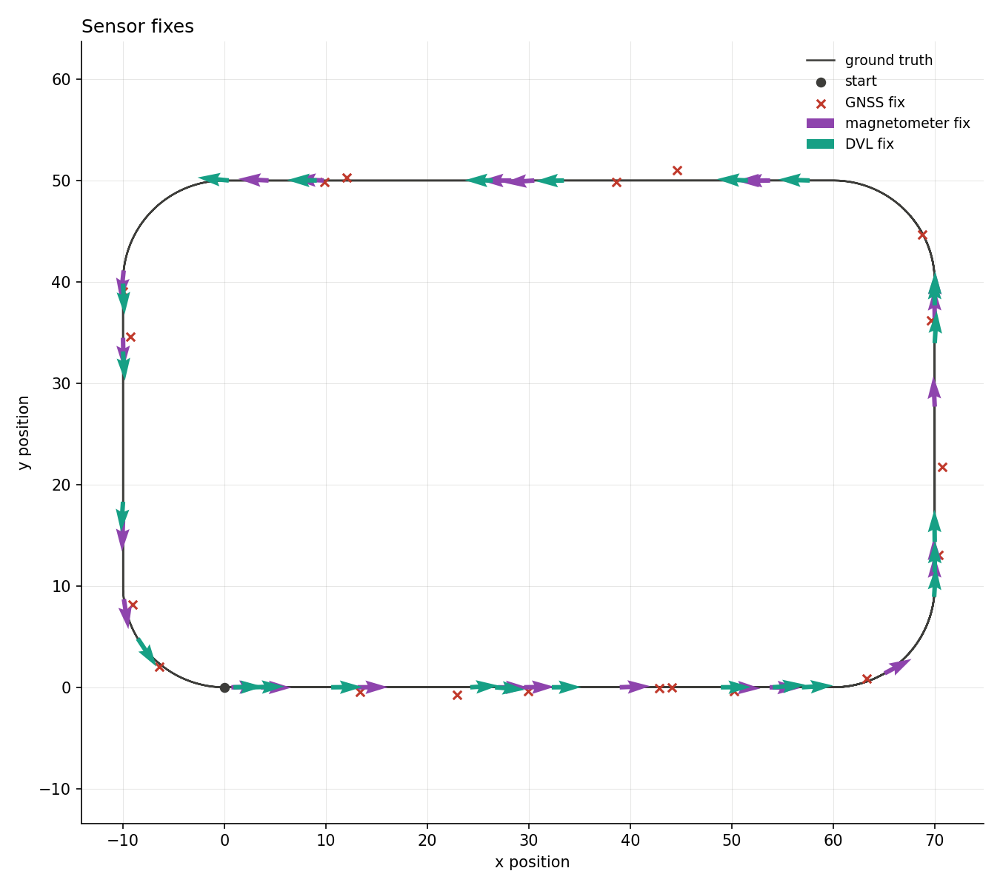
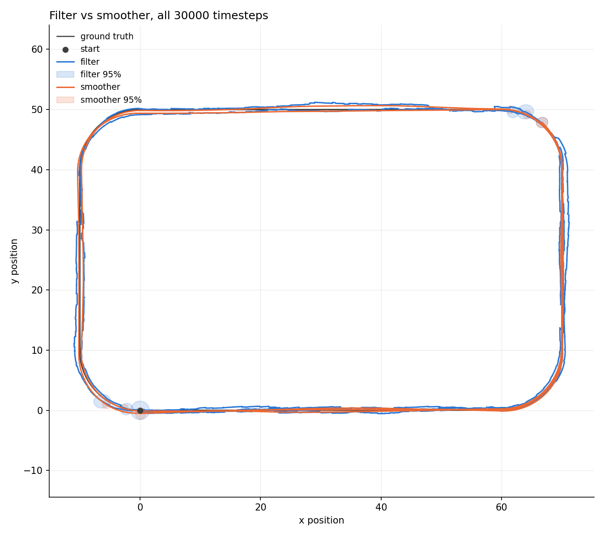
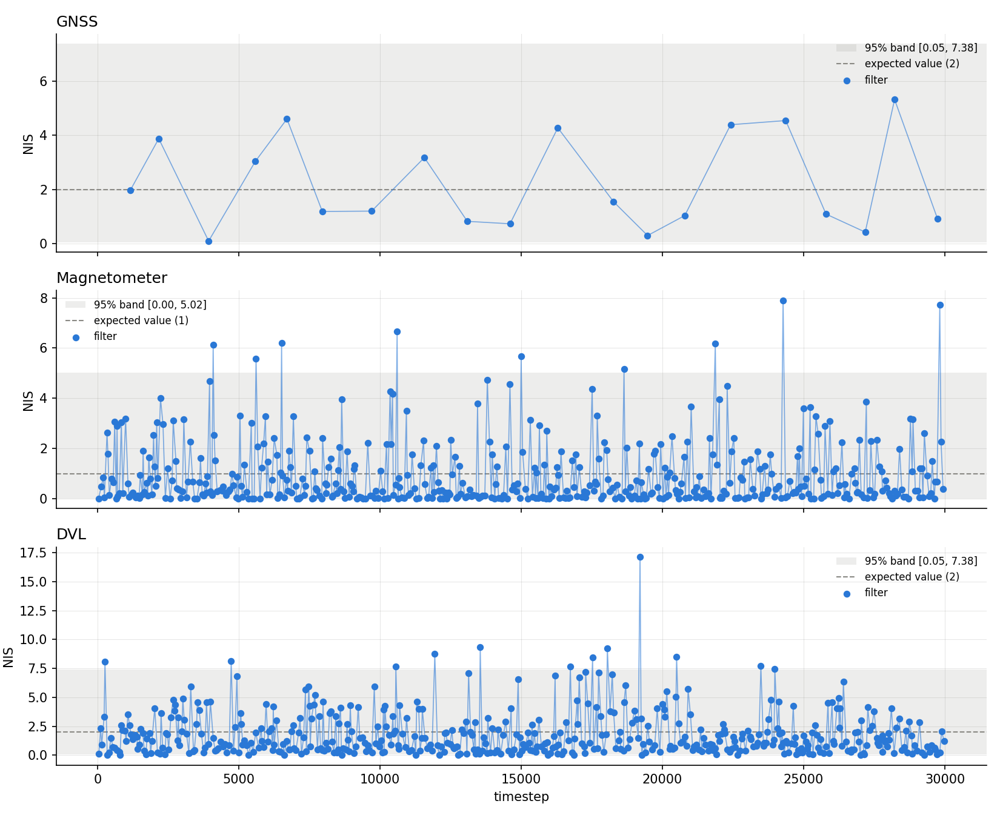
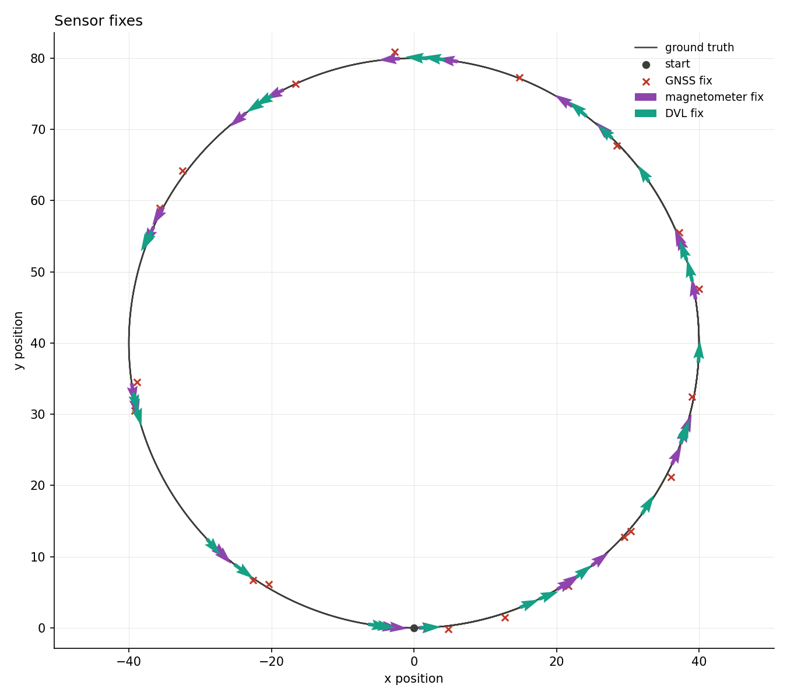
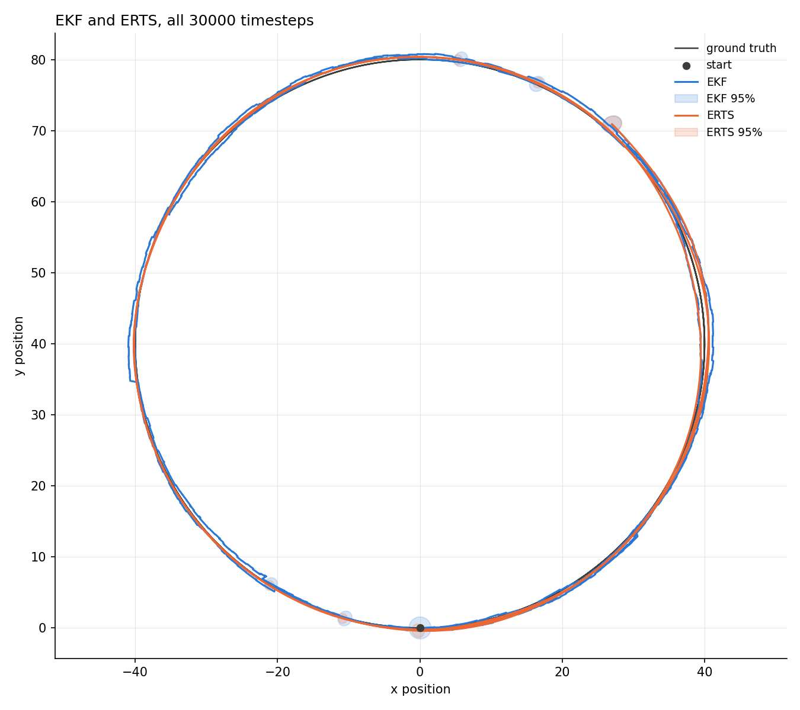
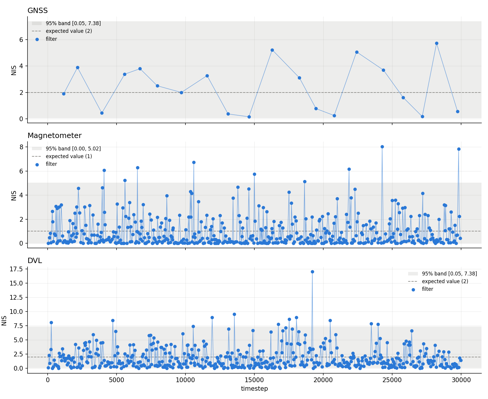
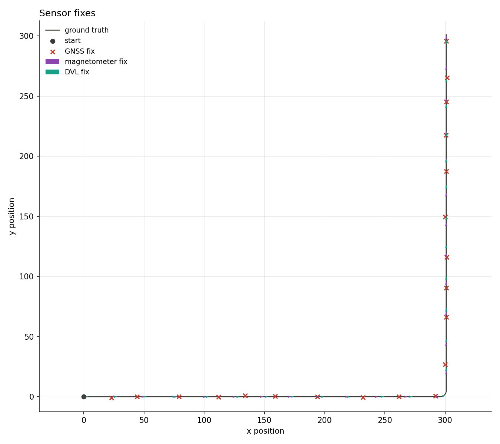
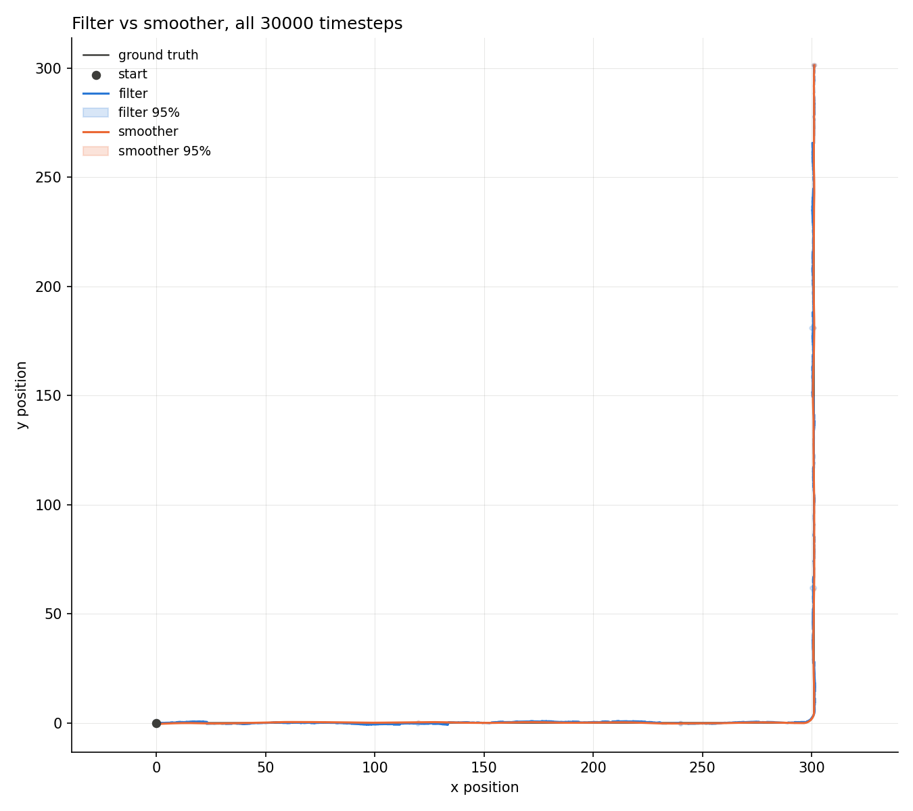
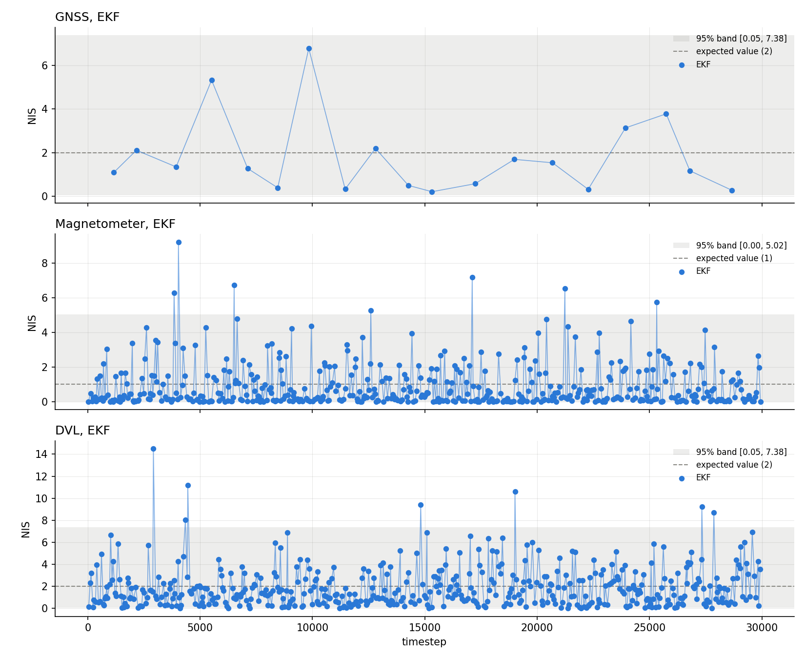

# 2-D strapdown INS, multi-sensor fusion

[Back to the overview](../../../README.md) | [Previous: GNSS only](../only_gnss/README.md) | [Next: dead reckoning](../dead_reckoning/README.md)

Second of three scenarios sharing one setup (see
[GNSS only](../only_gnss/README.md#setup) for the shared parameters): GNSS,
magnetometer and DVL all active and fused sequentially within a timestep.

|               |                                                  |
| ------------- | ------------------------------------------------ |
| **Status**    | done, consistent on all three trajectories       |
| **Run**       | 30000 timesteps (5 minutes at dt=0.01s), seed 42 |
| **Reproduce** | see [Reproduce](#reproduce)                      |

## Setup

Same shared parameters as [GNSS only](../only_gnss/README.md#setup). This
scenario's own sensor periods:

| sensor       | period            | fixes per run (typical) |
| ------------ | ----------------- | ----------------------- |
| GNSS         | uniform(10, 20)s  | ~20                     |
| Magnetometer | uniform(0.25, 1)s | ~370                    |
| DVL          | uniform(0.2, 1)s  | ~390                    |

GNSS period is longer here than in the GNSS-only scenario (10-20s instead
of 1-3s) since it no longer has to carry the whole run on its own.

## Reproduce

```bash
python3 scripts/analyze_ins_2d.py results/INS2D/multi_sensor_fusion/<trajectory>/data
```

To regenerate the data, copy
`results/INS2D/multi_sensor_fusion/<trajectory>/config.yaml` over
`configs/strapdown_ins_2D.yaml`, then follow the same steps as
[GNSS only's reproduce section](../only_gnss/README.md#reproduce).

## Results

### rounded_rectangle





|                         | value  | band             | verdict    |
| ----------------------- | ------ | ---------------- | ---------- |
| ANIS GNSS               | 2.2257 | [1.3804, 2.7327] | consistent |
| ANIS magnetometer       | 0.9395 | [0.8856, 1.1213] | consistent |
| ANIS DVL                | 1.8305 | [1.8238, 2.1842] | consistent |
| ANEES position filter   | 1.7704 | [1.1147, 3.1397] | consistent |
| ANEES position smoother | 1.3790 | [0.0506, 7.3778] | consistent |

RMSE: filter 0.59m, smoother 0.34m.

### circle





|                         | value  | band             | verdict    |
| ----------------------- | ------ | ---------------- | ---------- |
| ANIS GNSS               | 2.3925 | [1.4113, 2.6898] | consistent |
| ANIS magnetometer       | 0.9374 | [0.8854, 1.1214] | consistent |
| ANIS DVL                | 1.8331 | [1.8247, 2.1832] | consistent |
| ANEES position filter   | 2.3835 | [1.0410, 3.2669] | consistent |
| ANEES position smoother | 1.3655 | [0.0506, 7.3778] | consistent |

RMSE: filter 0.66m, smoother 0.33m.

### straight_into_turn





|                         | value  | band             | verdict    |
| ----------------------- | ------ | ---------------- | ---------- |
| ANIS GNSS               | 2.4072 | [1.5068, 2.5619] | consistent |
| ANIS magnetometer       | 0.9366 | [0.8856, 1.1212] | consistent |
| ANIS DVL                | 1.8335 | [1.8253, 2.1825] | consistent |
| ANEES position filter   | 1.4363 | [1.2652, 2.9003] | consistent |
| ANEES position smoother | 0.8816 | [0.0506, 7.3778] | consistent |

RMSE: filter 0.52m, smoother 0.26m.

The sharp-turn inconsistency seen in the [GNSS-only
scenario](../only_gnss/README.md#straight_into_turn) is gone here: with
magnetometer correcting heading every fraction of a second, the filter
never has to dead-reckon through a turn on the IMU model alone.

## Takeaways and limits

- All three sensors, all three trajectories: every consistency check
  passes. Adding magnetometer and DVL doesn't just lower RMSE, it fixes the
  one inconsistent case from the GNSS-only scenario.
- RMSE is actually a bit higher here than in GNSS-only on the gentle
  trajectories (0.59-0.66m vs 0.68-0.69m filter) despite the extra sensors.
  GNSS fires far less often here (~20 fixes vs ~150), so the net effect on
  accuracy is a tradeoff, not a strict win. Consistency is the clearer win.
- Single seed per trajectory, matched IMU model, no deliberate mismatch
  test yet.

## Next

[Dead reckoning](../dead_reckoning/README.md) removes GNSS entirely, the
opposite extreme from this scenario.
