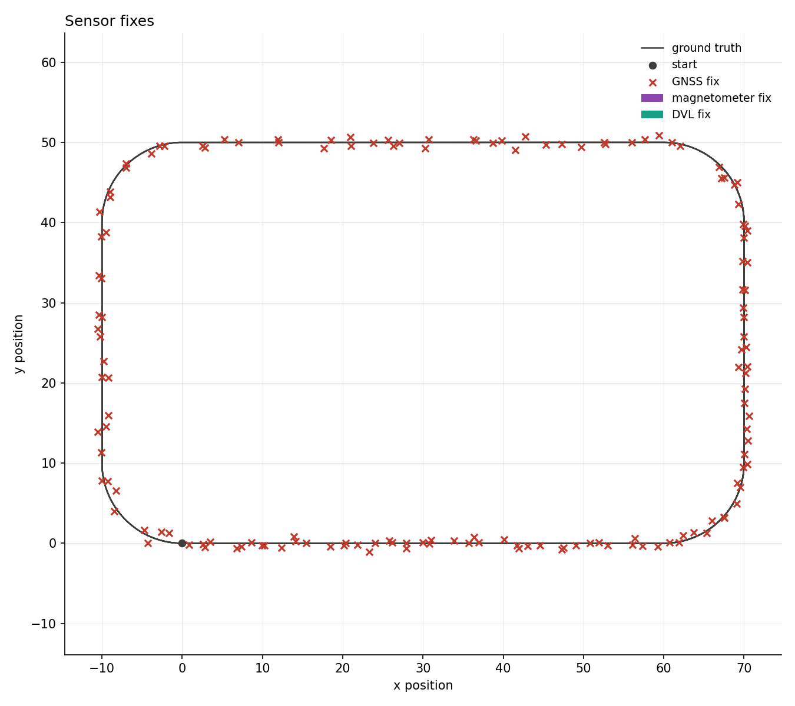
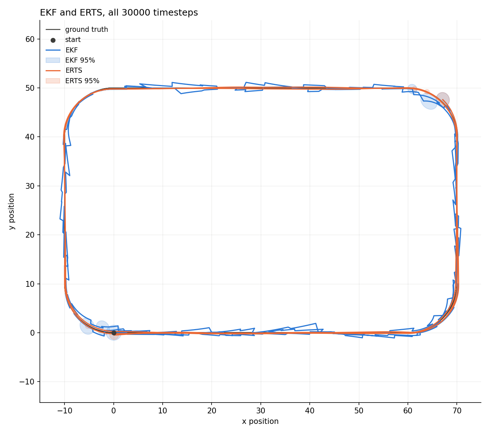
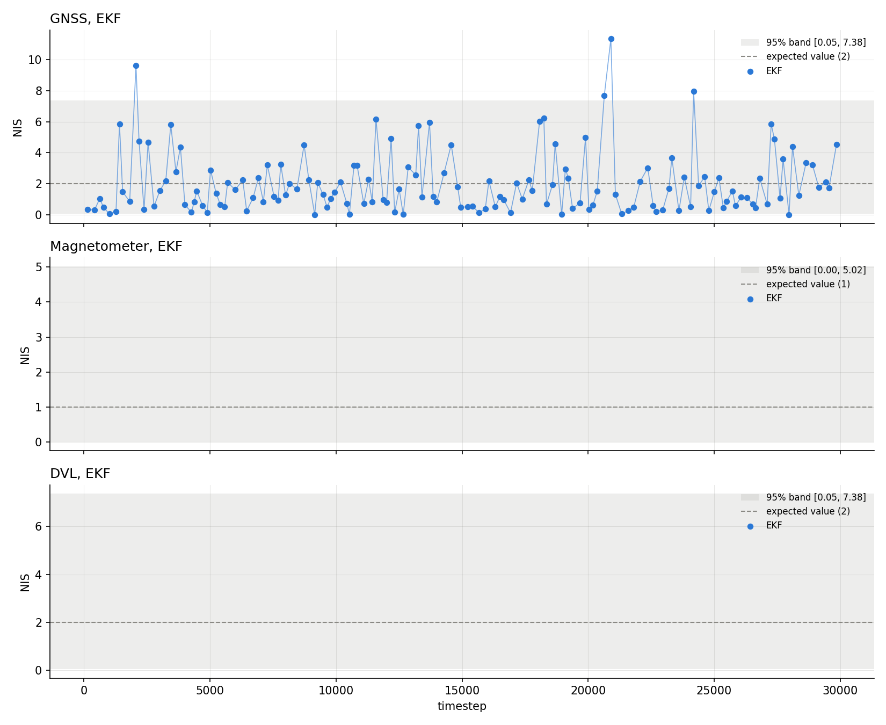
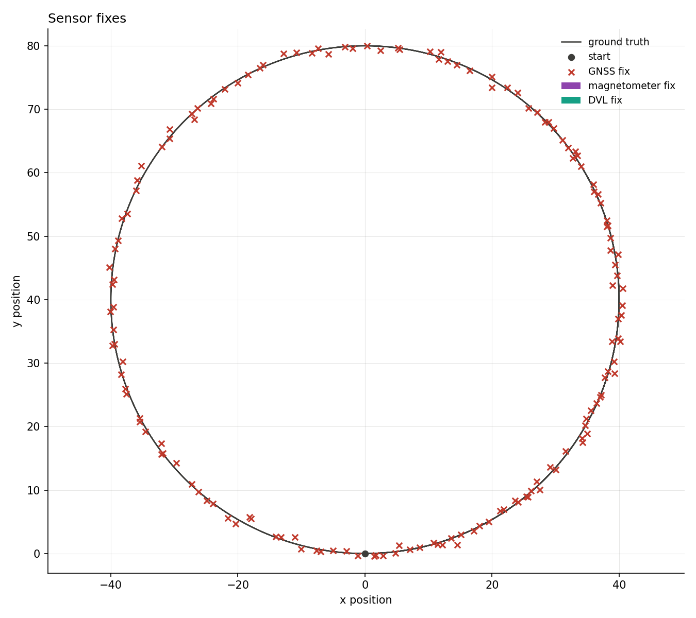
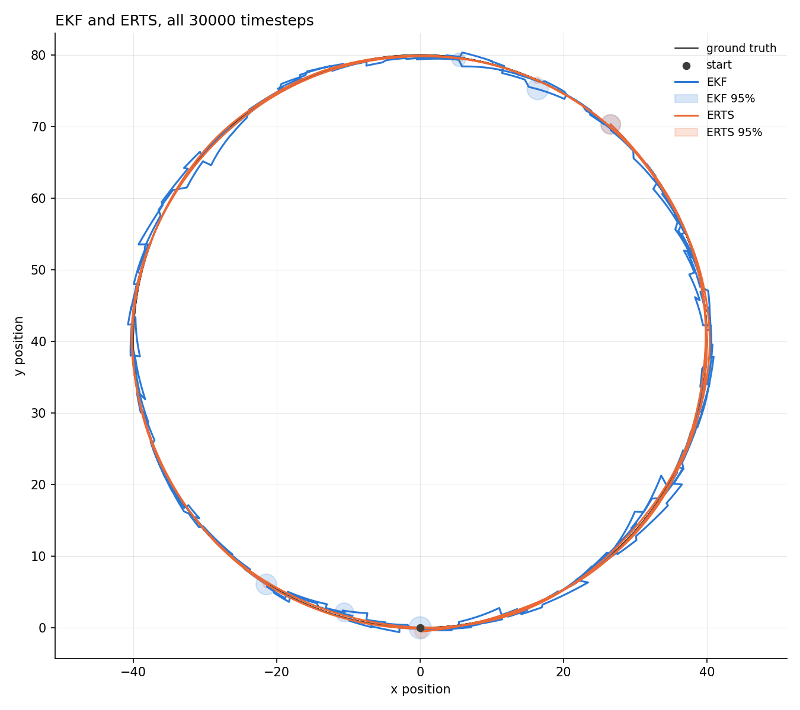
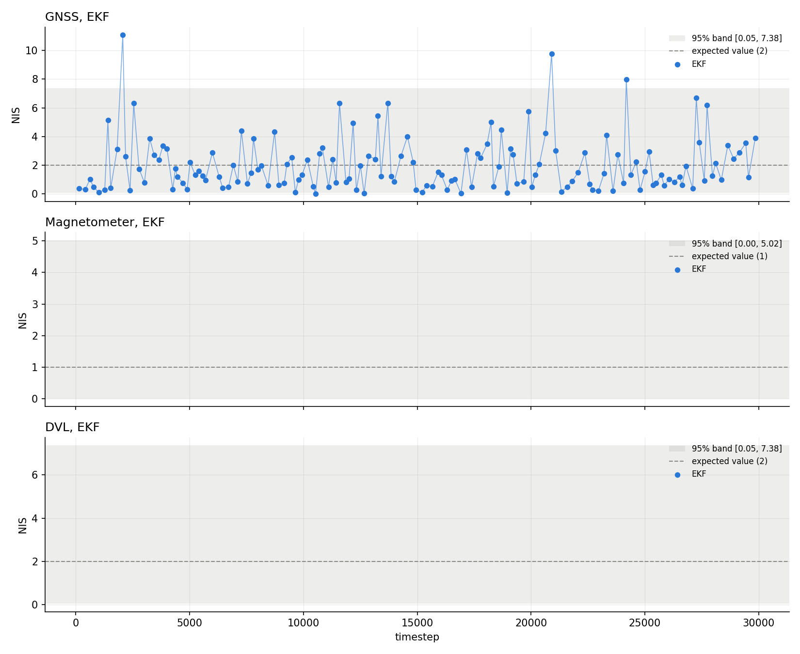
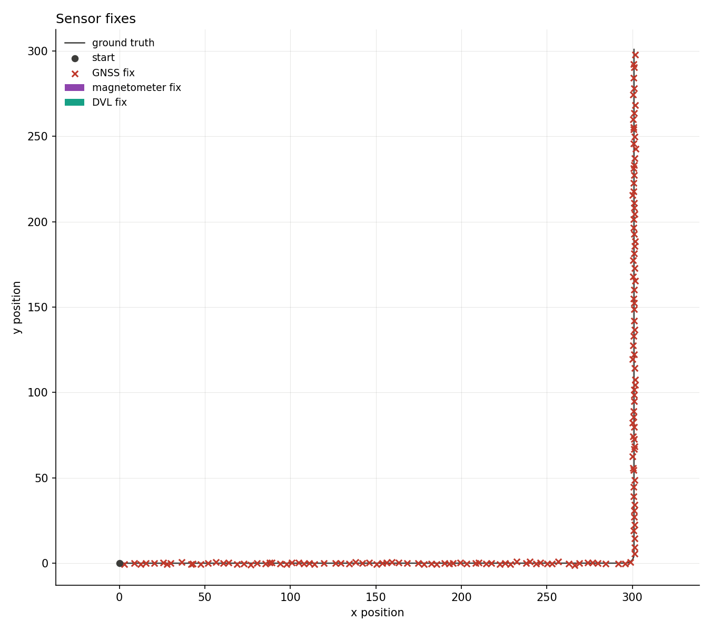
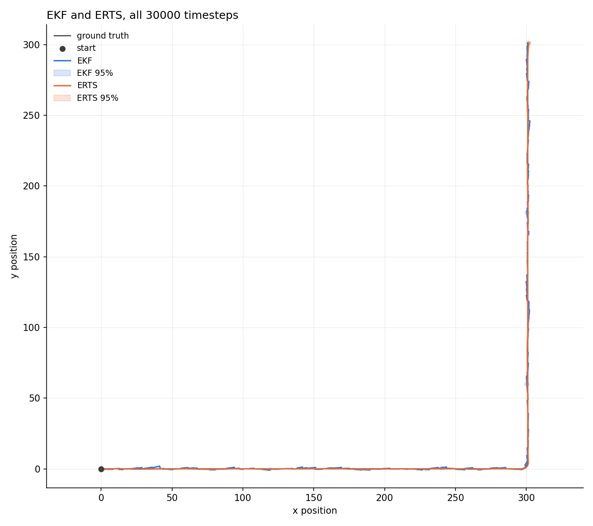
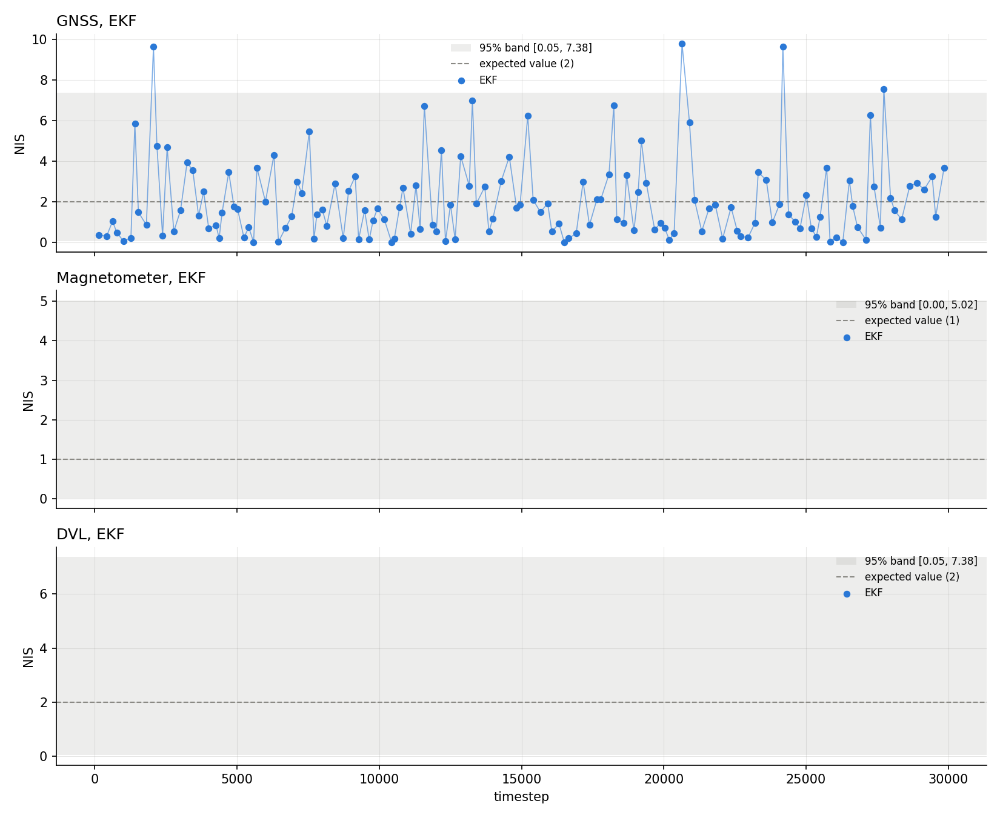

# 2-D strapdown INS, GNSS only

[Back to the overview](../../../README.md) | [Previous: 2-D random walk](../../2D/README.md) | [Next: multi-sensor fusion](../multi_sensor_fusion/README.md)

First of three scenarios sharing one setup (seed, IMU, trajectories), each
testing a different sensor combination: this one GNSS alone, magnetometer
and DVL disabled for the whole run. A sensor is disabled by setting its
`*_period_min`/`*_period_max` both far longer than the run itself, so its
uniformly-distributed next-fire time never lands inside the session, the
same trick used for GNSS in the
[dead reckoning scenario](../dead_reckoning/README.md).

Unlike the earlier (now removed) one-trajectory-per-folder results, every
scenario here is run on all three trajectories (`rounded_rectangle`,
`circle`, `straight_into_turn`) and reported together in this one README.

|               |                                                  |
| ------------- | ------------------------------------------------ |
| **Status**    | done, consistent on all three trajectories       |
| **Run**       | 30000 timesteps (5 minutes at dt=0.01s), seed 42 |
| **Reproduce** | see [Reproduce](#reproduce)                      |

## Setup

Shared across all three scenarios in this set (this one, multi-sensor
fusion, and dead reckoning) and all three trajectories within each:

| parameter                       | value                     | meaning                                                      |
| ------------------------------- | ------------------------- | ------------------------------------------------------------ |
| gyro bias instability           | 5e-5 (rad/s)^2            | true and filter belief matched, no deliberate mismatch       |
| accel bias instability          | 5e-2 (m/s^2)^2, both axes | true and filter belief matched                               |
| gyro / accel bias time constant | 1000s                     | slow enough to look like a near-constant offset over one run |
| GNSS position noise             | 0.20 m^2                  | 1-sigma ~0.45m                                               |
| magnetometer heading noise      | 3e-3 rad^2                | 1-sigma ~3deg                                                |
| DVL body-frame velocity noise   | 1e-2 (m/s)^2, both axes   |                                                              |

This scenario's own sensor periods:

| sensor       | period           | fixes per run (typical) |
| ------------ | ---------------- | ----------------------- |
| GNSS         | uniform(1, 3)s   | ~150                    |
| Magnetometer | disabled (1e5 s) | 0                       |
| DVL          | disabled (1e5 s) | 0                       |

Trajectories: `rounded_rectangle` (80x50m, 10m corner radius, looped),
`circle` (40m radius, looped), `straight_into_turn` (296m straight, 90deg
turn of 5m radius, then another 296m straight, not looped, length chosen so
the whole shape completes right around the end of the run). All three start
at the origin heading +x, at a constant 2 m/s.

## Reproduce

```bash
python3 scripts/analyze_ins_2d.py results/INS2D/only_gnss/<trajectory>/data
```

To regenerate the data, copy `results/INS2D/only_gnss/<trajectory>/config.yaml`
over `configs/strapdown_ins_2D.yaml`, then:

```bash
cmake --build build
./build/kalman_filtering_and_smoothing
cp data/*.csv results/INS2D/only_gnss/<trajectory>/data/
python3 scripts/analyze_ins_2d.py results/INS2D/only_gnss/<trajectory>/data
```

## Results

### rounded_rectangle





|                         | value  | band             | verdict      |
| ----------------------- | ------ | ---------------- | ------------ |
| ANIS GNSS               | 1.9965 | [1.6704, 2.3589] | consistent   |
| ANEES position filter   | 1.8411 | [1.4344, 2.6582] | consistent   |
| ANEES position smoother | 1.1497 | [0.0506, 7.3778] | consistent   |

RMSE: filter 0.70m, smoother 0.21m.

### circle





|                         | value  | band             | verdict      |
| ----------------------- | ------ | ---------------- | ------------ |
| ANIS GNSS               | 1.9989 | [1.7016, 2.3222] | consistent   |
| ANEES position filter   | 1.8535 | [1.4634, 2.6191] | consistent   |
| ANEES position smoother | 1.1266 | [0.0506, 7.3778] | consistent   |

RMSE: filter 0.68m, smoother 0.21m.

### straight_into_turn





|                         | value  | band             | verdict      |
| ----------------------- | ------ | ---------------- | ------------ |
| ANIS GNSS               | 2.0222 | [1.6799, 2.3476] | consistent   |
| ANEES position filter   | 1.8096 | [1.4692, 2.6114] | consistent   |
| ANEES position smoother | 1.2335 | [0.0506, 7.3778] | consistent   |

RMSE: filter 0.69m, smoother 0.22m.

The sharpest turn of the three (5m radius) stays inside its bands as well,
even though nothing but GNSS position fixes correct the filter through it.

## Takeaways and limits

- GNSS alone, well-tuned and with a fix every ~2s, is consistent on all
  three trajectories, including the 5m-radius turn of straight_into_turn.
- The smoother cuts RMSE by about 70% on every trajectory (0.68-0.70m
  to 0.21-0.22m), the biggest relative gain of the three scenarios in this
  set, since GNSS gives it an absolute position reference on both sides of
  every point.
- Single seed per trajectory, matched IMU model (see Setup), no deliberate
  mismatch test yet.

## Next

[Multi-sensor fusion](../multi_sensor_fusion/README.md) adds magnetometer
and DVL back in, with GNSS much sparser.
