# 2-D strapdown INS, UKF and URTSS

[Back to the overview](../../../README.md) | [Previous: GNSS outage](../gnss_outage/README.md)

The unscented filter and smoother on the same 2-D strapdown INS setup as the
EKF and ERTS scenarios, run on the same simulated data and the same sensor
fixes, so every difference below comes from the estimator and not from the
data. Two runs: the [GNSS outage](../gnss_outage/README.md) scenario, and a
heading stress run built to make the linearisation hurt.

|               |                                                                                             |
| ------------- | ------------------------------------------------------------------------------------------- |
| **Status**    | done, UKF and EKF indistinguishable on the outage run, UKF clearly better on the stress run |
| **Run**       | 30000 timesteps (5 minutes at dt=0.01s), seed 42, both runs                                 |
| **Reproduce** | see [Reproduce](#reproduce)                                                                 |

## Setup

Shared parameters as in [GNSS only](../only_gnss/README.md#setup). Unscented
transform parameters, not tuned: `alpha` 1.0, `beta` 2.0, `kappa` 0.0.

| run              | what it is                                                                                                                                  |
| ---------------- | ------------------------------------------------------------------------------------------------------------------------------------------- |
| `outage`         | identical to [`gnss_outage/matched`](../gnss_outage/README.md), GNSS denied 45-255s, magnetometer every 0.25-1s                             |
| `heading_stress` | `outage` with the filter's heading prior 1.5 rad (86 degrees) off the truth, heading variance 1.5^2, and the magnetometer only every 30-60s |

The stress run changes the filter's belief, never the truth: `x0` and
`p0_diagonal` only seed the filter prior, the truth comes from the
trajectory. The sparse magnetometer is what keeps the heading error alive.
With a magnetometer every second the heading is corrected within about a
second and the EKF and UKF end up indistinguishable, so the stress run was
needed to see any difference at all.

The EKF/ERTS and UKF/URTSS figures have the same layout, so the two sets can be
opened side by side. EKF figures keep their old names, UKF ones are prefixed
`ukf_`.

## Reproduce

```bash
python3 scripts/analyze_ins_2d.py results/INS2D/ukf/<outage|heading_stress>/data
```

To regenerate the data, copy
`results/INS2D/ukf/<outage|heading_stress>/config.yaml` over
`configs/strapdown_ins_2D.yaml`, then follow the same steps as
[GNSS only's reproduce section](../only_gnss/README.md#reproduce). One run
writes both the EKF/ERTS and the UKF/URTSS files.

## Results: outage run

### UKF and URTSS

| UKF and URTSS                                                     | NIS (UKF)                                    |
| ----------------------------------------------------------------- | -------------------------------------------- |
| 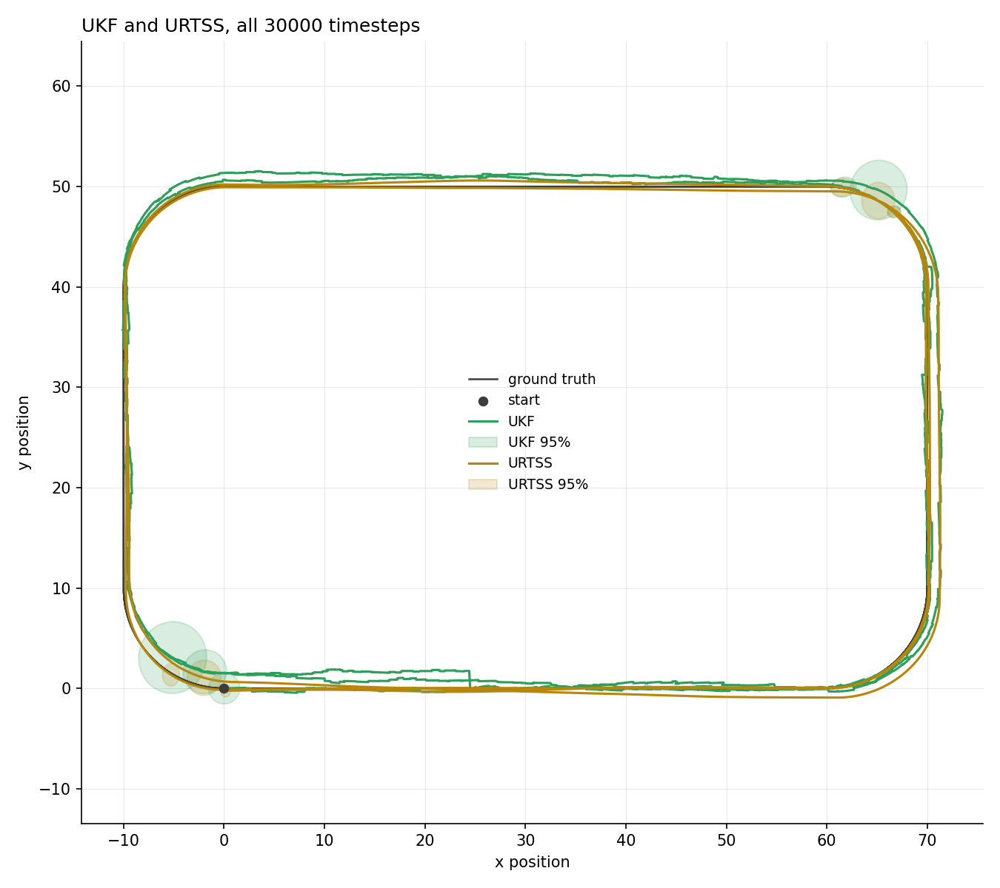 | 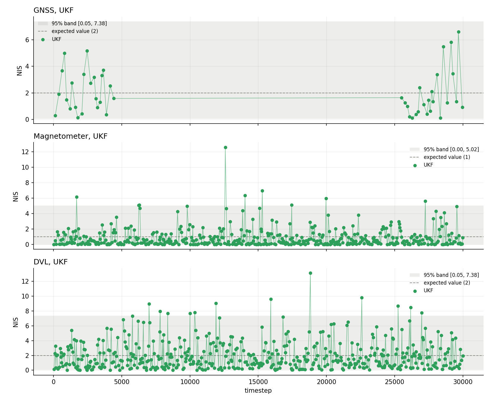 |

| value (verdict)         | EKF / ERTS            | UKF / URTSS           |
| ----------------------- | --------------------- | --------------------- |
| ANIS GNSS               | 1.9989 (consistent)   | 1.9987 (consistent)   |
| ANIS magnetometer       | 0.8573 (INCONSISTENT) | 0.8574 (INCONSISTENT) |
| ANIS DVL                | 1.9935 (consistent)   | 1.9931 (consistent)   |
| ANEES position filter   | 1.4470 (consistent)   | 1.4500 (consistent)   |
| ANEES position smoother | 1.5674 (consistent)   | 1.5733 (consistent)   |

|                        | EKF    | UKF    | ERTS   | URTSS  |
| ---------------------- | ------ | ------ | ------ | ------ |
| RMSE position [m]      | 0.9988 | 1.0014 | 0.7055 | 0.7074 |
| RMSE heading [deg]     | 1.308  | 1.308  | 0.794  | 0.794  |
| max position error [m] | 1.95   | 1.95   | 1.62   | 1.62   |

The UKF is consistent in the same places the EKF is, and fails in the same
place: the magnetometer ANIS sits just under its band for both, the same
mild underconfidence about the sensor's `R` found in the
[outage](../gnss_outage/README.md#consistency) and
[dead reckoning](../dead_reckoning/README.md#consistency-read-carefully)
pages. It is a property of the setup, not of either filter.

### Bias estimates

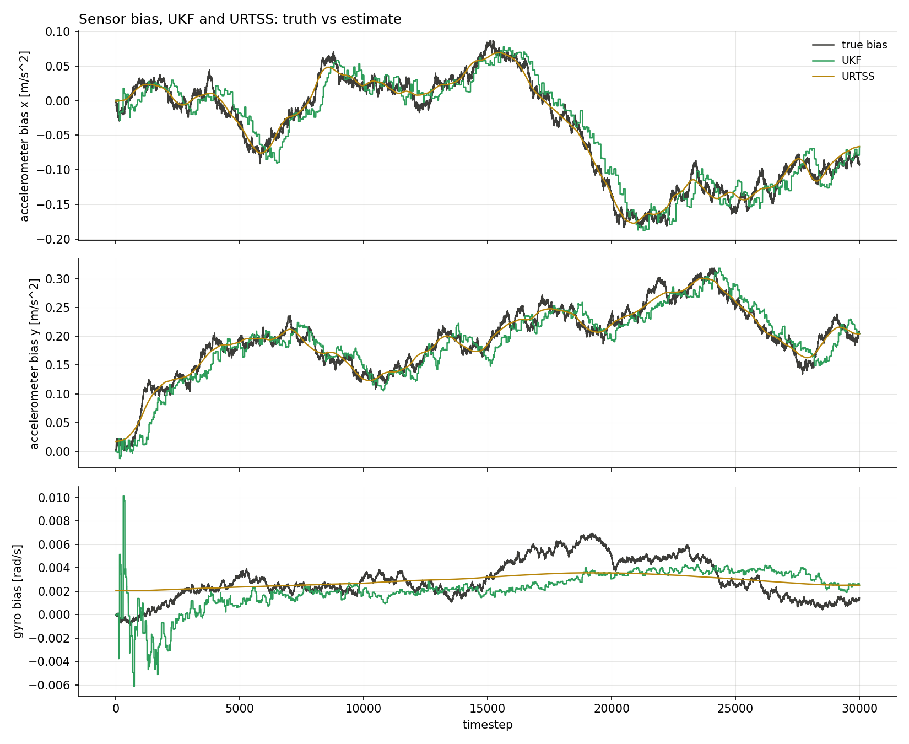

|                              | EKF     | UKF     | ERTS    | URTSS   |
| ---------------------------- | ------- | ------- | ------- | ------- |
| RMSE accel bias x [m/s^2]    | 0.0212  | 0.0212  | 0.0099  | 0.0099  |
| RMSE accel bias y [m/s^2]    | 0.0242  | 0.0242  | 0.0110  | 0.0110  |
| RMSE gyro bias [rad/s]       | 0.00186 | 0.00186 | 0.00133 | 0.00133 |

Both accelerometer biases are tracked closely through the whole run, outage
included, and the smoother is about twice as accurate as the filter. The gyro
bias is the hardest of the three, as in the
[EKF outage run](../gnss_outage/README.md#bias): the UKF's estimate swings
about 0.01 rad/s around the true value, which is close to zero, in the first
2000 steps and then settles within a few thousandths of it. The URTSS gyro
estimate is almost flat near 0.003 and does not follow the slow wander of the
true bias. The EKF and UKF numbers are the same to the printed digits.

### EKF against UKF

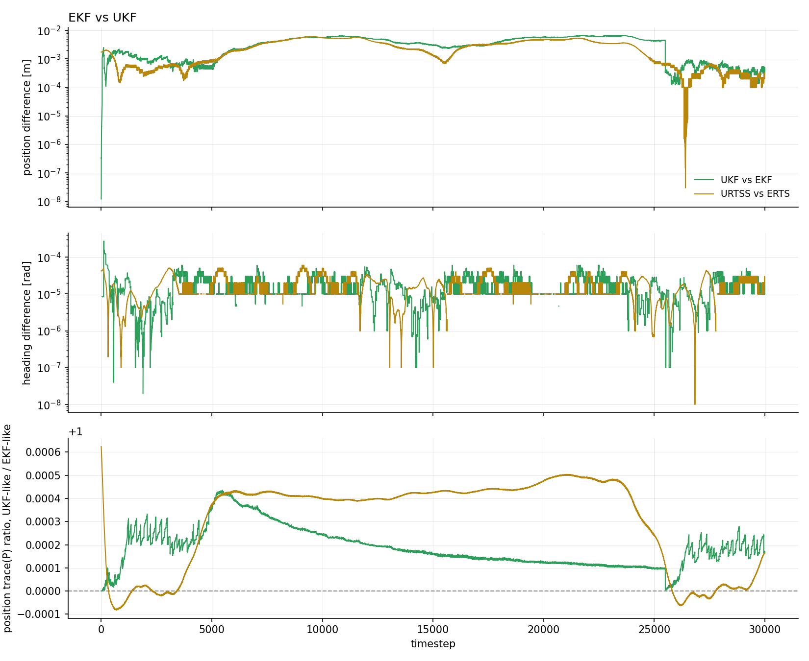

The two filters stay within 7 mm of each other for the whole run (median
3.5 mm) and within 0.02 degrees in heading. The URTSS stays within 6 mm of the
ERTS. The position `trace(P)` ratio stays between 1.0000 and 1.0004 for the
filters, so the UKF reports the same uncertainty as the EKF. The URTSS
`trace(P)` is below the UKF's at every step, the same invariant as for the
ERTS.

On this run the model is too mildly nonlinear for the choice of filter to
matter. This is the expected result when the heading error is a few degrees
and the linearisation is good over the whole spread.

## Results: heading stress run

### EKF and UKF side by side

| EKF and ERTS                                                         | UKF and URTSS                                                             |
| -------------------------------------------------------------------- | ------------------------------------------------------------------------- |
| 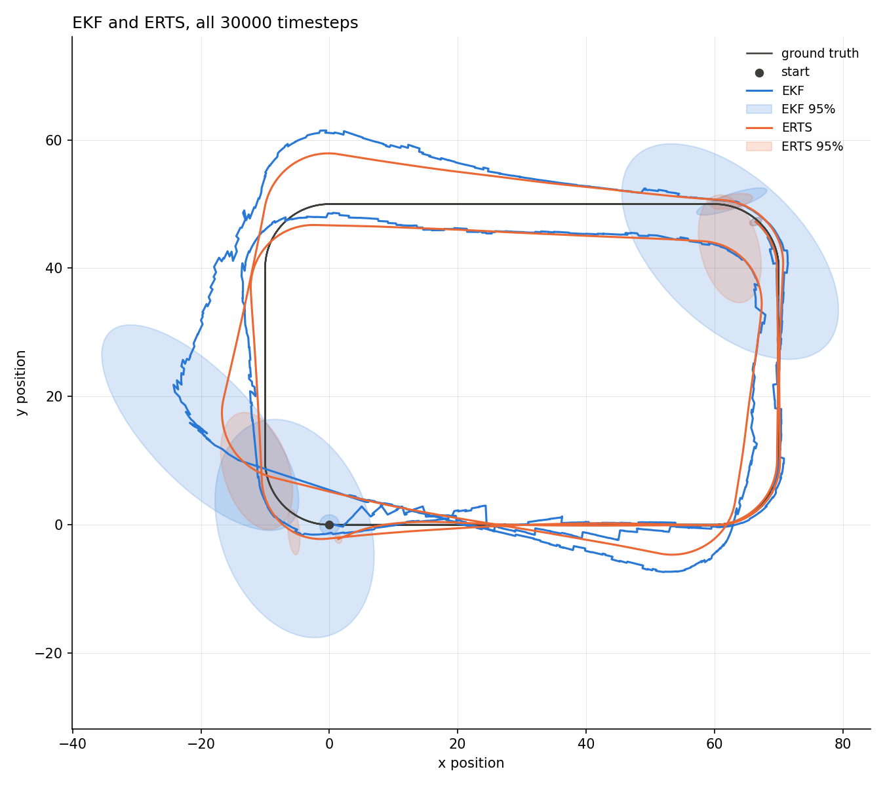 | 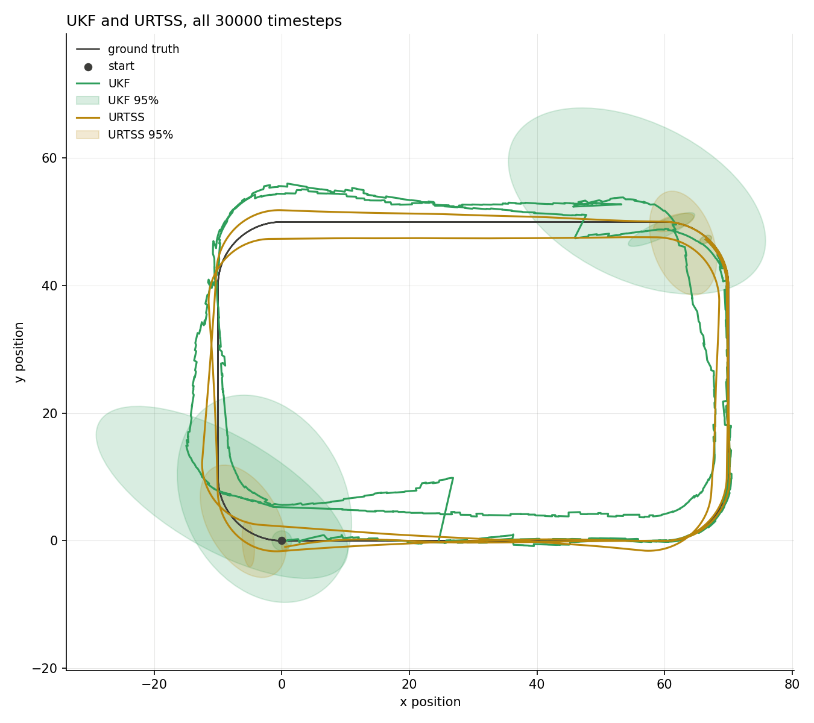 |
| 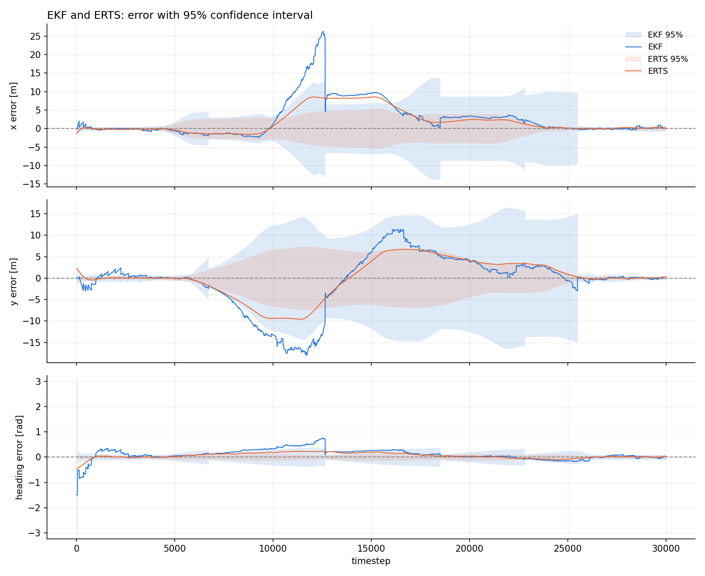   | 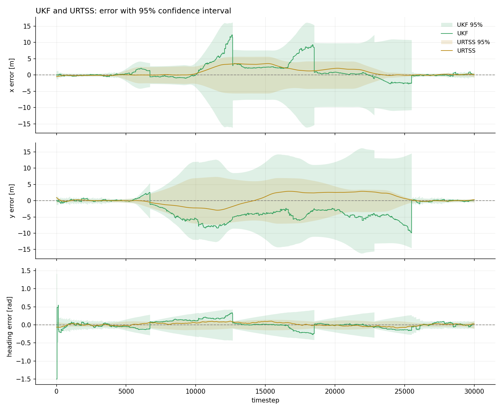    |
| 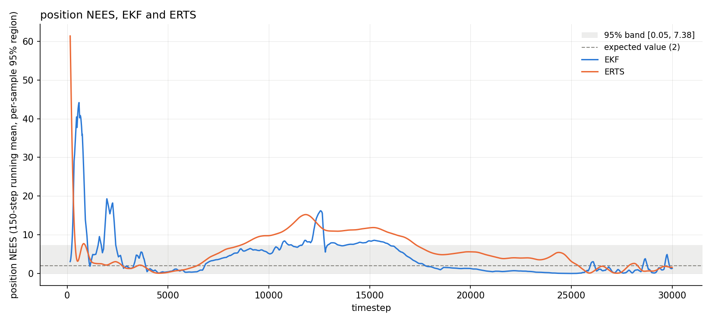                   | 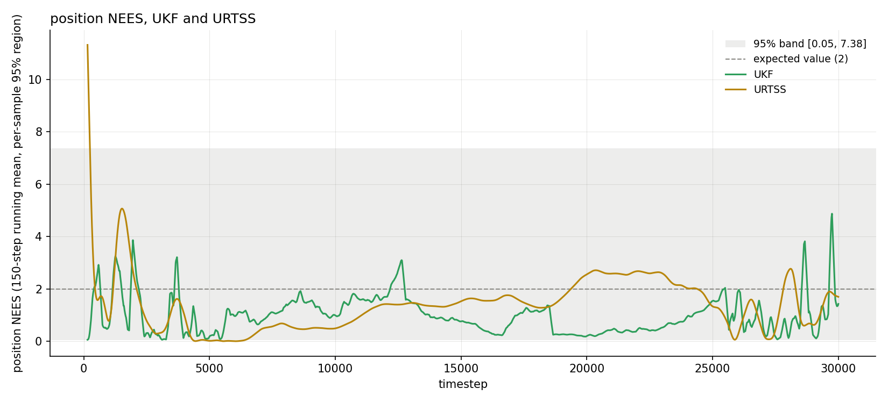                    |

Both filters start with a wrong heading, rotate the whole trajectory, and
only recover when a magnetometer fix or GNSS arrives. The EKF's error
reaches 26 m in x and 18 m in y during the outage and leaves its own 95%
interval for a long stretch. The UKF drifts too, but its error peaks at
about half of that and mostly stays inside its interval. The sparse
magnetometer fixes show up as the steps in both error plots.

### Accuracy

|                           | EKF   | UKF   | ERTS  | URTSS |
| ------------------------- | ----- | ----- | ----- | ----- |
| RMSE position [m]         | 8.49  | 4.90  | 5.64  | 2.30  |
| RMSE heading [deg]        | 13.65 | 6.89  | 6.98  | 2.69  |
| median position error [m] | 3.44  | 3.52  | 3.76  | 1.88  |
| 95th percentile [m]       | 19.36 | 9.53  | 10.36 | 3.88  |
| max position error [m]    | 29.14 | 13.63 | 12.07 | 4.18  |

The median error of the EKF and UKF is about the same, 3.4 against 3.5 m.
The difference is in the tail: the UKF's worst moments are about half as
bad. The URTSS is the best of the four on every row. The ERTS is worse than
the UKF filter on RMSE (5.64 against 4.90 m), so the choice of smoother
matters much more here than it did on the outage run.

### Bias estimates

| EKF and ERTS                                                    | UKF and URTSS                                                       |
| --------------------------------------------------------------- | ------------------------------------------------------------------- |
| 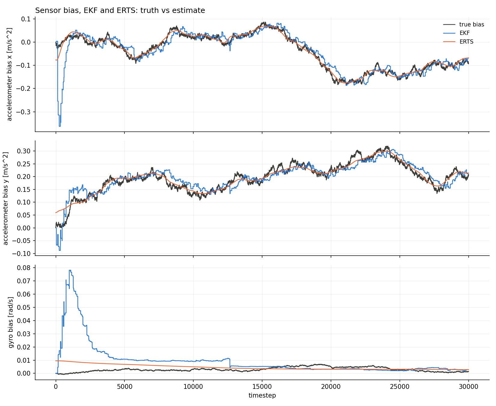              | 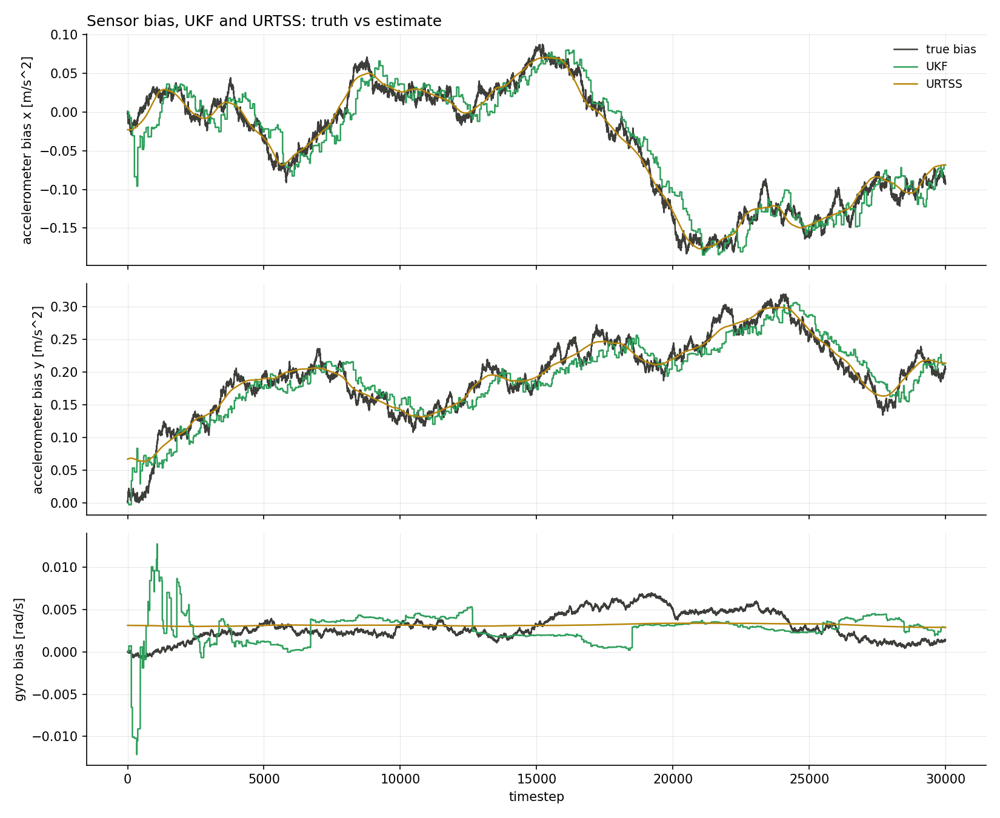              |

|                              | EKF     | UKF     | ERTS    | URTSS   |
| ---------------------------- | ------- | ------- | ------- | ------- |
| RMSE accel bias x [m/s^2]    | 0.0407  | 0.0223  | 0.0122  | 0.0105  |
| RMSE accel bias y [m/s^2]    | 0.0265  | 0.0244  | 0.0159  | 0.0146  |
| RMSE gyro bias [rad/s]       | 0.01500 | 0.00273 | 0.00352 | 0.00161 |
| peak gyro bias error [rad/s] | 0.0781  | 0.0127  | 0.0102  | 0.0040  |

The wrong initial heading leaks into the bias states. The EKF's gyro bias
estimate shoots up to 0.078 rad/s in the first 1000 steps, against a true
value near 0.002, and takes until step 12600 to come down to the true level.
Its x accelerometer bias dips to -0.35 m/s^2 early on, the truth being close
to zero. The UKF's gyro bias swings only up to 0.013 rad/s and is back near
the truth after about 2500 steps. A likely explanation, not tested: with the
heading wrong, the filter explains the mismatch between the heading and the
velocity direction with a bias, and the EKF's linearisation lets the gyro bias
absorb far more of it. The ERTS inherits part of the EKF's gyro error, its
estimate starting near 0.01 and decaying slowly, which is why its gyro RMSE
(0.0035) is worse than the UKF filter's (0.0027). The URTSS is the best on all
three biases.

Over the last 5000 steps the EKF and UKF gyro errors are the same, 0.0020 and
0.0021 rad/s, so the difference is the transient, not the long-run level.

### Consistency

| value (verdict)         | EKF / ERTS                  | UKF / URTSS                |
| ----------------------- | --------------------------- | -------------------------- |
| ANIS GNSS               | 5.1769 (INCONSISTENT, high) | 2.0967 (consistent)        |
| ANIS magnetometer       | 2.2892 (INCONSISTENT, high) | 1.1308 (consistent)        |
| ANIS DVL                | 2.3314 (consistent)         | 1.7308 (INCONSISTENT, low) |
| ANEES position filter   | 4.2239 (INCONSISTENT, high) | 0.9915 (INCONSISTENT, low) |
| ANEES position smoother | 5.8035 (consistent)         | 1.4242 (consistent)        |

The two filters fail in opposite directions. The EKF is overconfident:
ANEES 4.2 against a band topping out at 2.85, and the true position is
inside its own 95% ellipse for only 71% of the steps. The UKF is
conservative: ANEES 0.99 against a band starting at 1.49, and the true
position is inside its ellipse for 100% of the steps. An underconfident
filter is the safer failure of the two, but it is still not consistent.

The smoother ANEES rows say "consistent" for both, but the band is
[0.0506, 7.3778]: the position NEES is so autocorrelated that the effective
number of independent samples is clamped to one, so that band excludes
almost nothing. Read the smoother rows together with the 95%-ellipse
coverage: 64% for the ERTS, 99% for the URTSS.

### Sigma point health and the EKF/UKF difference

| EKF vs UKF                                                 | smallest eigenvalue of P                                                   |
| ---------------------------------------------------------- | -------------------------------------------------------------------------- |
| 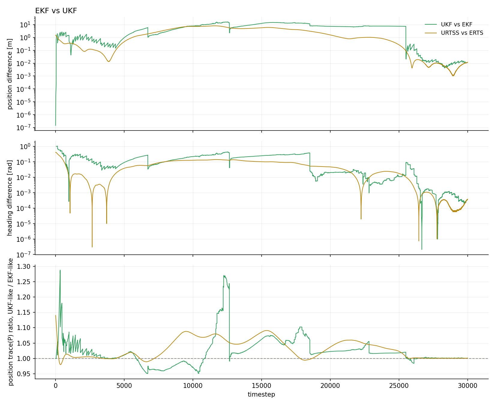 | 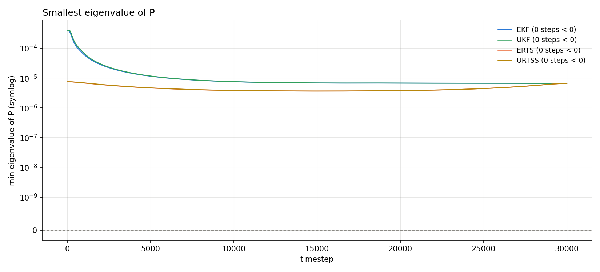 |

The unscented transform's centre weight can be negative, so nothing
algebraically keeps `P` positive semidefinite the way the EKF's Joseph form
does. The smallest eigenvalue of the full 8x8 `P` stays positive at every
step for all four estimators on both runs (about 7e-6 for the filters, 4e-6
for the smoothers), so with `alpha` 1.0 this does not happen here.

The two filters are a position median of 6.8 m and up to 16 m apart, and up
to 60 degrees in heading. The URTSS and ERTS are a median 1.1 m and up to 8
m apart. The UKF's `trace(P)` runs from 5% below to 29% above the EKF's. The
UKF is the less certain of the two for much of the run, which matches its
conservative consistency.

## Why the UKF can be expected to win here

A likely explanation, not tested separately. The EKF linearises `f` and `h`
at the mean. With a heading error of 1.5 rad, the rotation inside `f` and in
the DVL's `h` changes a lot over the heading spread, so the Jacobian at the
mean says little about how the whole distribution moves. The unscented
transform pushes sigma points spread across the heading uncertainty through
the real functions, so it sees the curvature. When the heading is known to a
few degrees the two coincide, which is what the outage run shows.

## Notes and limits

- **Single seed, hand-picked stress.** One seed, and the stress run was
  chosen after trying five variants (heading prior only at 0.8 and 1.5 rad,
  with and without sparse magnetometer, with and without the outage). The
  direction was the same in every variant that kept the heading error alive:
  the UKF better in the tail and on RMSE. The size of the gap, 8.5 against 4.9
  m, is for this seed. No Monte Carlo yet, so no error bars.
- **Heading prior only.** The mismatch is in the filter's prior, not in the
  model or the noise, so this says nothing about how the two filters handle a
  mistuned `Q` or `R`.
- **UT parameters not swept.** `alpha` 1.0, `beta` 2.0, `kappa` 0.0 throughout.
  The conservative consistency of the UKF might move with them.
